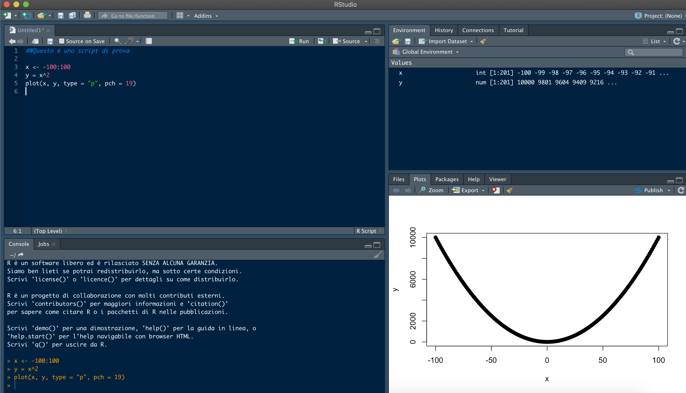

# Le basi {#base}


## Che cosa è l’ambiente R {#R}
R è un ambiente di programmazione. Parafrasando Morpheus che sfida Neo nella palestra virtuale di "Struttura", diremo che l'ambiente R ha le sue regole, e che conoscerle rappresenta il primo passo per impadronirsi di questo strumento (e aggirare o infrangere le sue regole).
In questa sezione saranno introdotte alcune nozioni generali che, spesso, sono date per scontate e quindi non chiaramente delineate. Nella nostra esperienza, dare per scontati questi concetti rende ostica il primo impatto con R e le prime fasi del suo utilizzo, cioè quelle durante le quali i nuovi utenti devono assimilare la sintassi, le diverse  tipologie di dati e le strutture all'interno delle quali possono essere organizzati e gestiti. Come tutti gli ambienti e i linguaggi di programmazione, R ha una sua sintassi e, sebbene essa non sia particolarmente complessa e articolata, sicuramente rappresenta il primo grande ostacolo a un utilizzo rapido ed efficace.
Al contrario, se resi comprensibili e chiari, i capisaldi della sintassi possono essere dei punti di riferimento quando guardiamo un codice scritto da altri o da noi stessi un pò di tempo fa... E dunque la prima parte di questo manuale è concepita per illustrare le regole generali che sono alla base delle procedure nell'ambiente R.   
Dunque impareremo la differenza sostanziale tra una **espressione** ed una **assegnazione**, l'utilizzo delle **parentesi** e le diverse tipologie di **oggetti** di base.   
Successivamente, imparemo a comporre dei semplici codici combinandoi espressioni, assegnazioni, e oggetti. Nel farlo, cercheremo subito di introdurre delle **norme di stile** e delle **buone pratiche** che ci aiuteranno a essere più ordinati, efficienti ed efficaci.

R è un ambiente per _Object-oriented programming_, cioè uno stile di programmazione diventato molto popolare negli ultimi anni. Questo stile si basa sull'utilizzo (la manipolazione mediante comandi) di **oggetti**, un approccio che rende molto semplice accedere (leggere e scrivere) ai dati in memoria e combinarli in strutture che possono essere anche molto complesse. 
Aspetti fondamentali dei lunguaggi _object-oriented_ sono il concetto di **classe** e quello di **metodo**, sui quali torneremo in seguito in maniera approfondita. 

**Classi** e **Metodi** sono legati dal fatto che, in R, la computazione si basa sull'applicazione di specifici metodi a oggetti di specifiche classi. Non esiste una corrispondenza biunivoca tra classi e metodi, piuttosto molti metodi possono essere applicati a oggetti di classi diverse e viceversa. Tuttavia, metodi diversi sono generalmente specializzati per essere applicati su specifiche classi di oggetti. Questa associazione metodi-classi è spesso molto intuitiva, ma esistono funzioni generiche per determinare di che classe sia un dato oggetto e quali siano i metodi su di esso applicabili.

Un altro aspetto importante dei lunguaggi _object-oriented_ è quello di _inheritance_ (eredità). Questo aspetto può essere sintetizzato come la capacità degli oggetti generati durante l'esecuzione di un codice o di una procedura di calcolo di "portarsi appresso" le caratteristiche degli oggetti "genitori" o delle funzioni "genitrici", cioè quelli a partire dai quali sono stati generati. Un esempio intuitivo è il seguente: se definisco due quantità numeriche _a_ e _b_ e le sommo, quello che ottengo (_c_) erediterà le caratteristiche dei genitori (numerici entrambi) e potrà essere trattato come tale. Questo aspetto semplifica enormemente il lavoro poichè, a differenza di quanto avviene in linguaggi di base, non è necessario pre-definire l'oggetto _c_ indicandone esplicitamente le caratteristiche e poi riempirlo.

Continuando l'elenco dei grandi vantaggi di R, dobbiamo sicuramente menzionare la sua enorme _Community_. Secondo la compagnia di analisi del software [TIOBE](https://www.tiobe.com/tiobe-index/), l'ambiente R è attualemnte al 9° posto tra i linguaggi più popolari ma, soprattutto, è quello che continua a crescere al ritmo più sostenuto. 


```r
TIOBE <- data.frame(Name = c("C", "Java", "Python", "C++", "C#", "Visual Basic", "Java Script", "R",
                             "PHP", "SQL", "Go", "Swift", "Pearl", "Assembly language", "Ruby",
                             "MATLAB", "Classic Visual Basic", "Groovy", "Objective-C", "Rust"),
                    Ratings = c(16.98, 14.43, 9.69, 6.84, 4.68, 4.66, 2.87, 2.79, 2.24, 1.46, 1.43, 1.42, 1.11, 1.04, 1.03, 0.86, 0.82, 0.77, 0.76, 0.74),
                    Change = c(1.83, -1.60, -0.33, 0.78, 0.83, 0.97, 0.62, 1.97, 0.17, -0.17, 0.45, 0.53, 0.25, -0.07, -0.28, -0.41, -0.20, -0.46, -0.93, 0.29))

knitr::kable(
  head(TIOBE, nrow(TIOBE)), caption = 'TIOBE Index for August 2020',
  booktabs = TRUE
)
```


Table: (\#tab:unnamed-chunk-1)TIOBE Index for August 2020

|Name                 | Ratings| Change|
|:--------------------|-------:|------:|
|C                    |   16.98|   1.83|
|Java                 |   14.43|  -1.60|
|Python               |    9.69|  -0.33|
|C++                  |    6.84|   0.78|
|C#                   |    4.68|   0.83|
|Visual Basic         |    4.66|   0.97|
|Java Script          |    2.87|   0.62|
|R                    |    2.79|   1.97|
|PHP                  |    2.24|   0.17|
|SQL                  |    1.46|  -0.17|
|Go                   |    1.43|   0.45|
|Swift                |    1.42|   0.53|
|Pearl                |    1.11|   0.25|
|Assembly language    |    1.04|  -0.07|
|Ruby                 |    1.03|  -0.28|
|MATLAB               |    0.86|  -0.41|
|Classic Visual Basic |    0.82|  -0.20|
|Groovy               |    0.77|  -0.46|
|Objective-C          |    0.76|  -0.93|
|Rust                 |    0.74|   0.29|

```r
par(las = 2, mar = c(5,10,1,1), cex = 0.7)
barplot(TIOBE$Ratings[order(TIOBE$Ratings, decreasing = F)], 
        names.arg = TIOBE$Name[order(TIOBE$Ratings, decreasing = F)], 
        xlab = "Ratings (%)", ylab = "",
        col = c(rep("grey",12),"blue",rep("grey",7)), horiz = T)
```


Questo dato è ancora più significativo se si considera che R non è esattamente un ambiente per produrre software compilato e quindi eseguibile (come avviene invece con i membri della famiglia **C**). 
Perchè questo aspetto è così importante? Semplicemente perchè, essendo R un ambiente "libero", ogni utente può attingere a una sterminata banca dati di informazioni, algoritmi, pacchetti aggiuntivi e funzioni già sviluppate da altri utenti... e spesso può contare sull'aiuto diretto di una vasta community. In ambito scientifico, R ha avuto (e continua ad avere) una diffusione inarrestabile perchè incarna perfettamente alcuni ideali della ricerca: la possibilità di sviluppare metodologie completamente replicabili, chiare e ulteriormente implementabili. 
Come ha giustamente argomentato [qui](https://ropensci.org/blog/2017/06/23/community/) Shannon Ellis, una _community_ ampia offre sviluppatori, esperti, potenziali collaboratori, estensori di documentazione, persone che mettono alla prova le nostre routine, "agitatori" (che sono sempre utili per tenere viva la _community_!) o semplicemente persone gentili che sono disposte ad aiutare i neofiti. Ma, soprattutto, qualsiasi sia la sfida con la quale siete alle prese, molto probabilmente qualcuno ci si è già cimentato e potrete ripartire dal suo lavoro. Non è forse, questo, un enorme vantaggio?
Shannon Ellis ha compilato una [lista di siti/blog](https://ropensci.org/blog/2017/06/23/community/) che rappresentano i principali canali web della 
_community_ di R. I principali sono:

* [**(Revolution) Local R meetup groups**](https://blog.revolutionanalytics.com/local-r-groups.html) - un motore di ricerca che aiuta a trovare riferimenti nella propria area di interesse (per salire sulla spalle dei giganti);
* [**Rweekly**](https://rweekly.org/) - un magazine settimanale di quello che succede nel mondo di R;
* [**R-bloggers**](https://www.r-bloggers.com/) - un archivio di post utili fatti tra utenti di R;
* [**Stack Overflow**](https://stackoverflow.com/) - dove cercare risposte alle nostre domande, spesso legate alle difficoltà dei neofiti (ma non solo)

Una bella e completa descrizione di cosa sia R la trovate [qui](https://www.performancetrading.it/Documents/VrRAmbiente/VrR_software_R.htm). In sintesi:

* R è un ambiente integrato e coerente per l'analisi statistica;
* R è contemporaneamente un linguaggio ed un software;
* R è un potente strumento per la produzione di grafici (originali);
* R è distribuito gratuitamente sotto i vincoli della [**GPL - General Public License**](https://it.wikipedia.org/wiki/GNU_General_Public_License) ed è disponibile per diverse architetture hardware e sistemi operativi: Unix, Linux, Windows, MacOS. 
* R è disponibile presso il sito [**The R Project for Statistical Computing**](http://www.r-project.org) dove è possibile scaricare, oltre che il programma base, anche una serie di moduli aggiuntivi e un'ampia manualistica (in lingua inglese) sull'ambiente che va dall'installazione del software al suo utilizzo nell'analisi dei dati;
* il sorgente di R è scritto parte nel linguaggio C e parte nel linguaggio Fortran.

------

## A cosa serve/non serve R {#Russo}
R non è una panacea, e anche gli appassionati di questo strumento devono essere a conoscenza dei suoi difetti quanto dei suoi pregi. Da una parte, R si comporta come gli smartphone (un nuovo tipo di _device_ che, dalla sua comparsa sul mercato, ha completamente "assorbito" e messo fuori dal mercato altri _device_ come i lettori mp3, le fotocamere, i navigatori satellitari). Infatti chi usa R può facilmente rinunciare a fogli di calcolo, software proprietari per la statistica, gestori di database, piattaforme per la geostatistica, software per l'analisi e la manipolazione di immagini, e la lista potrebbe continuare.
R può servire praticamente a tutto!
Un altro grande vantaggio di R è che, essendo un software opensource, si può accedere al codice sorgente e modificarlo. R è del tutto gratuito. 
R possiede un'ampia biblioteca di manuali e dispense accessibili gratuitamente in rete, oltre a pubblicazioni a pagamento. 
L'installazione base di R può essere integrata con librerie di funzioni addizionali (il vero valore aggiunto per il mondo della ricerca) che ne ampliano a dismisura le capacità.
R offre un supporto tramite l'[R Development Core Team](https://www.r-project.org/help.html).
Infine, R sa "parlare" con altri linguaggi, da C a SQL a fortran e Python, per cui si possono integrare metodi e funzioni sviluppate in altri contesti.
Per essere proprio completi, è importante ricordare che.

* R ha una quantità veramente incredibile di funzioni grafiche  che consentono di ottenere grafici estremamente efficaci dal punto di vista scientifico ma anche "belli"
* R permette di essere creativi ed efficienti, poichè consente di scrivere nuove funzioni o intere librerie in maniera molto semplice
* La sua versione base è molto snella, ed essendo sviluppato secondo una logica vettoriale lavora molto bene su vettori e matrici

E le brutte notizie?

Beh...

* R è "brutto": la sua interfaccia non è pensata per essere bella e accattivante come gli OS ai quali siamo abituati. L'interfaccia utente a carattere (CUI) di R è anche "ostico", poichè ci costringe a cambiare modo di lavorare. E' vero che è presente anche un'interfaccia GUI (Graphical User Interface), ma gli utenti esperti non la usano quasi mai;
* R è "un elefante": può arrivare a occupare una grande quantità di memoria e la sua velocità di calcolo è di gran lunga inferiore a quelle di ambienti e linguacci di livello più basso (come la famiglia C o Visual Basic). Questo, a volte, costringe gli utenti più esperti a compilare delle funzioni in C tutte le volte che le loro analisi diventano _computational and time demanding_;
* Non tutte le funzioni di R sono ottimizzate per avere elevate prestazioni (un buon esempio sono le funzioni di ottimizzazione numerica). A volte sarete costretti a metterci del vostro per sviluppare funzioni nuove o più performanti;
* Se sviluppate un'applicazione basata su R, è vostro onere tutto quello che rigarda il _debug_ e il mantenimento: se salta fuori un problema, non potete prendervela con nessun altro!

------

## “What You See Is What You Mean”: dallo Script al terminale (e viceversa) {#WYSIWYM}
Per affrontare la prima parte, dedicata a una carrellata degli aspetti base (concettuali e di sintassi) dell'ambiente R, è necessario assimilare alcuni termini (e strumenti):
Il **terminale** (detto *console* in inglese, così come è denominata la sua finestra nell'interfaccia di R studio), è l' **interfaccia** attraverso il quale l'utente interagisce con R. 


Citando testualmente Wikipedia: "*In informatica una interfaccia a riga di comando[1] (dall'inglese command line interface, in acronimo CLI) o anche console, a volte detta semplicemente riga di comando e, impropriamente[senza fonte], prompt dei comandi, è un tipo di interfaccia utente caratterizzata da un'interazione testuale tra utente ed elaboratore (vedi shell): l'utente impartisce comandi testuali in input mediante tastiera alfanumerica e riceve risposte testuali in output dall'elaboratore mediante display o stampante alfanumerici. Nei sistemi operativi moderni usati nei personal computer, al posto della CLI, in buona parte, c'è l'interfaccia grafica con caratteristiche tipicamente user friendly*".
Il primo (e forse principale) trauma al quale il neofita di R si trova di fronte è la necessità di rinunciare (possibilmente da subito e definitavamente) all'interazione tramite il mouse e quindi le interfacce a finestre e menù a tendina che tanto ci sono familiari e rispetto alle quali abbiamo sviluppato una certa dipendenza! Quando si comincia a usare R, bisogna accettare di inserire i comandi digitandoli direttamente nel terminale o predisponendoli in uno script (una sequenza di comandi annotata da qualche parte, generalmente in un editor di testo o in una apposita finestra di R studio). 
Ci sono due motivi principali per questo:
1. Sarebbe impossibile codificare tutti i possibili comandi di R in un menù grafico o a tendina, senza considerare che questo limiterebbe comunque l'originalità degli utenti e renderebbe assai complesso combinare insieme varie funzioni;
2. Imparare a usare il terminale rende il lavoro estremamente più veloce (provare per credere). Questo secondo aspetto accomuna R a tanti altri ambienti di alto livello e persino a sistemi operativi come Ubuntu e Debian (due delle principali distribuzioni di Linux). 
Per utilizzare il terminale, però, non basta conoscere la sintassi dei comandi: bisogna cambiare filosofia. Quando utilizziamo un elaboratore di testo, digitiamo i caratteri sapendo che esiste una precisa corrispondenza tra i tasti che premiamo e il risultato che apparirà sullo schermo. 
Questo modo di operare viene denominaro What You See Is What You Get ("quello che vedi è quello che è" o "ottieni quanto vedi" - acronimo WYSIWYG). Utilizzare il terminale di un ambiente come R significa invece applicare la filosofia What You See Is What You Mean (letteralmente: quel che vedi è ciò che intendi; sinteticamente, vedi quanto intendi - acronimo WYSIWYM). In sostanza, le istruzioni che digitiamo non sono semplici parole sullo schermo ma implicano l'applicazione di funzioni anche complesse che, nelle intenzioni dell'utente, devono restituire un risultato di qualche tipo.
L'utilizzo di R si svolge tipicamente attraverso un continuo passaggio dall'editor di testo, dove si modica lo script, al terminale dove lo si esegue. Se poi si usano interfacce avanzate come **R studio**[TIOBE](https://rstudio.com/), si può disporre di utili finestre accessorie (come quella dei grafici).
La figura seguente ci mostra una tipica schermata di **R studio**



L'interfaccia di Rstudio contiene 4 finestre che sono spesso organizzate in questo modo (ma l'utente ha ampie possibilità di personalizzarle). Analizziamo questo esempio:

* In alto a sinistra c'è lo **Script** o gli **Script** se si vuole gestire più procedure separate. Questa finestra è semplicemente un blocco note multipagina che consente di inviare i comandi direttamente al **terminale**

* In basso a sinistra ecco proprio lui, il **terminale**, ovvero il canale di collegamento in ingresso da noi verso R. In Rstudio, questa finestra si chiama **Console**. Avete presente Ellen Ripley che comunica con Mother, il super computer cattivo dell'astronale Nostromo, mediante un terminale? Ecco, il concetto è quello e...  a volte penserete che R è antipatico quasi quanto Mother :-)


* In alto a destra c'è una finestra "composita" che racchiude **Environment**, all'interno del quale troveremo un elenco (con alcune caratteristiche essenziali) degli oggetti nella memoria della sessione, **History**, una cronologia dei comandi passati alla **Console**, e infine le tre sottofinestre **Connections**, **Build** e **Tutorial** sulle quali, per ora, possiamo sorvolare.

* In basso a destra c'è un'altra finestra "composita" che racchiude **Files**, cioè l'elenco dei file nella cartella di lavoro (la directory del pc) scelta per la sessione, **Plots**, che conterrà le anteprime dei grafici realizzati, **Packages**, che è un prontuario di tutti gli help dei pacchetti installlati, **Help**, l'interfaccia minimale di aiuto che presto impareremo ad apprezzare, e **Viewer**,  destinata a mostrare contenuto HTML come le applicazioni Shiny. 

Una tipica sessione di lavoro in R con Rstudio prevedere un utizzo semi-simultaneo di questi pannelli, e principalmente dello **Script** e del **Terminale** o **Console**.
Dopo queste premesse siamo pronti per rompere gli indugi e fare conoscenza con R.
Qualsiasi sia la vostra installazione, aprite il terminale e cominciamo.

## Le Espressioni {#Espressioni}
R è, prima di tutto, un ambiente per calcolo. In questo senso, possiamo vedere il terminale come una calcolatrice. 
E' possibile eseguire calcoli semplici o complessi direttamente mediante il terminale, digitando delle istruzioni analoghe alle formule algebriche, cioè utilizzando un insieme di quantità numeriche, simboli e operatori matematici, e poi premendo il tasto INVIO.
Come avviene per altri ambienti e linguaggi di programmazione, gli operatori matematici di base sono:

* La somma, codificata col simbolo +.

```r
2 + 5
```

```
## [1] 7
```
* La sottrazione, codificata col simbolo -.

```r
2 - 5
```

```
## [1] -3
```
* La moltiplicazione, codificata col simbolo *.

```r
2 * 5
```

```
## [1] 10
```
* La divisione, codificata col simbolo /.

```r
2 / 5
```

```
## [1] 0.4
```
* L'elevamento a potenza, codicato col simbolo ^ (ad esempio x^2 indica x elevato al quadrato).

```r
2^5
```

```
## [1] 32
```
Esistono poi altre simbologie con un significato matematico definito, come ad esempio:


* Il simbolo : che serve a generare una sequenza ordinata di interi tra un minino ed un massimo definiti, come ad esempio

```r
1:10
```

```
##  [1]  1  2  3  4  5  6  7  8  9 10
```
* Il simbolo % che serve, ad esempio, per specificare il prodotto scalare invece che quello generico (vettoriale se utilizzato su vettori), come ad esempio

```r
c(3:7) %*% c(1:5)
```

```
##      [,1]
## [1,]   85
```
All'interno di R, l'utilizzo delle varie tipologie di parentesi è legato a funzionalità diverse (vedi più avanti). Per questo motivo, le parentesi ** tonde ** sono, di fatto, l'unica tipologia di parentesi che mantiene (anche) un significato matematico. Ad esempio

```r
2 * (2 + 3)
```

```
## [1] 10
```
Questo implica che, se esistono espressioni annidate, dovremo utilizzare sempre e solo le parentesi tonde (invece che passare alle quadre e poi alle graffe come ci hanno insegnato a scuola):

```r
((2 + 1) * (2 + 3))/2
```

```
## [1] 7.5
```
E' ovvio che l'utilzzo delle parentesi deve essere sempre "simmetrico" (una parentesi apre e una chiude) e coerente (i conti devono tornare e quindi ci devono essere tante parentesi aperte quanto quelle chiuse). Quando le espressioni diventano molto complesse, quindi, diventa complicato capire, a colpo d'occhio, quali sono le coppie di parentesi. Ad esempio:

```r
(((2 + 1) * (2 + 3))/(2 * (4 / 2)+ 1))^(2 + 3)
```

```
## [1] 243
```
Comunque i più comuni editor per gli script, e quindi anche software più complessi e integrati come R studio, ci vengono in soccorso evidenziando le coppie di parentesi quando ci spostiamo lungo una espressione con le frecce destra e sinistra della tastiera (provare per credere!).
Le frecce in alto e in basso, invece, possono essere usate per scorrere nella cronologia dei comandi che abbiamo inserito tramite il terminale. Questo ci aiuta a non dover ri-digitare daccapo un'istruzione usata poco prima. 
Possiamo digitare le espressioni, dunque, attraverso il terminale che, abbiamo già imparato, ci appare come il simbolo **>**. Tuttavia, quando digitiamo un'espressione matematicamente incompleta (nella quale, ad esempio, manca una parentesi o un argomento legato ad un operatore), R non eseguirà il calcolo ma ci risponderà con l'operatore **+** che serve a farci capire che "manca qualcosa".
E' possibile (ma è preferibile non farlo per non pasticciare il codice) inserire più espressioni, separate da **;** o **.** nella stessa linea di comando (prima di premere INVIO). 
In ogni caso, le espressioni digitate direttamente nel terminale non vengono salvate in memoria e non possono essere usate per produrre risultati molto complessi. Tutte le volte che sono necessari più passaggi per arrivare dai dati di partenza ai risultati finali è necessario "prendere appunti", cioè generare delle quantità intermedie e associare ad esse dei nomi. Questo è esattamente quello in cui consiste l' **assegnazione**.

------


## Le Assegnazioni {#Assegnazioni}
Il risultato di una semplice espressione, come gli esempi del paragrafo precedente, viene stampato sullo schermo, cioè appare come risposta di R nel terminale, ma non viene memorizzato.
Per generare una costante, una variabile o un qualsiasi oggetto che contenga uno o più valori (che magari solo il risultato di espressioni matematiche) è necessario **assegnare** all'espressione un nome.
Questo è possibile farlo attraverso i comandi **=** e **<-**. Ad esempio:

```r
a = 4
a <- 4
```
hanno lo stesso significato e producono il medesimo effetto: l'oggetto **a** sarà associato alla quantità 4. Perché questa ridondanza (2 simbologie per la stessa cosa)? In realtà, **=** e **<-** non si comportano esattamente allo stesso modo. Per cogliere la differenza, proviamo a digitare la seguente espressione, basata sull'utilizzo della funzione **sum**:

```r
sum(a = 4, b = 5)
```

```
## [1] 9
```

```r
a
```

```
## [1] 4
```
Dopo che R ci avrà restituito il risultato 9, proviamo a "chiedergli" se ricorda quanto valgono a e b, ad esempio digitando **a** nel terminale e premendo invio. Scopriremo che R non ricorda quanto valga **a**!
Se invece provassimo a digitare l'espressione:

```r
sum(a <- 4, b <- 5)
```

```
## [1] 9
```

```r
a
```

```
## [1] 4
```
e poi chiedessimo a R quanto vale **a** (oppure **b**) scopriremmo che R ha memorizzato i loro valori.
Il perchè di questa apparente stranezza sta nel fatto che l'ambiente di calcolo di R non è unico, bensì ogni funzione opera in un suo "spazio" secondario e solo le quantità assegnate con **<-** trascendono dal sottospazio definito dalla funzione _sum_ allo spazio generale attraverso il quale dialoghiamo. 
Dunque, a seconda che vogliamo assegnare delle quantità "generali" o "locali" sceglieremo la simbologia corrispondente, tenendo presente che esistono delle "buona pratiche" che vedremo più avanti. Ovviamente una differenza sostanziale tra **=** e **<-** sta anche nella complessità (e quindi nella velocità) delle due scritture: nel secondo caso, dovremo usare una combinazione due tasti (< + -) invece che uno, e quindi l'assegnazione "generale" è più "faticosa".
Un'ultima precisazione: le assegnazioni possono essere scritte anche da sinistra verso destra. Ad esempio le scritture:

```r
a <- 4
4 -> a
```
sono funzionalmente equivalenti. Tuttavia si sconsiglia la seconda poichè, come chiunque può sperimentare, è molto più chiaro un algoritmo in cui gli oggetti generati nei diversi passaggi compaiono subito all'inizio di ogni riga.

------
 

## Sintassi di base (I): l’uso delle parentesi  {#SintassiI}

Le parentesi sono dei simboli tipografici ampiamente usate sia nella lingua scritta che nella matematica. Esistono 3 tipi di parentesi, e per ognuno di essi  esiste una versione di apertura delle parentesi ed una di chiusura: la prima è generalmente un'immagine dotata di convessità verso sinistra, mentre la seconda la possiede generalmente a destra. Nell'ambiente R, le parentesi sono delle strutture molto importanti usate per finalità ben precise. Per questo è fondamentale imparare ad usarle in modo appropriato ed imparare a riconoscerele all'interno di uno _script_, in modo da orientarsi in procedure complicate o istruzioni annidate.
All'interno di R, ognuna delle tre diverse tipologie di parentesi (tonde, quadre, graffe) è destinata a uno scopo preciso:

### Le parentesi **tonde** 
Servono per specificare gli argomenti (ed eventualmente le opzioni) di una **funzione**. In sostanza, le parentesi tonde deliminato un micro-ambiente, parzialmente indipendente da quello generale, all'interno del quale entrano alcuni oggetti o valori (gli argomenti) e dal quale fuoriescono altri oggetti o valori (i risultati). 
Può essere utile, a questo punto, fare un piccolo antipasto di come si usano le funzioni in R (torneremo estesamente più avanti sull'argomento). L'esempio seguente ci mostra il risultato dell'utilizzo della funzione _c_, una delle più semplici tra quelle di base.

```r
c(1, 2, 3, 5)
```

```
## [1] 1 2 3 5
```
Il nome _c_ sta per _concatenate_ (concatena), e difatti questa funzione mette insieme gli _argomenti_, separati da virgole, in un singolo oggetto (in questo caso un vettore composto da 4 numeri). **Le parentesi tonde seguono sempre il nome della funzione e racchiudono gli argomenti (e le opzioni, se ci sono) separati da virgole**. In questo caso non abbiamo effettuato nessuna assegnazione, e il terminale di R esegue il comando restituendoci il vettore desiderato.
Un altro semplice esempio è:

```r
a <- c(1, 2, 3, 5)
sum(a)
```

```
## [1] 11
```
In questo caso, abbiamo generato un vettore denominato _a_ e poi abbiamo applicato la funzione _sum_ (somma) su di esso, ottenendo il risultato corrispondente alla somma degli elementi di _a_.
Gli argomenti di una funzione, dunque, sono i dati in ingresso, la materia prima per permettere alla funzione di lavorare e restituirci un risultato.


### Le parentesi **quadre** 
Servono per **indicizzare** gli oggetti, cioè per identificare al loro interno delle sottoparti precise. Come all'interno di una griglia spaziale (immaginate di giocare una partita di battaglia navale), le parentesi quadre ci permettono di fare riferimento a pezzi specifici di oggetti complessi, permettendoci di manipolarli (estrarne delle parti, sostituirle, modificarle, ecc.).
Anche in questo caso si possono fare degli esempi preliminari. 

```r
a <- c(10, 15, 23, 5)
a[1]
```

```
## [1] 10
```
La scrittura precedente definisce un nuovo vettore _a_ e poi, mediante l'uso delle parentesi quadre, ne identifica e isola il primo valore (in questo caso il numero 10). Naturalmente potremmo isolare, con la stessa logica, un altro elemento di _a_, per esempio il quarto.

```r
a <- c(10, 15, 23, 5)
a[4]
```

```
## [1] 5
```
Dovrebbe essere chiaro, quindi, che il numero che compare tra le parentesi quadre corrisponde alla posizione dell'elemento desiderato, e non al suo valore. Siccome un vettore di numeri è, per definizione, un oggetto unidimensionale, è sufficiente un singolo valore (la "posizione nella fila") per indicare un singolo valore (come nella coda alle poste). Ma cosa accade quando abbiamo oggetti con più di una dimensione?
Per comprenderlo estendiamo gli esempi alle matrici (che sono oggetti a due dimensioni, righe e colonne). Vediamo un esempio:

```r
m <- matrix(101:109, 3, 3)
m
```

```
##      [,1] [,2] [,3]
## [1,]  101  104  107
## [2,]  102  105  108
## [3,]  103  106  109
```

```r
m[1,1]
```

```
## [1] 101
```
Sorvoliamo sull'analisi degli argomenti della funzione _matrix_ (i lettori più scaltri avranno intuito che la funzione la genera mettendo i valori da 101 a 109 in 3 righe e 3 colonne, come si vede dalla struttura che R stampa sullo schermo quando invochiamo _m_), e vediamo come, in questo caso, all'interno delle parentesi quadre abbiamo messo 2 numeri, 1 e 1, separati da una virgola.
R ci dice che _m[1,1]_ corrisponde al numero 101, quello collocato nella prima riga e prima colonna della matrice.
Allo stesso modo potremmo identificare il numero 104 come quello nella prima riga e seconda colonna.

```r
m <- matrix(101:109, 3, 3)
m
```

```
##      [,1] [,2] [,3]
## [1,]  101  104  107
## [2,]  102  105  108
## [3,]  103  106  109
```

```r
m[1,2]
```

```
## [1] 104
```
Insomma i due valori separati da virgola tra le quadre sono niente altro che le coordinate dei valori desiderati. Nel caso di un oggetto bidimensionale come una matrice, per indicare un elemento si deve ragionare come in una partita di battaglia navale!

Naturalmente possiamo voler isolare più di un elemento di un oggetto complesso, ad esempio:

```r
m <- matrix(101:109, 3, 3)
m
```

```
##      [,1] [,2] [,3]
## [1,]  101  104  107
## [2,]  102  105  108
## [3,]  103  106  109
```

```r
n <- m[1:2,1:2]
n
```

```
##      [,1] [,2]
## [1,]  101  104
## [2,]  102  105
```
In questo caso, abbiamo isolato un pezzo della matrice _m_, corrispondente alle prime 4 celle (quelle nelle prime due righe e prime due colonne) e lo abbiamo assegnato all'oggetto _n_.
Un ultimo esempio, la selezione di elementi non contingui:

```r
m <- matrix(101:109, 3, 3)
m
```

```
##      [,1] [,2] [,3]
## [1,]  101  104  107
## [2,]  102  105  108
## [3,]  103  106  109
```

```r
n <- m[c(1,3),c(1,3)]
n
```

```
##      [,1] [,2]
## [1,]  101  107
## [2,]  103  109
```
Analizzando il codice dell'esempio, dovremmo poter capire che, all'interno delle quadre, abbiamo indicato due vettori generati con la funzione _c_. Ciascuno di essi corrisponde al vettore composto da due elementi, i numeri 1 e 3, e quindi il risultato complessivo sarà la creazione di un oggetto _n_, anch'esso una matrice, composto dagli elementi nella prima riga e terza colonna di _m_.
Torneremo sul concetto di indicizzazione, e sul suo utilizzo, man mano che prenderemo familiarietà con oggetti aventi struttura più complessa (come ad esempio le _liste_ o gli _array_)


### Le parentesi **graffe** 
Servono principalmente a delimitare strutture precise come i _loop_ (cicli). Dunque le vedremo comparire all'interno di un codice per generare e gestire delle strutture di controllo complesse come le scelte (il ciclo _if_, _else_) o iterazioni di blocchi di istruzioni (il ciclo _for_).
Un esempio è:

```r
a <- 0
b <- 5
c <- 2
for(i in 1:b){
  a <- a  + c
}
a
```

```
## [1] 10
```
In questo caso, abbiamo definito tre oggetti ( _a_, _b_, e _c_), e poi abbiamo usato la struttura di controllo _for_ per iterare una semplice operazione: prendere _a_ e sommargli _b_ volte _c_.
Il risultato, intuitivo, è 10.
Le graffe servono per racchiudere il ciclo _for_. 
E' interessante notare che, manipolando i valori di _a_, _b_ e _c_, si possono ottenere risultati diversi... il che è esattamente lo spirito di una struttura iterativa del genere.
Vedremo che le parentesi graffe servono anche a definire le funzioni, ma su questo torneremo più avanti.


------

## Tipologie di dati: gli attributi e le classi {#TipiDati}
Tutti i linguaggi di programmazione a oggetti (ed R è uno di questi) sono basati sul fatto che blocchi di informazione detti **oggetti** (siano essi quantità, variabili, istruzioni, procedure complesse) siano utilizzati per accedere ad altrettanti blocchi di dati in memoria. Questa è una differenza sostaziale rispetto ad altri linguaggi come C che si basano sull'accesso _diretto_ ai dati in memoria, cosa che R non consente. All'interno di R gli oggetti hanno un nome esclusivo e sono l'elemento di base su cui lavorare, qualsiasi sia la loro struttura.
Il modo in cui R immagazzina in memoria una dato oggetto è detta **tipo** dell'oggetto stesso.
Non è importante approfondire i diversi tipi di oggetti in R, per cui non ci dilungheremo sull'argomento. 

Quello che, invece, è veramente importante sapere è che ogni tipo di oggetto possiede una serie di **attributi**. Tra questi, quello che spicca per importante è la **Classe**.
Come abbiamo già detto in precedenza, le classi sono importanti poichè a seconda di essere variano i metodi che si possono applicare agli oggetti. A questo punto è utile chiarire che i metodi non sono altro che funzioni, e che quindi a ogni classe di oggetti possono essere applicate funzioni diverse, ovvero che una stessa funzione può avere comportamenti diversi a seconda della classe dei suoi
argomenti (cioè degli oggetti sui quali viene applicata).

All'interno di R è possibile operare con diverse tipologie di dati, per ognuna della quali esiste una **classe** predefinita. Sebbene ci siano molte classi già implementate ed altre possano essere definite dagli utenti esperti, esistono 5 classi principali di dati:

* La classe **numeric**, destinata a tutti i **numeri reali** (elementi dell'insieme R)
* La classe **integer**, destinata a tutti i **numeri interi** (elementi dell'insieme N)
* La classe **character**, destinata alle stringhe di testo o alle sequenze di caratteri
* La classe **logical**, destinata alle espressioni nell'accezione dell'**Algebra di Boole**
* La classe **factor**, destinata a variabili o quantità qualitative o semi-quantitative

E' facile immaginare il senso delle prime due classi, poichè si riferiscono a insiemi ben noti della matematica. Anche la terza classe è intuitivamente familiare: tutti sappiamo cosa sono i caratteri di un testo. Per gli altri è sufficiente dire che il testo (formato da caratteri) è un tipo di informazione particolare per gli ambienti di calcolo (come R), poichè se ne possono valutare le caratteristiche (quanti caratteri ci sono in una stringa? Quante parole ci sono in un testo?) ma non ha senso applicare funzioni matematiche ai testi.
La quarta classe si riferisce agli oggetti (le espressioni, ma in un senso diverso da quello di cui abbiamo parlato in una sezione precedente a proposito di R) propri dell'Algebra di Boole, il grande matematico inglese che ha gettato le basi per la computazione elettorica.
L'ultima classe è pensata per permetterci di gestire valori semi-quantitativi o qualitativi. Si possono fare moltissimi esempi di "fattori" (**variabili che possono assumere un numero finito di stati o valori**): il sesso di ciascun individuo di una popolazione, il colore degli occhi di diversi individui, la classe di età (coorte) a cui appartengono, l'intensità di un trattamento farmacologico. La cosa importante da dire, in proposito, è che possono esserci fattori ordinabili e fattori non ordinabili. Un esempio del primo tipo sono il sesso o il colore degli occhi: non ha senso dire che maschio viene prima di femmina o che ci sia una scala ordinata di colori (o forse si?). Esempi di fattori ordinabili sono invece la classe di età (coorte) o l'intensità di un trattamento farmacologico: è possibile stabilire una sequenza continua di valori (es. classe di età 0, classe 1, classe 2 e così via). 

Per ciascuna delle 5 classi esiste un comando (funzione) che serve a generare un oggetto appartenente alla classe voluta. I comandi in questione hanno lo stesso nome della classe, e quindi avremo le funzioni:

* numeric()
* integer()
* character()
* logical()
* factor()

L'utilizzo di queste funzioni è abbastanza intuitivo. Ad esempio, la funzione _numeric_ può essere utulizzata con un solo argomento ( _length_, ovvero lunghezza) per generare un vettore numerico pieno di zeri (0 è il valore di default) di dimensione desiderata.


```r
a <- numeric(5)
a
```

```
## [1] 0 0 0 0 0
```
Lo stesso avviene per _integer_, _character_, e _logical_

```r
a <- integer(5)
a
```

```
## [1] 0 0 0 0 0
```
Nel caso di _integer_ non c'è molto da dire.

```r
a <- character(5)
a
```

```
## [1] "" "" "" "" ""
```
Nel caso di _character_ otteniamo una sequenza di blocchi di testo vuoti.

```r
a <- logical(5)
a
```

```
## [1] FALSE FALSE FALSE FALSE FALSE
```
Nel caso di _logical_ otteniamo una sequenza di espressioni booleane, per definizione _false_ (che è il corrispettivo di 0 nell'Algebra binaria di Boole, mentre 1 corrisponde a _true_). Una piccola trattazione dell'Algebra di Boole, così importante per la programmazione, ci aspetta più avanti.

Una cosa che merita di essere detta, inoltre, è che R è in grado di riconoscere automaticamente le caratteristiche di un oggetto e assegnarlo alla classe opportuna.
Proviamo a riprendere uno degli esempi precedenti e, dopo aver generato una variabile di nome _a_ alla quale assegnamo valore 4, usiamo la funzione **class()** per chiedere a R che roba sia _a_.


```r
a <- 4
class(a)
```

```
## [1] "numeric"
```

In questo esempio, R ha correttamente dedotto che volessimo generare una quantità numerica. In effetti, avremmo potuto anche scegliere di assegnare _a_ alla classe _integer_. Tuttavia R sceglierà sempre come default la classe _numeric_ (che è un sinonimo di _double_ per chi ha già familiarità con linguaggi di programmazione, e in effetti _double_ è il tipo degli oggetti _numeric_, cioè il modo con cui viene archiviato in memoria) per tutti gli oggetti che contengono solo numeri.

E' anche possibule definire un oggetto senza inserirne direttamente il valore, e l'esempio che segue ci permette anche di riprendere il concetto di **eredità** (_inheritance_).


```r
a <- sqrt(9) + 2^2
a
```

```
## [1] 7
```

```r
class(a)
```

```
## [1] "numeric"
```

In questo esempio abbiamo definito la quantità _a_ come la somma della radice quadrata di 9 (la funzione _sqrt_ è appunto l'acronimo di square root) e del numero 2 elevato al quadrato. 
Interrogato sul valore di _a_ e sulla sua classe, R ci risponde che _a_ vale 7 e che è un _numeric_.
R ha automaticamente calcolato il risultato e lo ha assegnato all'oggetto _a_. Inoltre, ha dedotto che _a_ è un oggetto della classe _numeric_, e questo è precisamente un esempio di _eredità_ della classe.

------


## Strutture di dati {#StruttureDati}
A questo punto, dopo aver visto quali sono le principali tipologie di dati che si possono gestire in R, dobbiamo comprendere in quali modi è possibile organizzarli. L'oggetto più semplice all'interno di R è il *vettore*, ma strutture di base sono anche le **matrici**, gli **array**, le **liste** e, infine, i **data frame** (che possono essere considerati degli oggetti "speciali").

### Vettori
Un vettore può essere pensato come una serie di celle concatenate, ognuna delle quali contiene un valore. A ciascuna cella o elemento del vettore corrisponde un _indice di posizione_ che, come nel caso dei numeri civici su una via che consentono a un corriere postale di trovare un destinatario specifico, possono essere usati per manipolare il vettore, ad esempio estraendone i valori presenti in celle precise identificate tra quadre in una indicizzazione. La cosa importante da assimilare è che **un vettore può contenere elementi che appartengono tutti a una stessa classe**. Questo vuol dire che R gestisce vettori di tanti tipi, i principali dei quali sono proprio i  **character**, **integer**, **logical**, **numeric**.... insomma proprio le classi che abbiamo visto poco fa.
Esistono anche altri tipi di vettori, che menzioniamo senza approfondire: **complex** (numeri complessi), **double**, **expression**, **list**,  **single**, e **raw**.
Generare un vettore è molto semplice, e non indicheremo due modalità alternative:

* Mediante la sua "funzione generatrice". Ne esiste una per ogni tipo di vettore, e il suo nome è intuitivo. Ad esempio, per generare un vettore numeric c'è la funzione omonima **numeric**. Il suo utilizzo, come quello delle sue "sorelle" **character**, **logical**, **integer**, e **factor** (ma vale anche per gli altri tipi appena menzionati), è molto semplice:


```r
a <- numeric(10)
a
```

```
##  [1] 0 0 0 0 0 0 0 0 0 0
```

```r
class(a)
```

```
## [1] "numeric"
```

L'argomento all'interno delle parentesi specifica la lunghezza del vettore che si vuole generare. Si noterà che, per default, R ha generato un vettore composto da 10 quantità tutte uguali a 0. Intuitivamwente, la funzione **character** genera una serie di stringhe di lunghezza 0 (vuote).


```r
a <- character(10)
a
```

```
##  [1] "" "" "" "" "" "" "" "" "" ""
```

```r
class(a)
```

```
## [1] "character"
```

Se non lo avete già notato, le quantità character sono sempre facilmente identificabili perchè R le racchiude tra le virgolette.
In entrambi gli esempi, l'applicazione della funzione **class** sugli oggetti generati restituisce una risposta analoga a quelle viste nel paragrafo precedente, e naturalmente univoca perchè tutti gli elementi del vettore sono della stessa classe.

* Mediante la funzione **c**, che abbiamo già incontrato:

```r
a <- c(1, 2, 3)
a
```

```
## [1] 1 2 3
```

```r
class(a)
```

```
## [1] "numeric"
```

```r
a <- c("A", "B", "C")
a
```

```
## [1] "A" "B" "C"
```

```r
class(a)
```

```
## [1] "character"
```
Noterete che nel primo caso abbiamo messo insieme (concatenato) 3 numeri per generale il vettore a, immediatamante classificato da R come numeric. Nel secondo caso abbiamo messo insieme le prime tre lettere dell'alfabeto, ottenendo un vettore che R classifica come character.


Per ciascuna delle funzioni generatrici esiste una sorella "coercitrice". Per esempio a **numeric** corrisponde **is.numeric**, così come a **character** corrisponde **is.character**.
Vediamo un esempio illuminante.


```r
a <- c(1, 2, 3)
a
```

```
## [1] 1 2 3
```

```r
class(a)
```

```
## [1] "numeric"
```

```r
a <-as.character(a)
a
```

```
## [1] "1" "2" "3"
```

```r
class(a)
```

```
## [1] "character"
```
In questo caso abbiamo prima generato un vettore numeric e poi lo abbiamo "costretto" a diventare character. A volte i neofiti di R sono confusi da alcuni aspetti di queste trasformazioni, per cui vediamo cosa succede caso per caso.


```r
#Da numeric a character
a <- c(1, 2, 3)
a <- as.character(a)
a
```

```
## [1] "1" "2" "3"
```

```r
#Da  character a numeric
a <- c("1", "2", "3")
a <- as.numeric(a)
a
```

```
## [1] 1 2 3
```

```r
a <- c("A", "C", "C")
a <- as.numeric(a)
```

```
## Warning: si è prodotto un NA per coercizione
```

```r
a
```

```
## [1] NA NA NA
```
Nei primi due casi è andato tutto bene. Infatti, quando R ha **coercito** il vettore "1", "2", "3" a diventare numeric ha ottenuto dei numeri... cioè delle quantità che per lui hanno senso e possono essere gestite come tali. Ma, quando abbiamo coercito il vettore "A", "B", "C" a diventare numeric,
R non ha ottenuto dei valori gestibili come numeric e ha quindi generato dei valori detti **NA (not assigned)**. Questa è la prima volta che ci imbattiamo in loro, e dobbiamo subito sapere che la loro comparsa può essere un indice cdel fatto he qualcosa nei nostri calcoli è andato storto. Magari c'è un "errore" da qualche parte nel nostro codice. Invece:


```r
#Da character a factor
a <- c("A", "C", "C")
a <- as.factor(a)
a
```

```
## [1] A C C
## Levels: A C
```

```r
#Da numeric a factor
a <- c(1, 2, 3)
a <- as.factor(a)
a
```

```
## [1] 1 2 3
## Levels: 1 2 3
```

```r
#Da factor a character
a <- factor(c("A", "C", "C"), levels = c("A", "B", "C"))
a
```

```
## [1] A C C
## Levels: A B C
```

```r
a <- as.character(a)
a
```

```
## [1] "A" "C" "C"
```

```r
#Da factor a numeric
a <-factor(c("A", "C", "C"), levels = c("A", "B", "C"))
a <- as.numeric(a)
a
```

```
## [1] 1 3 3
```

Guardiamo per bene questi esempi, anche perchè ne approfitteremo per illustrare la funzione generatrice **factor**. 
Nel primo esempio, abbiamo definito il vettore _a_ concatenando tre valori, due dei quali sono uguali tra loro, in modo da generare un vettore character che poi abbiamo coercito a diventare factor.
Poichè gli _univoci_ nel vettore di partenza erano solo due ("A" e "C"), R ha automaticamente stabilito che il _factor a_ contiene valori che possono assumere solo uno tra questi due possibili stati. Gli stati o valori che possono essere assunti da un factor si chiamano **livelli**. I livelli possono essere esplicitamente definiti mediante la funzione generatrice _factor_ o possono essere "desunti" dall'analisi dei valori assunti dagli elementi di un oggetto già esistente, come avviene anche nel secondo esempio (in cui abbiamo generato un _numeric_ e poi lo abbiamo trasformato in un _factor_).
Il terzo esempio, invece, ci mostra come possiamo generare un vettore _factor_ definendo i suoi livelli in modo che comprendano stati o valori che non sono osservati nel vettore stesso, ma sono teoricamente ammessi. Nello specifico, _a_ comprende solo tre elementi che assumono uno tra due valori ("A" e "C"), ma il livello "B" è ammesso anche se non osservato.

Sorvoleremo sulle altre combinazioni di coercizione, ma il neofita è invitato a sperimentare e apprendere in maniera euristica...

Invece è importante richiamare l'attenzione su un aspetto già menzionato di R: la sua logica ad oggetti è concepita per essere vettoriale. Questo significa che vettori e matrici sono le sue strutture di base, e di fatto ogni oggetto può essere visto come un qualche tipo di vettore. Addirittura gli scalari possono essere visti come speciali vettori di dimensione 1 (un unico elemento). Le conseguenze di questa cosa sarà evidente nel prossimo paragrafo.

------

### Matrici (e Array)
Ed eccoci qui a parlare di matrici.
La prima cosa da dire a proposito di esse è che sono uno degli oggetti elettivi per il calcolo all'interno di R. Moltissime funzione di base, infatti, sono già predisposte per essere applicate sulle matrici in diretta e "performante" in termini di tempo di esecuzione. Ma cosa è una matrice?
Una matrice può essere definita come un reticolo (in inglese _lattice_) di valori omologhi (nel senso che appartengono tutti alla stessa tipologia, per esempio sono tutti _numeric_ o tutti _character_) disposti in maniera regolare in righe e colonne. Ogni valore sarà pertanto individuato in maniera univoca da una coppia di numeri interi che corrisponde ai suoi indici di posizione all'interno della matrice (riga e colonna). Questa logica topografica è la stessa che utilizzavamo quando giocavamo alla battaglia navale sui banchi di scuola.
La sintassi del comando che si deve usare per generare una matrice è molto semplice. Quello che occorre è specificare il contenuto della matrice e la sua geometria (quante righe, quante colonne).


```r
#Genero la matrice M avente 3 righe, 2 colonne e contenente i numeri da 1 a 6
M <- matrix(data = 1:6, nrow = 3, ncol = 2)
M
```

```
##      [,1] [,2]
## [1,]    1    4
## [2,]    2    5
## [3,]    3    6
```
Questo primo, banale esempio ci aiuta a capire 2 cose importanti: 

* Quando visualizziamo una matriche, R utilizza l'*indicizzazione* per mostrarci la sua struttura reticolare. Infatti all'inizio di ogni riga e sopra ogni colonna compaiono due parentesi quadre con all'interno i rispettivi indici di riga  e di colonna.

* Nel comando predente abbiamo speficato che l'argomento data (cioè il contenuto della matrice) deve corrispondere ai numeri da 1 a 6. Ebbene, R dispone questi numeri in 2 colonne e partendo dall'angolo sinistro e procedendo a riempire la matrice "per colonne".

In effetti, il comando matrix ha un'opzione che ci permette, se lo vogliamo, di riempire la matrice "per riga":


```r
#Genero la matrice M avente 3 righe, 2 colonne e contenente i numeri da 1 a 6
M <- matrix(data = 1:6, nrow = 3, ncol = 2, byrow = T)
M
```

```
##      [,1] [,2]
## [1,]    1    2
## [2,]    3    4
## [3,]    5    6
```

In questo esempio, l'*attivazione* dell'opzione _byrow_ ci ha restituito un oggetto con lo stesso contenuto della matrice precedente ma con una diversa disposizione dei numeri al suo interno.
In entrambi i casi, comunque, la matrice può essere vista come una serie di vettori (righe o colonne) appiccicati insieme. Una dimostrazione di questo ci viene dall'utilizzo dei comandi *cbind* e *rbind* (acronimi di "columns bind" e "rows bind"):


```r
#Genero la matrice M avente 3 righe, 2 colonne e contenente i numeri da 1 a 6
c1 = 1:3
c2 = 4:6
M <- cbind(c1, c2)
M
```

```
##      c1 c2
## [1,]  1  4
## [2,]  2  5
## [3,]  3  6
```

```r
class(M)
```

```
## [1] "matrix" "array"
```

```r
c1 = 1:3
c2 = 4:6
M <- rbind(c1, c2)
M
```

```
##    [,1] [,2] [,3]
## c1    1    2    3
## c2    4    5    6
```

```r
class(M)
```

```
## [1] "matrix" "array"
```
In entrambi i casi otteniamo un oggetto di classe _matrix_.
Da questi semplici esempi si deduce che una matrice è un oggetto sempre e solo bidimensionale. Ebbene, per comprendere gli *array* basta sapere che essi sono semplicemente matrici sono più di 2 dimensioni.
Non ci dilunghiamo oltre sulle matrici, ma torneremo estesamente su di esse quando (tra poco) parleremo di funzioni.

### Liste
Le *liste* sono delle vere e proprie "collezioni" di oggetti in R. Ogni lista è di per se un oggetto, ma in pratica ogni lista contiene dei sotto-oggetti (matrici, vettori, scalari, array, data frame, altre liste).
L'utilità delle lista sta proprio nella loro versatilità strutturale: mentre vettori, matrici ed array sono oggetti che contengono elementi di un solo tipo, le liste possono contenere una molteplicità di sotto-oggetti di tipo diverso. Inoltre, tutti gli altri oggetti di R sono "regolari": la loro struttura è organizzata in dimensioni (le righe o le colonne) rigide: ci si aspetta che ogni riga di una matrice contenga un elemento per ciascuna colonna, e viceversa.
Per comprendere la differenza tra le *liste* e gli altri oggetti, può essere utile fare un giro all'Ikea.

La figura parla da se: non potreste mai mettere la TV in una matrice o in un vettore!

E' possibile generare una lista mediante il comando _list_ di cui vediamo una prima semplicissima applicazione:


```r
#Genero il vettore V avente 5 elementi  numerici
V <- c(4, 9, 1, 0, 7)
V
```

```
## [1] 4 9 1 0 7
```

```r
#Genero la matrice M avente 3 righe, 2 colonne e contenente i numeri da 1 a 6
M <- matrix(data = 1:6, nrow = 3, ncol = 2)
M
```

```
##      [,1] [,2]
## [1,]    1    4
## [2,]    2    5
## [3,]    3    6
```

```r
#Genero la lista L contenente i sotto-oggetti V e M
L <- list(V, M)
L
```

```
## [[1]]
## [1] 4 9 1 0 7
## 
## [[2]]
##      [,1] [,2]
## [1,]    1    4
## [2,]    2    5
## [3,]    3    6
```

Si vede subito che all'interno di L ci sono sia V che M.
Ora, prima di passare alle funzioni (che abbiamo subdolamente introdotto senza parlarne in maniera esplicita...), vediamo l'ultima tipologia di oggetto R di base: i data.frame


### Data Frame
E' abbastanza facile immaginare un *data frame* come una matrice, quindi un oggetto regolare, che contenga diversi tipi di oggetti, tipicamente un tipo per ogno colonna. Ad esempio


```r
#Genero il vettore V avente 5 elementi numerici
V <- c(4, 9, 1, 0, 7)

#Genero il vettore C avente 5 elementi character
C <- c("A","A","B","B","C")

#Genero il vettore H avente 5 elementi factor
H <- factor(c("L1","L2","L2","L2","L1"), levels = c("L1", "L2"))

#Genero il data frame df contente gli oggetti V, C e H
df <- data.frame(V, C, H) 
df
```

```
##   V C  H
## 1 4 A L1
## 2 9 A L2
## 3 1 B L2
## 4 0 B L2
## 5 7 C L1
```
Comodo no? Immaginate di essere un ecologo intento nel monitoraggio di una popolazione animale "sul campo".
Per ogni indivduo analizzato (la riga del data frame) raccoglierete una serie di misure. Alcune continue (il peso, la lunghezza), altre character (il nome o il codice dell'esemplare), altre factor (il sesso), e così via.
Vi sarà possibile organizzare queste molteplici informazioni nelle colonne di un data frame in modo da avere il corrispondente informatico di una tabella. E' chiaro che tutto questo è molto intuitivo e versatile, e questo è esattamente il motivo per cui, nella maggior parte dei corsi su R, i data frame sono un argomento centrale e questi oggetti sono considerati i più importanti all'interno di R.

Tuttavia, da un punto di vista computazionale, i data.frame sono oggetti da prendere con pinze. Questo anche perchè per usare i data frame è necessario avere una certa famigliarità con tutte le tipologie di dati (numeric, character, factor, ecc.)
Torneremo in maniera apporondita sui data frame quando affronteremo le diverse "filosofie " per produrrre grafici, ma per ora li mettiamo da parte.


## Sintassi di base (II): le funzioni {#Funzioni}
Abbiamo già spiegato che R è un ambiente _object-oriented_ e, quindi, la manipolazione e trasformazione dei dati contenuti negli oggetti rappresenta in estrema sintesi il metodo di lavoro che si utilizza in questo ambiente. Le **funzioni** non sono altro che sequenze di istruzioni per manipolare dati in ingresso ed ottenere un certo risultato in uscita.
R, anche nella sua versione base, contiene centinaia di funzioni preimpostate e disponibili, ma diciamo da subito che l'utente, anche se è un principiante, può definirne di nuove e, anzi, il successo di R si deve sopratutto alla sua capacità di stimolare la fantasia e la creatività.
Per impadronirci di questo strumento essenziale, tuttavia, dobbiamo comprenderne ed assimilarne gli aspetti di base:

* Ogni funzione ha un suo **nome** preciso, non ambiguo e unico. In generale, non possiamo definire oggetti che hanno lo stesso nome delle funzioni e viceversa (o meglio possiamo farlo, ma a nostro rischio e pericolo);
* Ogni funzione si utilizza mediante il suo nome seguito da una coppia di parentesi tonde al cui interno sono inseriti i riferimenti agli **argomenti** della funzione e alle sue **opzioni**;
* **argomenti** e **opzioni** sono specifici di ogni funzione. Questo significa che, col tempo, è necessario (e automatico) imparare a memoria tanti nomi di funzioni e dei loro argomenti...

Vediamo alcuni esempi cominciando da una funzione che abbiamo già incontato: la funzione **matrix**


```r
#Genero la matrice M avente 3 righe, 2 colonne e contenente i numeri da 1 a 6
M <- matrix(data = 1:6, nrow = 3, ncol = 2)
```

In questo esempio di applicazione notiamo che:

* Definiamo un oggetto di nome M mediante assegnazione alla funzione matrix. Questo significa che quello che esce dalla parte destra dell'assegnazione diventerà **M**;
* Usiamo la funzione mediante il suo nome seguito da una serie di input forniti all'interno di una coppia di parentesi tonde;
* Quello che c'è tra le parentesi tonde è una serie di assegnazioni con tanto di nomi e di valori. Questa è la modalità di utilizzo più "verbose" cioè esplicita a prolissa. In realtà, potremmo omettere i nomi degli argomnti purchè li inseriamo nell'ordina in cui la funzione se li aspetta.

Ad esempio:

```r
#Genero la matrice M avente 3 righe, 2 colonne e contenente i numeri da 1 a 6
M <- matrix(data = 1:6, nrow = 3, ncol = 2)

#Utilizzo equivalente
M <- matrix(1:6, 3, 2)
```

Dunque la funzione matrix, per funzionare, ha bisogno di 3 argomenti: _data_, _nrow_ e _ncol_. Il significato dei loro nomi dovrebbe essere intuitivo: _data_ corrisponde ai dati da inserire (i valori nelle celle della matrice), _nrow_ specifica il numero di righe della matrice, _ncol_ specifica il numero di colonne.
Non tutti gli argomenti di una funziona hanno la stessa importanza. Nel caso di _matrix_, la geometria della matrice da creare (cioè il suo numero di righe e di colonne) è più importante del contenuto. Ce ne accorgiamo provando a fare:

Ad esempio:

```r
#Genero la matrice M "vuota" avente 3 righe, 2 colonne 
M <- matrix(NA, 3, 2)
M
```

```
##      [,1] [,2]
## [1,]   NA   NA
## [2,]   NA   NA
## [3,]   NA   NA
```

L'oggetto M contiene una serie di valori tutti uguali chiamati **NA**. Scopriremo tra poco di cosa si tratta, ma intanto notiamo che la geometria è quella desiderata. Allo stesso modo, possiamo generare una matrice contenente valori tutti uguali (ma definiti)


```r
#Genero la matrice M "vuota" avente 3 righe, 2 colonne 
M <- matrix(1, 3, 2)
M
```

```
##      [,1] [,2]
## [1,]    1    1
## [2,]    1    1
## [3,]    1    1
```

In questo caso R ha popolato la matrice con tanti valori pari a 1.
E' interessante commentare cosa succede quando l'input non è "coerente". Ad esempio:

Ad esempio:

```r
#Genero la matrice M "vuota" avente 3 righe, 2 colonne 
M <- matrix(1:7, 3, 2)
```

```
## Warning in matrix(1:7, 3, 2): data length [7] is not a sub-multiple or multiple
## of the number of rows [3]
```

```r
M
```

```
##      [,1] [,2]
## [1,]    1    4
## [2,]    2    5
## [3,]    3    6
```

In questo caso abbiamo indicato a R che la matrice deve contenere i valori da 1 a 7, pur avendo 3 righe e 2 colonne (e quindi 6 celle). R, obbediente, produce un oggetto M identico a precedenti omettendo l'ultimo valore da noi indicato per l'argomento _data_ (il 7), ma ci avvisa che "i conti non tornano" mediante un "warning". Come dice il suo nome, un **warning** non è un errore ma un avvertimento, ma è importante fare attenzione perchè magari l'incoerenza degli argomenti è frutto di un banale errore di digitazione.
Vediamo un altro esempio:


```r
#Genero la matrice M "vuota" avente 3 righe, 2 colonne 
M <- matrix(1:5, 3, 2)
```

```
## Warning in matrix(1:5, 3, 2): data length [5] is not a sub-multiple or multiple
## of the number of rows [3]
```

```r
M
```

```
##      [,1] [,2]
## [1,]    1    4
## [2,]    2    5
## [3,]    3    1
```

Se guardiamo bene il contenuto di M, ci accorgiamo che sono presenti i numeri da 1 a 5, inseriti per colonne, ma nell'ultima cella della matrice (quella in basso a destra) compare una seconda volta il numero 1 (il primo della serie da noi indicata). Il motivo è semplice: abbiamo detto a R di generare una matrice di 6 celle ma gli abbiamo fornito solo 5 valori per riempirla. Risultato: R ha "riutilizzato" il primo valore della serie.

Altra cosa da dire importante sulle funzioni è che, oltre agli argomenti (indispensabili), può essere importante conoscere e padroneggiare le **opzioni**.
Riprendiamo l'esempio di matrix


```r
#Genero la matrice M "vuota" avente 3 righe, 2 colonne 
M <- matrix(1:6, 3, 2, byrow = TRUE)
M
```

```
##      [,1] [,2]
## [1,]    1    2
## [2,]    3    4
## [3,]    5    6
```


```r
#Genero la matrice M "vuota" avente 3 righe, 2 colonne 
M <- matrix(1:6, 3, 2, byrow = FALSE)
M
```

```
##      [,1] [,2]
## [1,]    1    4
## [2,]    2    5
## [3,]    3    6
```

Che differenza notiamo tra questi due comandi? Nel primo caso R ha usato la sequenza da 1 a 6 per riempire la matrice M "per colonna", nel secondo caso lo ha fatto "per riga". Questo ci permette di chiarire in senso generale l'uso delle opzioni: **esse rappresentano dei comandi di input delle funzioni per alterarne il comportamento ma, essendo appunto opzionali, esiste una modalità "di base" (o di default come dicono gli inglesi) nell'esecuzione di ogni funzione e le opzioni hanno il potere di alterarla**. Per disattivare un'opzione dobbiamo porla uguale a FALSE, se la vogliamo attivare la dobbiamo porre uguale a TRUE. Questa è un'altra peculiarità delle opzioni: sono delle variabili booleane e possono assumere solo due valori, TRUE e FALSE appunto.
Se comprendiamo questo, possiamo facilmente intuire perchè le opzioni sono sempre per definizione disattive e siamo noi a doverle "attivare".

Ad esempio:

```r
#Genero la matrice M "vuota" avente 3 righe, 2 colonne 
M <- matrix(1:6, 3, 2)
M
```

```
##      [,1] [,2]
## [1,]    1    4
## [2,]    2    5
## [3,]    3    6
```


```r
#Genero la matrice M "vuota" avente 3 righe, 2 colonne 
M <- matrix(1:6, 3, 2, byrow = FALSE)
M
```

```
##      [,1] [,2]
## [1,]    1    4
## [2,]    2    5
## [3,]    3    6
```

Questi due comandi producono risultati identici perchè sono identici: nel secondo caso l'opzione _byrow_ è espressamente ed esplicitamente annullata dall'utente, nel primo lo è perchè quello è lo stato predefinito di ogni opzione.
Questo punto ci fornisce l'appiglio per introdurre una nuova, semplice funzione: **sum**. Come dice il suo nome, la funzione **sum** calcola la somma degli oggetti che le vengono forniti come input, indipendentemente dalla loro geometria (possono essere vettori o matrici o array) ma non dal loro tipo (la somma è definita solo per le quantità integer e numeric, non per quelle factor o character o per le altre).
Quindi:


```r
#Genero la matrice M "vuota" avente 3 righe, 2 colonne 
M <- matrix(1:6, 3, 2)
SM <- sum(M)
SM
```

```
## [1] 21
```

```r
#Genero il vettore V avente 5 elementi numerici
V <- c(4, 9, 1, 0, 7)
SV <- sum(V)
SV
```

```
## [1] 21
```

Ok? Allora adesso introduciamo volutamente un esempio "rognoso":

```r
V <- c(1, 3, 5, -2, 3, 7)
V
```

```
## [1]  1  3  5 -2  3  7
```

```r
V <- sqrt(V)
```

```
## Warning in sqrt(V): Si è prodotto un NaN
```

```r
V
```

```
## [1] 1.000000 1.732051 2.236068      NaN 1.732051 2.645751
```

```r
M <- matrix(V, 3, 2)
SM <- sum(M)
SM
```

```
## [1] NaN
```
Analizziamo il pasticcio che abbiamo combinato:

* Abbiamo definito il vettore V come composto da 6 elementi numerici, di cui uno negativo
* Abbiamo usato la semplice funzione **sqrt** (acronimo di _square root_) per calcolare le radici quadrate dei valori di V
* Siccome non esiste un numero reale che corrisponda alla radice quadrata di un negativo, il nuovo vettore V contiene un valore "strano" che non abbiamo mai incontrato: **NaN** (acronimo di not-a-number)
* Siamo andati avanti generando la matrice M come se  nulla fosse...
* Quando abbiamo calcolato il valore della somma SM di M, abbiamo ottenuto una brutta risposta: ancora un NaN!!!!

Perchè ci siamo andati a impelagare in questa brutta storia? Per mostrare che la funzione _sum_ ha un'utilissima (ma pericolosa!) opzione denominata **na.rm**. Proviamo ad attivarla:


```r
V <- c(1, 3, 5, -2, 3, 7)
V <- sqrt(V)
```

```
## Warning in sqrt(V): Si è prodotto un NaN
```

```r
M <- matrix(V, 3, 2)
SM <- sum(M, na.rm = TRUE)
SM
```

```
## [1] 9.345921
```
Questa volta abbiamo ottenuto un valore "buono" della somma di M. Se facciamo due calcoli a mente possiamo facilmente dedurre che esso corrisponde alla somma di tutti i valori di M tranne quello strano e brutto NaN, con il quale faremo conoscenza tra poco. Adesso però ci interessa un'altra cosa: l'opzione _na.rm_ sta per "remove NA or NaN", e quindi significa autorizzare la funzione a far finta che non ci siano valori strani. Quindi, attivandola, abbiamo detto a R di calcolare la somma solo sugli altri valori. A questo punto qualcuno di voi lettori si starà chiedendo: e perchè mai questa fantastica opzione è disattiva di default e dobbiamo attivarla noi? Non sarebbe meglio se fosse sempre accesa e ci proteggesse da risultati brutti? La risposta è NO, non sarebbe affatto meglio, perchè il fatto che i nostri calcoli si inceppino ogni volta che da qualche parte compare un valore strano è un ottimo modo per costringerci a ricontrollare le nostre procedure e fare in modo che siano il più generali e versatili possibili. Per esempio, vogliamo risolvere un problema ma non prendiamo in considerazione che i valori di alcune variabili possono assumere valori negativi. Se così è, e da qualche parte nel nostro codice usiamo funzioni non definite sull'insieme R dei numeri reali (come la radice quadrata o il logaritmo) ci imbatteremo in un valore anomalo e saremmo naturalmente portati a rimediare.


Ci soffermiamo ora su un altro aspetto essenziale delle funzioni. Mi riferisco al fatto che ciascuna di esse vive e opera in un sottoambiente di quello principale, cioè la sessione di lavoro all'interno della quale stiamo operando. Vediamo cosa significa con un esempio:


```r
x <- 5
y <- 3
sum(x = 5, y = 0)
```

```
## [1] 5
```

```r
x
```

```
## [1] 5
```

```r
y
```

```
## [1] 3
```

Sebbene avessimo definito x e y con valori pari a 5 e 3, la somma (in cui abbiamo ri-definito i valori di x e di y), ci ha restituito come somma 0. Inoltre, nell'ambiente principale i valori di x e di y sono rimasti quelli "originali". Questa ultima cosa dipende dal fatto che, all'interno della funzione **sum**, abbiamo usato l'uguale (=) invece dell'assegnazione (<-). Infatti, se facciamo il contrario:


```r
x <- 5
y <- 3
sum(x <- 5, y <- 0)
```

```
## [1] 5
```

```r
x
```

```
## [1] 5
```

```r
y
```

```
## [1] 0
```
scopriamo che ora il valore di y è cambiato anche nell'ambiente principale. **Questo è il motivo per cui, nell'ambito delle "buona pratiche" che affronteremo più avanti, è sempre proibito fare assegnazioni nello sviluppo di codici e pacchetti: si rischia di fare un pasticcio tremendo quando le si utilizza perchè si rischia di sovrascrivere quantità e oggetti dell'ambiente principale**.

## Il mondo "a matrioske"  {#Matrioske}

Il mondo delle funzioni di R è fatto come le famose bambole russe, nel senso che ogni funzione generalmente può accettare, al posto dei sui argomenti, delle altre funzioni, a patto che restituiscano oggetti coerenti con gli input attesi dalla funzione di Rango superiore.


Se, ad esempio, volessi generare una matrice che contiene come elementi i valori restituiti dalla funzione somma, scriverò:


```r
x <- 1:9
m <- matrix(sum(x), 3, 3)
```

In questo caso, la matrice m è rimpita con il solo valore 9, cioè l'output della funzione sum applicata al vettore x. Come avevamo già detto, quello che avviene dentro le funzioni di rango più basso non si riflette (se non tramite i risultati) sulle funzioni di rango più elevato. Ancora un esempio:


```r
x <- 1:9
m <- matrix(sum(x), 3, 3)
s <- sum(matrix(sum(x), 3, 3))
s
```

```
## [1] 405
```

In questo semplice esercizio abbiamo "annidato" tre funzioni una dentro l'altra, ottenento il valore finale di s.
Il grande vantaggio di questa potenzialità di R è che ci consente di risparmiare sugli oggetti (e i relativi nomi) che è necessario generare. Il prezzo è che, con strutture molto complesse a annidate, può essere difficile modificare il codice o correggerlo.


## La frontiera del calcolo: NA e NaN {#Calcolo}
Abbiamo recentemente fatto la sgradevole conoscenza del *NaN*. Questa quantità, "_not-a-number_", viene fuori quanto facciamo calcoli che non sono definiti nell'insieme dei numeri Reali.
Quindi:


```r
x <- 0
log(x)
```

```
## [1] -Inf
```


```r
x <- -5
sqrt(x)
```

```
## Warning in sqrt(x): Si è prodotto un NaN
```

```
## [1] NaN
```

Ora completiamo l'opera con la conoscenza dei **NA**, che sono ancora più antipatici. **NA** sta per "_not_assigned_", cioè quantità non definita. Ecco alcuni esempi di come può saltare fuori:


```r
x <- "Testo"
as.numeric(x)
```

```
## Warning: si è prodotto un NA per coercizione
```

```
## [1] NA
```

In questo caso abbiamo generato un **NA** chiedendo a R di coercire come numerico una quantità testo, il che letteralmente non ha alcun senso. Più in generale, i **NA** sono il classico caso di "dato mancante". Se si trovano all'interno di un oggetto, i **NA** devono essere interpretati e trattati come dei "buchi", a differenza dei **NaN** che sono "valori impossibili".
La presenza dei **NA** in un codice sono generalmente un sintomo del fatto che la procedura non è abbastanza generale (poichè la presenza di buchi vuol dire spesso che ci sono condizioni che non si realizzano mai, per esempio selezioni che restituiscono un insieme vuoto) e che quindi non è adatta ai dati.
Come abbiamo visto, R non nasconde la polvere sotto il tappeto (a meno che non lo invitiamo a farlo), per cui la graduale eliminazione dei passaggi che generano dei **NA** o dei **NaN** rappresenta una normale fase di revisione e debugging del codice.


## Operatori relazionali e algebra di Boole {#Boole}

Sull'opera immortale di **George Boole** è stato scritto tanto, ma mai a sufficienza. Nessuno più di lui ha contribuito a gettare le basi della computazione elettonica. Tanto è vero che la sua **Algebra** è fondamentale anche (e ancora) per noi. Alla base di tutto c'è che le quantità che maneggiamo sono sempre tradotte, nel profondo dei nostri pc, in quantità binarie. Come nelle sinapsi del nostro cervello, i microchip dei nostri processori riduco la realtà a sequenze di stati **acceso-spento**. 


La prova sta nel fatto che le quantità booleane le abbiamo già incontrate: sono le quantità di tipo **logical**. Adesso dobbiamo generalizzare a problemi più complessi, per esempio la **verifica di condizioni** all'interno di funzioni o algoritmi. Per farlo, prima dobbiamo prendere in rassegna la sintassi degli operatori booleani in R:


```r
dB = data.frame(Operatore = c("==", ">", "<", ">=", "<=", "!", "&", "|"),
                Significato = c("uguale", "maggiore", "minore", "maggiore o uguale",
                                "minore o uguale", "negazione","and","or"))
knitr::kable(
  dB, caption = 'Gli operatori booleani in R',
  booktabs = TRUE
)
```


Table: (\#tab:nice-tab5)Gli operatori booleani in R

|Operatore |Significato       |
|:---------|:-----------------|
|==        |uguale            |
|>         |maggiore          |
|<         |minore            |
|>=        |maggiore o uguale |
|<=        |minore o uguale   |
|!         |negazione         |
|&         |and               |
|&#124;    |or                |

Vediamo ora alcune loro semplici applicazioni, in modo da spiegare in maniera intuitiva il loro utilizzo


```r
#Definisco le quantità x e y e faccio a R una serie di domande
x <- 5
y <- 3
x > y #x è maggiore di y
```

```
## [1] TRUE
```

```r
x < y #x è minore di y
```

```
## [1] FALSE
```

```r
!(x == y) # negazione di (x è uguale a y)
```

```
## [1] TRUE
```

```r
(x == y) & (x > y) # (x è uguale a y) and (x è maggiore di y)
```

```
## [1] FALSE
```

```r
(x == y) | (x > y) # (x è uguale a y) or (x è maggiore di y)
```

```
## [1] TRUE
```

Prestiamo attenzione agli esempi precedenti perchè abbiamo introdotto alcune cose importanti:
* Si possono scrivere semplici **espressioni** proprie dall'Algebra di Boole, ovvero quantità logiche che possono essere solo o vere (TRUE) o false (FALSE) senza ambiguità e complicazioni ulteriori.
* In risposta a queste semplici espressioni, R ci restituisce TRUE o FALSE
* **Se vogliamo usare la negazione o combinare insieme più espressioni dobbiamo racchiuderle tra tonde perchè, di fatto, ogni singola espressione è una piccola funzione**

E' chiaro che tutto questo può esserci utile soltanto se ricordiamo l'Algebra di Boole e, in particolare, le tabelle di verità degli indicatori che si usano per mettere insieme più espressioni.

Questa è la tabella di verità per AND (&):


```r
knitr::kable(data.frame(Espressione1 = c("TRUE","FALSE", "TRUE","FALSE"),
                        Espressione2 = c("TRUE", "TRUE", "FALSE", "FALSE"),
                        Valore = c("TRUE","FALSE","FALSE","FALSE")), 
             caption = "Tabella di verità dell'operatore AND",
  booktabs = TRUE
)
```


Table: (\#tab:nice-tab6)Tabella di verità dell'operatore AND

|Espressione1 |Espressione2 |Valore |
|:------------|:------------|:------|
|TRUE         |TRUE         |TRUE   |
|FALSE        |TRUE         |FALSE  |
|TRUE         |FALSE        |FALSE  |
|FALSE        |FALSE        |FALSE  |


Questa è la tabella di verità per OR (|):


```r
knitr::kable(data.frame(Espressione1 = c("TRUE","FALSE", "TRUE","FALSE"),
                        Espressione2 = c("TRUE", "TRUE", "FALSE", "FALSE"),
                        Valore = c("TRUE","TRUE","TRUE","FALSE")), 
             caption = "Tabella di verità dell'operatore OR",
  booktabs = TRUE
)
```


Table: (\#tab:nice-tab7)Tabella di verità dell'operatore OR

|Espressione1 |Espressione2 |Valore |
|:------------|:------------|:------|
|TRUE         |TRUE         |TRUE   |
|FALSE        |TRUE         |TRUE   |
|TRUE         |FALSE        |TRUE   |
|FALSE        |FALSE        |FALSE  |

Per capire l'utilità dell'Algebra di Boole in R possiamo usare alcuni semplici esempi:


```r
x <- c(9, 4, 6, -7, 7, 3, 3, 1, -14, 0)
x[x > 0]
```

```
## [1] 9 4 6 7 3 3 1
```

```r
x[x < 0]
```

```
## [1]  -7 -14
```

```r
x[x == 3]
```

```
## [1] 3 3
```
Dopo aver generato il vettore _x_, composto di 10 valori numerici, usiamo le parentesi **quadre** per racchiudere un'espressione che ci permetta di selezione, usando l'algebra di Boole, alcuni degli elementi di x. In questi esempi, estraiamo gli elementi di x che sono positivi, o negativi, o uguali al valore 3.
Si tratta ovviamente di esempi molto semplici. Ma la logica da utilizzare per combinazioni più complesse è esattamente la stessa... ma per applicarla dobbiamo fare conoscenza con la funzione **which**.

La funzione **which** serve per combinare più condizioni usando gli operatori di Boole.
Immaginiamo di voler estrarre da x, in un colpo solo, gli elementi maggiori di 3 o minori di -3.


```r
x <- c(9, 4, 6, -7, 7, 3, 3, 1, -14, 0)
x[which((x > 3)|(x < -3))]
```

```
## [1]   9   4   6  -7   7 -14
```
Naturalmente dobbiamo prestare grande attenzione alla struttura annidata delle parentesi e alla sintassi.
Infatti, nel comando precedente, ci sono due condizioni che devono essere valutate, cioè **(x > 3)** e  **(x < -3)**. Poichè esse sono collegate dall'operatore booleano OR (|), è sufficiente che una sola di esse sia soddisfatta.
**which** è, in effetti, una funzione estremamente utile e frequente, che ci permette di assemblare condizioni anche molto complesse.


```r
x <- c(9, 4, 6, -7, 7, 3, 3, 1, -14, 0)
x[which(((x <= 3)&(x >= -3))&(x != 0))]
```

```
## [1] 3 3 1
```
In questo esempio abbiamo "rovesciato" la selezione precedente, e quindi abbiamo scelto di estrarre i valori compresi tra -3 e 3 ma con l'esclusione dello zero.
Si noti che le due condizioni **((x <= 3)&(x >= -3))** sono racchiuse da una coppia di graffe e quindi il risultato di questa espressione viene prima calcolato e poi combinato con quello dell'espressione **(x != 0)**. Le due espressioni **(x <= 3)** e **(x >= -3)** hanno quindi la precedenza e un livello più basso, mentre il loro risultato è di pari livello rispetto a **(x != 0)**.
La funzione  **which** ha anche una opzione molto importante, che si chiama **arr.ind** (contrazione di array indexes). Per assimilarla, facciamo un esempio riferito a una matrice


```r
x <- matrix(c(9, 4, 6, -7, 7, 3, 3, 1, -14, 0), nrow = 5)

x[which(((x <= 3)&(x >= -3))&(x != 0))]
```

```
## [1] 3 3 1
```

```r
x[which(((x <= 3)&(x >= -3))&(x != 0), arr.ind = T)]
```

```
## [1] 3 3 1
```

```r
which(((x <= 3)&(x >= -3))&(x != 0))
```

```
## [1] 6 7 8
```

```r
which(((x <= 3)&(x >= -3))&(x != 0), arr.ind = T)   
```

```
##      row col
## [1,]   1   2
## [2,]   2   2
## [3,]   3   2
```

L'utilizzo dell'opzione **arr.ind** non cambia il risultato dell'indicizzazione di _x_, ma cambia **la forma** in cui la funzione **which** ci restituisce gli **indici di posizione** degli elementi di _x_ che soddisfano la condizione specificata. Se **arr.ind** disattiva, **which** tratta tutti gli oggetti (anche le matrici) come dei vettori, e dunque il risultato che ci fornisce è vettoriale. Se ***arr.ind** è attiva e stiamo lavorando su una matrice, **which** ci restituisce delle coordinate in due dimensioni: riga e colonna degli elementi di _x_ che soddisfano la condizione desiderata. 

## L’uso dell’Help

Fino a questo punto, abbiamo _subdolamente_ introdotto alcune funzioni di base di R (matrix, which, sum,...) illustrandone le principali caratteristiche. Queste e altre funzioni fanno parte del vocabolario di base che un neofita di R deve assimilare, ma ce ne sono tante altre che si aggiungono via via ed è evidente che dobbiamo capire come si fa ad apprendere il loro utilizzo (in maniera possibilmente rapida). La risposta è: **usando l'help di R**! L'Help di R è un interfaccia brutto e apparentemente antipatico. Però, a dispetto delle apparenze, è uno strumento estramemente versatile e completo, e quindi imparare a usarlo ci permette di procedere rapidamente con il nostro _self training_.


Per fare la sua conoscenza, proviamo a digitare da terminale il nome di una funzione preceduto dal punto interrogativo:


```r
?sum
?which    
?matrix
```

L'help di qualsiasi funzione di R è organizzato secondo le seguenti voci (per comodità ci riferiremo all'help della funzione _matrix_):

1. Il nome della funzione: **matrix {base}**
2. Il titolo dell'help: **Matrices**
3. Una breve e concisa (occhio ai termini usati) descrizione della funzione: **Description**
4. Un esempio generico ma completo del suo utilizzo: **Usage**
5. Una dettagliata descrizione degli argomenti necessari e delle opzioni: **Arguments**
6. Una articolata descrizione di cosa fa la funzione: **Details**
7. Alcune annotazioni: **Note**
8. I riferimenti alla letteratura (soprattutto se si tratta di una metodo scientifico): **References**
9. Un elenco delle funzioni che sono "apparentate" con la nostra funzione: **See Also**
10. Una serie di esempi pratici: **Examples**

Il nome della funzione (1) è sempre associato al nome del pacchetto, riportato tra parentesi graffe. Per adesso abbiamo incontrato solo funzione del pacchetto _base_, ma via via ne useremo molte altre disponibili mediante pacchetti aggiuntivi.
Il titolo della funzione (2), da non confondere con il **nome** della funzione, è semplicemente una denominazione immediata ed esplicita di quello che la funzione serve a fare.
La descrizione (3) è una breve frase, basata sull'utilizzo di termini precisi e con un chiaro significato nel contesto di R, di come lavora la funzione e di quello che ci consente di fare. 
La voce **Usage** (4) è probabilmente la più diretta, utile e efficare voce dell'help. Mano mano che si diventa esperti di R si impara a usare nuove funzioni scorrendo rapidamente il loro help e intuendone l'utilizzo proprio dalla voce usage. Essa ci indica immediatamente quali sono gli argomenti (gli input) necessari per far funzionare la funzione, ma ci dice anche si comporterà la funzione nel caso in cui non indichiamo esplicitamente alcuni argomenti. Ad esempio, nel caso della funzione matrix, ci dice che essa si aspetta 3 argomenti: _data_, _nrow_ e _ncol_. Tuttavia, in assenza di indicazioni dell'utente, la funzione userà NA come valore di default dell'argomento _data_, e 1 come valore di _nrow_ ed _ncol_. Vediamo tre esempi:


```r
matrix(,3,3)
```

```
##      [,1] [,2] [,3]
## [1,]   NA   NA   NA
## [2,]   NA   NA   NA
## [3,]   NA   NA   NA
```

```r
matrix(1:9)
```

```
##       [,1]
##  [1,]    1
##  [2,]    2
##  [3,]    3
##  [4,]    4
##  [5,]    5
##  [6,]    6
##  [7,]    7
##  [8,]    8
##  [9,]    9
```

Nel primo caso otteniamo una matrice di 3 righe e 3 colonne piena di NA. Nel secondo caso abbiamo assegnato a _data_ il vettore 1:9, quindi la funzione deve disporre 9 valori in qualche modo.... ma, essendo prioritario l'argomento _nrow_, la funzione genera un vettore colonna. 
Un aspetto importante è che ogni funzione di R si accontenta di avere i valori degli argomenti anche senza l'assegnazione al loro nome predefinito. Quindi se scriviamo:


```r
matrix(1:12,4,3)
```

```
##      [,1] [,2] [,3]
## [1,]    1    5    9
## [2,]    2    6   10
## [3,]    3    7   11
## [4,]    4    8   12
```

R capirà che 1:9 è riferito a _data_, mentre 4 e 3 sono riferiti rispettivamente a _nrow_ ed _ncol_. Quindi la voce usage ci dice anche in che ordine fornire gli argomenti alla funzione che ci interessa.
Se vogliamo fornirli in ordine differente, però, (come può capitare con funzioni che hanno tanti argomenti) possiamo farlo usando nomi e assegnazioni. Ad esempio:


```r
matrix(nrow = 4, data = 1:12, ncol = 3)
```

```
##      [,1] [,2] [,3]
## [1,]    1    5    9
## [2,]    2    6   10
## [3,]    3    7   11
## [4,]    4    8   12
```

Ci fornisce lo stesso identico risultato di prima.
La voce **Arguments** (5), comunque, ci può tornare utile se non abbiamo subito chiara la natura degli argomenti necessari, ad esempio di quale classe (vettore? matrice? lista?) essi devono essere. Allo stesso tempo, questa voce dell'help ci spieg bene a cosa servono le opzioni.

La voce **Details** (6) ci illustra il razionale della funzione, cioè quali procedure ci sono alla sua base, ma ci indica anche cosa attenderci in casi "particolari". Nel caso della funzione matrix, la voce Details ci spiega che, quando la dimensione dell'argomento _data_ non corrisponde al numero di celle della matrice, R prova ad "adattare i dati", ad esempio riciclando gli elementi di _data_ se sono meno di quelli attesi. Vediamo un esempio:


```r
matrix(data = 1:9, nrow = 4, ncol = 3)
```

```
## Warning in matrix(data = 1:9, nrow = 4, ncol = 3): data length [9] is not a sub-
## multiple or multiple of the number of rows [4]
```

```
##      [,1] [,2] [,3]
## [1,]    1    5    9
## [2,]    2    6    1
## [3,]    3    7    2
## [4,]    4    8    3
```

In questo caso abbiamo generato una matrice di 4 righe e 3 colonne, e quindi di 12 elementi, ma abbiamo fornito un vettore di soli 9 elementi come argomento _data_. Come si può intuire, R ha ricominciato da capo e dopo il 9 ha usato i valori 1, 2 e 3.
Sulle voci **Note**, **References** e **See Also** non ci dilunghiamo perchè sono davvero molto intuitive.


## Una cassetta degli attrezzi essenziali

In questa sezione faremo conoscenza, anche mediante alcuni esempi, con una seria di funzioni del pacchetto _base_ di R. Conoscerle è utile per due motivi: 

* ci permette di avere gli strumenti di base per cominciare a usare sul serio R
* ci allena ad apprendere in modo autonomo l'utilizzo di qualsiasi altra funzione.

Nella figura seguente sono rappresentate alcune delle funzioni del pacchetto _base_, arbitrariamente raggruppate sulla base di 7 diverse tipologie (tratteremo a parte le principali funzioni per fare grafici):

* Ramo <span style="color:blue">Funzioni per generare oggetti</span>
* Ramo <span style="color:red">Funzioni per esplorare gli oggetti</span>
* Ramo <span style="color:LawnGreen">Funzioni per la combinazione di oggetti</span>
* Ramo <span style="color:DarkKhaki">Funzioni statistiche di base</span>
* Ramo <span style="color:DarkGreen">Funzioni per salvare i grafici</span>
* Ramo <span style="color:GoldenRod">Funzioni per leggere/salvare file di testo</span>
* Ramo <span style="color:darkgrey">Funzioni per leggere/salvare dati nel formato R</span>


Prendiamole in considerazione, illustrandone brevemente le caratteristiche e l'utilizzo.

### c

E' la funzione più semplice e infatti è una delle prima che abbiamo incontato. Gli input di questa funzione sono gli oggetti da unire per creare il vettore, e sono messi insieme nella stessa sequenza con cui vengono menzionati come argomenti.
Serve a generare dei vettori che avranno, però, tutti gli oggetti appartenenti alla stessa classe. Questo vuol dire che, se forniamo a **c** argomenti di classi diverse, alcuni di loro saranno _coerciti_ a diventare di classi diverse. Questo avviene secondo una logica intuitiva: se mescolo numeri e caratteri, avrò un vettore di solo caratteri (perchè non avrebbe senso trasformare i valori _character_ in _numeric_).


```r
vector_character = c("A","B")
vector_numeric = c(1:3)

c(vector_numeric, vector_character)
```

```
## [1] "1" "2" "3" "A" "B"
```

Invece ha senso convertire i livelli di un _factor_ in una serie di valori ordinali


```r
vector_factor = factor(c("a","b"), levels = c("a","b"))
vector_numeric = c(4:6)

c(vector_numeric, vector_factor)
```

```
## [1] 4 5 6 1 2
```

Infine, un _factor_ mescolato a un _character_ sarà prima convertito in _numeric_ e poi in un carattere. 


```r
vector_factor = factor(c("a","b"), levels = c("a","b"))
vector_character = c("A","B")

c(vector_factor, vector_character)
```

```
## [1] "1" "2" "A" "B"
```


### numeric

La funzione per creare vettore di numeri. L'argomento della funzione è la lunghezza del vettore che vogliamo generare. Indipendentemente dalla lunghezza, il vettore sarà costituito solo da zeri. Ha due cugini di cui **as.numeric** è spesso usato per coercire oggetti di classe diversa da _numeric_ in vettori numerici. Se questa operazione non ha senso, la funzione **as.numeric** restituirà una serie di NA.


```r
numeric(10)
```

```
##  [1] 0 0 0 0 0 0 0 0 0 0
```

```r
numeric(5)
```

```
## [1] 0 0 0 0 0
```

```r
vector_factor = factor(c("a","b"), levels = c("a","b"))
as.numeric(vector_factor)
```

```
## [1] 1 2
```

```r
vector_character = c("A","B")
as.numeric(vector_character)
```

```
## Warning: si è prodotto un NA per coercizione
```

```
## [1] NA NA
```

### character

Questa funzione si comporta esattamente come la funzione _numeric_: il suo unico argomento è la lunghezza del vettore di caratteri da generare, che sarà formato da stringhe vuote. 


```r
character(3)
```

```
## [1] "" "" ""
```

La funzione con essa imparentata, _as.character_, trasforma tutto quello che le si da come argomento in una seguenza di stringhe.


```r
vector_factor = factor(c("a","b"), levels = c("a","b"))
vector_numeric = c(4:6)

as.character(vector_numeric)
```

```
## [1] "4" "5" "6"
```

```r
as.character(vector_factor)
```

```
## [1] "a" "b"
```


### list

Si tratta della funzione per assembrale delle liste, ed è molto semplice da usare: è sufficiente fornirle in input gli oggetti che formeranno gli elementi della lista. Si può decidere di nominarli oppure di non farlo, a seconda delle esigenze.


```r
vector_factor = factor(c("a","b"), levels = c("a","b"))
vector_numeric = c(4:6)
vector_character = c("A","B")

list(vector_factor, vector_numeric, vector_character)
```

```
## [[1]]
## [1] a b
## Levels: a b
## 
## [[2]]
## [1] 4 5 6
## 
## [[3]]
## [1] "A" "B"
```

```r
list(fattori = vector_factor, 
     numeri = vector_numeric, 
     caratteri = vector_character)
```

```
## $fattori
## [1] a b
## Levels: a b
## 
## $numeri
## [1] 4 5 6
## 
## $caratteri
## [1] "A" "B"
```

### matrix

Abbiamo già incontrato questa funzione. Essa vuole come argomenti obbligati la geometria della matrice da generare, in termini di numero di righe e numero di colonne, e il contenuto della matrice stessa (a meno che non ci accontentiamo che sia piena di NA).
Come nel caso dei vettori, anche le matrice possono contenere solo oggetti che appartengono alla stessa classe.


```r
matrix(1:9, 3, 3)
```

```
##      [,1] [,2] [,3]
## [1,]    1    4    7
## [2,]    2    5    8
## [3,]    3    6    9
```

```r
matrix(c("a","b","c","d","e","f","g"), 3, 3)
```

```
## Warning in matrix(c("a", "b", "c", "d", "e", "f", "g"), 3, 3): data length [7]
## is not a sub-multiple or multiple of the number of rows [3]
```

```
##      [,1] [,2] [,3]
## [1,] "a"  "d"  "g" 
## [2,] "b"  "e"  "a" 
## [3,] "c"  "f"  "b"
```

```r
matrix(c("a","b","c","d",1, 2, 3), 3, 3)
```

```
## Warning in matrix(c("a", "b", "c", "d", 1, 2, 3), 3, 3): data length [7] is not
## a sub-multiple or multiple of the number of rows [3]
```

```
##      [,1] [,2] [,3]
## [1,] "a"  "d"  "3" 
## [2,] "b"  "1"  "a" 
## [3,] "c"  "2"  "b"
```

Naturalmente sappiamo che dobbiamo prestare attenzione al **modo** in cui R riempirà la nostra matrice. Per questo dobbiamo ricordare che esiste la funzione **byrow** che ci permette di indicare se la matrice deve essere riempita per riga invece che per colonna.
Un altro aspetto da considerare è la **coerenza** tra le dimensioni dell'argomento _data_ e la geometria della matrice definita dai valori degli argomenti _nrow_ e _ncol_.
Se "i conti non tornano", R cerca di farseli tornare ma ci avverte che qualcosa non va...


```r
matrix(1:9, 3, 4)
```

```
## Warning in matrix(1:9, 3, 4): data length [9] is not a sub-multiple or multiple
## of the number of columns [4]
```

```
##      [,1] [,2] [,3] [,4]
## [1,]    1    4    7    1
## [2,]    2    5    8    2
## [3,]    3    6    9    3
```

In questo esempio, abbiamo messo R in imbarazzo dando alla funzione _matrix_ argomenti discordanti: _data_ è definito come un vettore di 9 elementi, ma i valori di _nrow_ e _ncol_ definiscono una matrice avente 12 celle!
Come si vede, R "ricicla" gli elementi di _data_, ripartendo dall'inizio del vettore, ma ci avvisa con un _warning_. Tuttavia...


```r
matrix(1:2, 3, 4)
```

```
##      [,1] [,2] [,3] [,4]
## [1,]    1    2    1    2
## [2,]    2    1    2    1
## [3,]    1    2    1    2
```

In questo caso R non ha protestato, perchè replicando gli elementi di _data_ è riuscito a ottenere un numero di elementi coerente con la geometria della matrice.
Ovviamente questo è un caso particolare della regola generale:


```r
matrix(100, 3, 4)
```

```
##      [,1] [,2] [,3] [,4]
## [1,]  100  100  100  100
## [2,]  100  100  100  100
## [3,]  100  100  100  100
```

In questo caso, avendo assegnato all'argomento _data_ un singolo valore numerico, qualsiasi geometria della matrice andrà bene.


### array

Questa funzione è la corrispondente di _matrix_ per matrici a _n_ dimensioni con _n_ che appartiene a N+. A parte l'argomento _data_, che è identico a quello di _matrix_, la funzione _array_ vuole un argomento _dim_, nella forma di un vettore numerico in cui ogni valore specifica il numero di elementi corrispondente alla n-esima dimensione. Dunque il numero di dimensioni dipende dalla lunghezza del vettore associato a _dim_. Ad esempio


```r
array(1:24, dim = c(3, 2, 4))
```

```
## , , 1
## 
##      [,1] [,2]
## [1,]    1    4
## [2,]    2    5
## [3,]    3    6
## 
## , , 2
## 
##      [,1] [,2]
## [1,]    7   10
## [2,]    8   11
## [3,]    9   12
## 
## , , 3
## 
##      [,1] [,2]
## [1,]   13   16
## [2,]   14   17
## [3,]   15   18
## 
## , , 4
## 
##      [,1] [,2]
## [1,]   19   22
## [2,]   20   23
## [3,]   21   24
```

E' interessante fare la conoscenza con il modo, rozzo ma efficace, che R usa per mostrarci oggetti compessi come questo array a 3 dimensioni. Per orientarsi, si devono utilizzare gli indici, tra quadre, che ci indicano quale strato dell'array ci viene mostrato. Essendo alle prese con un array tridimensionale, ci servono 3 coordinate per identificare un suo elemento, e quindi tra le quadre (che servono per indicizzarlo) vediamo 2 virgole che separano 3 valori, siano essi presenti o meno.
Quindi la scrittura [,2,3] vuol dire prendi TUTTI gli elementi dell'array rispetto alla sua prima dimensione, solo il secondo rispetto alla seconda dimensione e solo il terzo rispetto alla terza dimensione. Chiaro no?


```r
a = array(1:24, dim = c(3, 2, 4))
a[,2,3]
```

```
## [1] 16 17 18
```


### data.frame

I data frame sono sicuramente gli oggetti più flessibili di R, e sono di gran lunga il tipo più usato per organizzare, gestire e analizzare dati biologici.
I data frame combinano la "rigidità" strutturale delle matrici (ogni riga di un data frame ha le stesse colonne di ogni altra, e viceversa per le colonne) con la flessibilità del poter incorporare dati _factor_, _numeric_, _character_, ecc.
Questo vuol dire che, generalmente, le colonne di un data frame contengono record (righe) omogenei e, quindi, ogni variabile (colonna) è formata da valori che appartengono alla stessa classe di R.
Questo, però, li rende oggetti non ideali per fare calcoli, come vedremo parlando delle funzioni matematico-statistiche.
Per fare pratica coi data frame introduciamo uno dei dataset nativi del pacchetto base di R, il data frame **iris**


```r
data(iris)
iris
```

```
##     Sepal.Length Sepal.Width Petal.Length Petal.Width    Species
## 1            5.1         3.5          1.4         0.2     setosa
## 2            4.9         3.0          1.4         0.2     setosa
## 3            4.7         3.2          1.3         0.2     setosa
## 4            4.6         3.1          1.5         0.2     setosa
## 5            5.0         3.6          1.4         0.2     setosa
## 6            5.4         3.9          1.7         0.4     setosa
## 7            4.6         3.4          1.4         0.3     setosa
## 8            5.0         3.4          1.5         0.2     setosa
## 9            4.4         2.9          1.4         0.2     setosa
## 10           4.9         3.1          1.5         0.1     setosa
## 11           5.4         3.7          1.5         0.2     setosa
## 12           4.8         3.4          1.6         0.2     setosa
## 13           4.8         3.0          1.4         0.1     setosa
## 14           4.3         3.0          1.1         0.1     setosa
## 15           5.8         4.0          1.2         0.2     setosa
## 16           5.7         4.4          1.5         0.4     setosa
## 17           5.4         3.9          1.3         0.4     setosa
## 18           5.1         3.5          1.4         0.3     setosa
## 19           5.7         3.8          1.7         0.3     setosa
## 20           5.1         3.8          1.5         0.3     setosa
## 21           5.4         3.4          1.7         0.2     setosa
## 22           5.1         3.7          1.5         0.4     setosa
## 23           4.6         3.6          1.0         0.2     setosa
## 24           5.1         3.3          1.7         0.5     setosa
## 25           4.8         3.4          1.9         0.2     setosa
## 26           5.0         3.0          1.6         0.2     setosa
## 27           5.0         3.4          1.6         0.4     setosa
## 28           5.2         3.5          1.5         0.2     setosa
## 29           5.2         3.4          1.4         0.2     setosa
## 30           4.7         3.2          1.6         0.2     setosa
## 31           4.8         3.1          1.6         0.2     setosa
## 32           5.4         3.4          1.5         0.4     setosa
## 33           5.2         4.1          1.5         0.1     setosa
## 34           5.5         4.2          1.4         0.2     setosa
## 35           4.9         3.1          1.5         0.2     setosa
## 36           5.0         3.2          1.2         0.2     setosa
## 37           5.5         3.5          1.3         0.2     setosa
## 38           4.9         3.6          1.4         0.1     setosa
## 39           4.4         3.0          1.3         0.2     setosa
## 40           5.1         3.4          1.5         0.2     setosa
## 41           5.0         3.5          1.3         0.3     setosa
## 42           4.5         2.3          1.3         0.3     setosa
## 43           4.4         3.2          1.3         0.2     setosa
## 44           5.0         3.5          1.6         0.6     setosa
## 45           5.1         3.8          1.9         0.4     setosa
## 46           4.8         3.0          1.4         0.3     setosa
## 47           5.1         3.8          1.6         0.2     setosa
## 48           4.6         3.2          1.4         0.2     setosa
## 49           5.3         3.7          1.5         0.2     setosa
## 50           5.0         3.3          1.4         0.2     setosa
## 51           7.0         3.2          4.7         1.4 versicolor
## 52           6.4         3.2          4.5         1.5 versicolor
## 53           6.9         3.1          4.9         1.5 versicolor
## 54           5.5         2.3          4.0         1.3 versicolor
## 55           6.5         2.8          4.6         1.5 versicolor
## 56           5.7         2.8          4.5         1.3 versicolor
## 57           6.3         3.3          4.7         1.6 versicolor
## 58           4.9         2.4          3.3         1.0 versicolor
## 59           6.6         2.9          4.6         1.3 versicolor
## 60           5.2         2.7          3.9         1.4 versicolor
## 61           5.0         2.0          3.5         1.0 versicolor
## 62           5.9         3.0          4.2         1.5 versicolor
## 63           6.0         2.2          4.0         1.0 versicolor
## 64           6.1         2.9          4.7         1.4 versicolor
## 65           5.6         2.9          3.6         1.3 versicolor
## 66           6.7         3.1          4.4         1.4 versicolor
## 67           5.6         3.0          4.5         1.5 versicolor
## 68           5.8         2.7          4.1         1.0 versicolor
## 69           6.2         2.2          4.5         1.5 versicolor
## 70           5.6         2.5          3.9         1.1 versicolor
## 71           5.9         3.2          4.8         1.8 versicolor
## 72           6.1         2.8          4.0         1.3 versicolor
## 73           6.3         2.5          4.9         1.5 versicolor
## 74           6.1         2.8          4.7         1.2 versicolor
## 75           6.4         2.9          4.3         1.3 versicolor
## 76           6.6         3.0          4.4         1.4 versicolor
## 77           6.8         2.8          4.8         1.4 versicolor
## 78           6.7         3.0          5.0         1.7 versicolor
## 79           6.0         2.9          4.5         1.5 versicolor
## 80           5.7         2.6          3.5         1.0 versicolor
## 81           5.5         2.4          3.8         1.1 versicolor
## 82           5.5         2.4          3.7         1.0 versicolor
## 83           5.8         2.7          3.9         1.2 versicolor
## 84           6.0         2.7          5.1         1.6 versicolor
## 85           5.4         3.0          4.5         1.5 versicolor
## 86           6.0         3.4          4.5         1.6 versicolor
## 87           6.7         3.1          4.7         1.5 versicolor
## 88           6.3         2.3          4.4         1.3 versicolor
## 89           5.6         3.0          4.1         1.3 versicolor
## 90           5.5         2.5          4.0         1.3 versicolor
## 91           5.5         2.6          4.4         1.2 versicolor
## 92           6.1         3.0          4.6         1.4 versicolor
## 93           5.8         2.6          4.0         1.2 versicolor
## 94           5.0         2.3          3.3         1.0 versicolor
## 95           5.6         2.7          4.2         1.3 versicolor
## 96           5.7         3.0          4.2         1.2 versicolor
## 97           5.7         2.9          4.2         1.3 versicolor
## 98           6.2         2.9          4.3         1.3 versicolor
## 99           5.1         2.5          3.0         1.1 versicolor
## 100          5.7         2.8          4.1         1.3 versicolor
## 101          6.3         3.3          6.0         2.5  virginica
## 102          5.8         2.7          5.1         1.9  virginica
## 103          7.1         3.0          5.9         2.1  virginica
## 104          6.3         2.9          5.6         1.8  virginica
## 105          6.5         3.0          5.8         2.2  virginica
## 106          7.6         3.0          6.6         2.1  virginica
## 107          4.9         2.5          4.5         1.7  virginica
## 108          7.3         2.9          6.3         1.8  virginica
## 109          6.7         2.5          5.8         1.8  virginica
## 110          7.2         3.6          6.1         2.5  virginica
## 111          6.5         3.2          5.1         2.0  virginica
## 112          6.4         2.7          5.3         1.9  virginica
## 113          6.8         3.0          5.5         2.1  virginica
## 114          5.7         2.5          5.0         2.0  virginica
## 115          5.8         2.8          5.1         2.4  virginica
## 116          6.4         3.2          5.3         2.3  virginica
## 117          6.5         3.0          5.5         1.8  virginica
## 118          7.7         3.8          6.7         2.2  virginica
## 119          7.7         2.6          6.9         2.3  virginica
## 120          6.0         2.2          5.0         1.5  virginica
## 121          6.9         3.2          5.7         2.3  virginica
## 122          5.6         2.8          4.9         2.0  virginica
## 123          7.7         2.8          6.7         2.0  virginica
## 124          6.3         2.7          4.9         1.8  virginica
## 125          6.7         3.3          5.7         2.1  virginica
## 126          7.2         3.2          6.0         1.8  virginica
## 127          6.2         2.8          4.8         1.8  virginica
## 128          6.1         3.0          4.9         1.8  virginica
## 129          6.4         2.8          5.6         2.1  virginica
## 130          7.2         3.0          5.8         1.6  virginica
## 131          7.4         2.8          6.1         1.9  virginica
## 132          7.9         3.8          6.4         2.0  virginica
## 133          6.4         2.8          5.6         2.2  virginica
## 134          6.3         2.8          5.1         1.5  virginica
## 135          6.1         2.6          5.6         1.4  virginica
## 136          7.7         3.0          6.1         2.3  virginica
## 137          6.3         3.4          5.6         2.4  virginica
## 138          6.4         3.1          5.5         1.8  virginica
## 139          6.0         3.0          4.8         1.8  virginica
## 140          6.9         3.1          5.4         2.1  virginica
## 141          6.7         3.1          5.6         2.4  virginica
## 142          6.9         3.1          5.1         2.3  virginica
## 143          5.8         2.7          5.1         1.9  virginica
## 144          6.8         3.2          5.9         2.3  virginica
## 145          6.7         3.3          5.7         2.5  virginica
## 146          6.7         3.0          5.2         2.3  virginica
## 147          6.3         2.5          5.0         1.9  virginica
## 148          6.5         3.0          5.2         2.0  virginica
## 149          6.2         3.4          5.4         2.3  virginica
## 150          5.9         3.0          5.1         1.8  virginica
```

Iris è un famoso insieme di dati (Fisher's or Anderson's) che contiene biometrie di individui (fiori) di 3 specie del genere _Iris_. 
Come si può notare, ogni colonna ha un nome che corrisponde alla biometria misurata, mentre l'ultima colonna è un factor con 3 livelli corrispondenti alle 3 specie.
Nel caso dei data frame, oltre alla normale indicizizzazione basata sulle parentesi quadre, possiamo disporre di un riferimento diretto alle colonne (variabili) mediante il simbolo **$**.
Ad esempio


```r
iris$Sepal.Length
```

```
##   [1] 5.1 4.9 4.7 4.6 5.0 5.4 4.6 5.0 4.4 4.9 5.4 4.8 4.8 4.3 5.8 5.7 5.4 5.1
##  [19] 5.7 5.1 5.4 5.1 4.6 5.1 4.8 5.0 5.0 5.2 5.2 4.7 4.8 5.4 5.2 5.5 4.9 5.0
##  [37] 5.5 4.9 4.4 5.1 5.0 4.5 4.4 5.0 5.1 4.8 5.1 4.6 5.3 5.0 7.0 6.4 6.9 5.5
##  [55] 6.5 5.7 6.3 4.9 6.6 5.2 5.0 5.9 6.0 6.1 5.6 6.7 5.6 5.8 6.2 5.6 5.9 6.1
##  [73] 6.3 6.1 6.4 6.6 6.8 6.7 6.0 5.7 5.5 5.5 5.8 6.0 5.4 6.0 6.7 6.3 5.6 5.5
##  [91] 5.5 6.1 5.8 5.0 5.6 5.7 5.7 6.2 5.1 5.7 6.3 5.8 7.1 6.3 6.5 7.6 4.9 7.3
## [109] 6.7 7.2 6.5 6.4 6.8 5.7 5.8 6.4 6.5 7.7 7.7 6.0 6.9 5.6 7.7 6.3 6.7 7.2
## [127] 6.2 6.1 6.4 7.2 7.4 7.9 6.4 6.3 6.1 7.7 6.3 6.4 6.0 6.9 6.7 6.9 5.8 6.8
## [145] 6.7 6.7 6.3 6.5 6.2 5.9
```

```r
iris$Species
```

```
##   [1] setosa     setosa     setosa     setosa     setosa     setosa    
##   [7] setosa     setosa     setosa     setosa     setosa     setosa    
##  [13] setosa     setosa     setosa     setosa     setosa     setosa    
##  [19] setosa     setosa     setosa     setosa     setosa     setosa    
##  [25] setosa     setosa     setosa     setosa     setosa     setosa    
##  [31] setosa     setosa     setosa     setosa     setosa     setosa    
##  [37] setosa     setosa     setosa     setosa     setosa     setosa    
##  [43] setosa     setosa     setosa     setosa     setosa     setosa    
##  [49] setosa     setosa     versicolor versicolor versicolor versicolor
##  [55] versicolor versicolor versicolor versicolor versicolor versicolor
##  [61] versicolor versicolor versicolor versicolor versicolor versicolor
##  [67] versicolor versicolor versicolor versicolor versicolor versicolor
##  [73] versicolor versicolor versicolor versicolor versicolor versicolor
##  [79] versicolor versicolor versicolor versicolor versicolor versicolor
##  [85] versicolor versicolor versicolor versicolor versicolor versicolor
##  [91] versicolor versicolor versicolor versicolor versicolor versicolor
##  [97] versicolor versicolor versicolor versicolor virginica  virginica 
## [103] virginica  virginica  virginica  virginica  virginica  virginica 
## [109] virginica  virginica  virginica  virginica  virginica  virginica 
## [115] virginica  virginica  virginica  virginica  virginica  virginica 
## [121] virginica  virginica  virginica  virginica  virginica  virginica 
## [127] virginica  virginica  virginica  virginica  virginica  virginica 
## [133] virginica  virginica  virginica  virginica  virginica  virginica 
## [139] virginica  virginica  virginica  virginica  virginica  virginica 
## [145] virginica  virginica  virginica  virginica  virginica  virginica 
## Levels: setosa versicolor virginica
```

Quindi, usando il comando _class_, possiamo esaminare ogni variabile.


```r
class(iris$Sepal.Length)
```

```
## [1] "numeric"
```

```r
class(iris$Sepal.Width)
```

```
## [1] "numeric"
```

```r
class(iris$Petal.Length)
```

```
## [1] "numeric"
```

```r
class(iris$Petal.Width)
```

```
## [1] "numeric"
```

```r
class(iris$Species)
```

```
## [1] "factor"
```

Esistono due modi in cui si può organizzare un data frame. Il primo, detto **wide**, contiene osservazioni ripetute di un soggetto in una singola riga, e ogni risposta è in una colonna separata. Il data frame iris è un esempio di data frame wide. Nel secondo tipo, detto **long**, ogni riga è combinazione di soggetto e risposta (variabile) su di esso osservata. Il data frame iris nel formato long ci appare così:


```r
library(reshape2)
iris$id = 1:150
iris_long = melt(iris, id.vars = "id")
```

```
## Warning: attributes are not identical across measure variables; they will be
## dropped
```

```r
iris_long
```

```
##      id     variable      value
## 1     1 Sepal.Length        5.1
## 2     2 Sepal.Length        4.9
## 3     3 Sepal.Length        4.7
## 4     4 Sepal.Length        4.6
## 5     5 Sepal.Length          5
## 6     6 Sepal.Length        5.4
## 7     7 Sepal.Length        4.6
## 8     8 Sepal.Length          5
## 9     9 Sepal.Length        4.4
## 10   10 Sepal.Length        4.9
## 11   11 Sepal.Length        5.4
## 12   12 Sepal.Length        4.8
## 13   13 Sepal.Length        4.8
## 14   14 Sepal.Length        4.3
## 15   15 Sepal.Length        5.8
## 16   16 Sepal.Length        5.7
## 17   17 Sepal.Length        5.4
## 18   18 Sepal.Length        5.1
## 19   19 Sepal.Length        5.7
## 20   20 Sepal.Length        5.1
## 21   21 Sepal.Length        5.4
## 22   22 Sepal.Length        5.1
## 23   23 Sepal.Length        4.6
## 24   24 Sepal.Length        5.1
## 25   25 Sepal.Length        4.8
## 26   26 Sepal.Length          5
## 27   27 Sepal.Length          5
## 28   28 Sepal.Length        5.2
## 29   29 Sepal.Length        5.2
## 30   30 Sepal.Length        4.7
## 31   31 Sepal.Length        4.8
## 32   32 Sepal.Length        5.4
## 33   33 Sepal.Length        5.2
## 34   34 Sepal.Length        5.5
## 35   35 Sepal.Length        4.9
## 36   36 Sepal.Length          5
## 37   37 Sepal.Length        5.5
## 38   38 Sepal.Length        4.9
## 39   39 Sepal.Length        4.4
## 40   40 Sepal.Length        5.1
## 41   41 Sepal.Length          5
## 42   42 Sepal.Length        4.5
## 43   43 Sepal.Length        4.4
## 44   44 Sepal.Length          5
## 45   45 Sepal.Length        5.1
## 46   46 Sepal.Length        4.8
## 47   47 Sepal.Length        5.1
## 48   48 Sepal.Length        4.6
## 49   49 Sepal.Length        5.3
## 50   50 Sepal.Length          5
## 51   51 Sepal.Length          7
## 52   52 Sepal.Length        6.4
## 53   53 Sepal.Length        6.9
## 54   54 Sepal.Length        5.5
## 55   55 Sepal.Length        6.5
## 56   56 Sepal.Length        5.7
## 57   57 Sepal.Length        6.3
## 58   58 Sepal.Length        4.9
## 59   59 Sepal.Length        6.6
## 60   60 Sepal.Length        5.2
## 61   61 Sepal.Length          5
## 62   62 Sepal.Length        5.9
## 63   63 Sepal.Length          6
## 64   64 Sepal.Length        6.1
## 65   65 Sepal.Length        5.6
## 66   66 Sepal.Length        6.7
## 67   67 Sepal.Length        5.6
## 68   68 Sepal.Length        5.8
## 69   69 Sepal.Length        6.2
## 70   70 Sepal.Length        5.6
## 71   71 Sepal.Length        5.9
## 72   72 Sepal.Length        6.1
## 73   73 Sepal.Length        6.3
## 74   74 Sepal.Length        6.1
## 75   75 Sepal.Length        6.4
## 76   76 Sepal.Length        6.6
## 77   77 Sepal.Length        6.8
## 78   78 Sepal.Length        6.7
## 79   79 Sepal.Length          6
## 80   80 Sepal.Length        5.7
## 81   81 Sepal.Length        5.5
## 82   82 Sepal.Length        5.5
## 83   83 Sepal.Length        5.8
## 84   84 Sepal.Length          6
## 85   85 Sepal.Length        5.4
## 86   86 Sepal.Length          6
## 87   87 Sepal.Length        6.7
## 88   88 Sepal.Length        6.3
## 89   89 Sepal.Length        5.6
## 90   90 Sepal.Length        5.5
## 91   91 Sepal.Length        5.5
## 92   92 Sepal.Length        6.1
## 93   93 Sepal.Length        5.8
## 94   94 Sepal.Length          5
## 95   95 Sepal.Length        5.6
## 96   96 Sepal.Length        5.7
## 97   97 Sepal.Length        5.7
## 98   98 Sepal.Length        6.2
## 99   99 Sepal.Length        5.1
## 100 100 Sepal.Length        5.7
## 101 101 Sepal.Length        6.3
## 102 102 Sepal.Length        5.8
## 103 103 Sepal.Length        7.1
## 104 104 Sepal.Length        6.3
## 105 105 Sepal.Length        6.5
## 106 106 Sepal.Length        7.6
## 107 107 Sepal.Length        4.9
## 108 108 Sepal.Length        7.3
## 109 109 Sepal.Length        6.7
## 110 110 Sepal.Length        7.2
## 111 111 Sepal.Length        6.5
## 112 112 Sepal.Length        6.4
## 113 113 Sepal.Length        6.8
## 114 114 Sepal.Length        5.7
## 115 115 Sepal.Length        5.8
## 116 116 Sepal.Length        6.4
## 117 117 Sepal.Length        6.5
## 118 118 Sepal.Length        7.7
## 119 119 Sepal.Length        7.7
## 120 120 Sepal.Length          6
## 121 121 Sepal.Length        6.9
## 122 122 Sepal.Length        5.6
## 123 123 Sepal.Length        7.7
## 124 124 Sepal.Length        6.3
## 125 125 Sepal.Length        6.7
## 126 126 Sepal.Length        7.2
## 127 127 Sepal.Length        6.2
## 128 128 Sepal.Length        6.1
## 129 129 Sepal.Length        6.4
## 130 130 Sepal.Length        7.2
## 131 131 Sepal.Length        7.4
## 132 132 Sepal.Length        7.9
## 133 133 Sepal.Length        6.4
## 134 134 Sepal.Length        6.3
## 135 135 Sepal.Length        6.1
## 136 136 Sepal.Length        7.7
## 137 137 Sepal.Length        6.3
## 138 138 Sepal.Length        6.4
## 139 139 Sepal.Length          6
## 140 140 Sepal.Length        6.9
## 141 141 Sepal.Length        6.7
## 142 142 Sepal.Length        6.9
## 143 143 Sepal.Length        5.8
## 144 144 Sepal.Length        6.8
## 145 145 Sepal.Length        6.7
## 146 146 Sepal.Length        6.7
## 147 147 Sepal.Length        6.3
## 148 148 Sepal.Length        6.5
## 149 149 Sepal.Length        6.2
## 150 150 Sepal.Length        5.9
## 151   1  Sepal.Width        3.5
## 152   2  Sepal.Width          3
## 153   3  Sepal.Width        3.2
## 154   4  Sepal.Width        3.1
## 155   5  Sepal.Width        3.6
## 156   6  Sepal.Width        3.9
## 157   7  Sepal.Width        3.4
## 158   8  Sepal.Width        3.4
## 159   9  Sepal.Width        2.9
## 160  10  Sepal.Width        3.1
## 161  11  Sepal.Width        3.7
## 162  12  Sepal.Width        3.4
## 163  13  Sepal.Width          3
## 164  14  Sepal.Width          3
## 165  15  Sepal.Width          4
## 166  16  Sepal.Width        4.4
## 167  17  Sepal.Width        3.9
## 168  18  Sepal.Width        3.5
## 169  19  Sepal.Width        3.8
## 170  20  Sepal.Width        3.8
## 171  21  Sepal.Width        3.4
## 172  22  Sepal.Width        3.7
## 173  23  Sepal.Width        3.6
## 174  24  Sepal.Width        3.3
## 175  25  Sepal.Width        3.4
## 176  26  Sepal.Width          3
## 177  27  Sepal.Width        3.4
## 178  28  Sepal.Width        3.5
## 179  29  Sepal.Width        3.4
## 180  30  Sepal.Width        3.2
## 181  31  Sepal.Width        3.1
## 182  32  Sepal.Width        3.4
## 183  33  Sepal.Width        4.1
## 184  34  Sepal.Width        4.2
## 185  35  Sepal.Width        3.1
## 186  36  Sepal.Width        3.2
## 187  37  Sepal.Width        3.5
## 188  38  Sepal.Width        3.6
## 189  39  Sepal.Width          3
## 190  40  Sepal.Width        3.4
## 191  41  Sepal.Width        3.5
## 192  42  Sepal.Width        2.3
## 193  43  Sepal.Width        3.2
## 194  44  Sepal.Width        3.5
## 195  45  Sepal.Width        3.8
## 196  46  Sepal.Width          3
## 197  47  Sepal.Width        3.8
## 198  48  Sepal.Width        3.2
## 199  49  Sepal.Width        3.7
## 200  50  Sepal.Width        3.3
## 201  51  Sepal.Width        3.2
## 202  52  Sepal.Width        3.2
## 203  53  Sepal.Width        3.1
## 204  54  Sepal.Width        2.3
## 205  55  Sepal.Width        2.8
## 206  56  Sepal.Width        2.8
## 207  57  Sepal.Width        3.3
## 208  58  Sepal.Width        2.4
## 209  59  Sepal.Width        2.9
## 210  60  Sepal.Width        2.7
## 211  61  Sepal.Width          2
## 212  62  Sepal.Width          3
## 213  63  Sepal.Width        2.2
## 214  64  Sepal.Width        2.9
## 215  65  Sepal.Width        2.9
## 216  66  Sepal.Width        3.1
## 217  67  Sepal.Width          3
## 218  68  Sepal.Width        2.7
## 219  69  Sepal.Width        2.2
## 220  70  Sepal.Width        2.5
## 221  71  Sepal.Width        3.2
## 222  72  Sepal.Width        2.8
## 223  73  Sepal.Width        2.5
## 224  74  Sepal.Width        2.8
## 225  75  Sepal.Width        2.9
## 226  76  Sepal.Width          3
## 227  77  Sepal.Width        2.8
## 228  78  Sepal.Width          3
## 229  79  Sepal.Width        2.9
## 230  80  Sepal.Width        2.6
## 231  81  Sepal.Width        2.4
## 232  82  Sepal.Width        2.4
## 233  83  Sepal.Width        2.7
## 234  84  Sepal.Width        2.7
## 235  85  Sepal.Width          3
## 236  86  Sepal.Width        3.4
## 237  87  Sepal.Width        3.1
## 238  88  Sepal.Width        2.3
## 239  89  Sepal.Width          3
## 240  90  Sepal.Width        2.5
## 241  91  Sepal.Width        2.6
## 242  92  Sepal.Width          3
## 243  93  Sepal.Width        2.6
## 244  94  Sepal.Width        2.3
## 245  95  Sepal.Width        2.7
## 246  96  Sepal.Width          3
## 247  97  Sepal.Width        2.9
## 248  98  Sepal.Width        2.9
## 249  99  Sepal.Width        2.5
## 250 100  Sepal.Width        2.8
## 251 101  Sepal.Width        3.3
## 252 102  Sepal.Width        2.7
## 253 103  Sepal.Width          3
## 254 104  Sepal.Width        2.9
## 255 105  Sepal.Width          3
## 256 106  Sepal.Width          3
## 257 107  Sepal.Width        2.5
## 258 108  Sepal.Width        2.9
## 259 109  Sepal.Width        2.5
## 260 110  Sepal.Width        3.6
## 261 111  Sepal.Width        3.2
## 262 112  Sepal.Width        2.7
## 263 113  Sepal.Width          3
## 264 114  Sepal.Width        2.5
## 265 115  Sepal.Width        2.8
## 266 116  Sepal.Width        3.2
## 267 117  Sepal.Width          3
## 268 118  Sepal.Width        3.8
## 269 119  Sepal.Width        2.6
## 270 120  Sepal.Width        2.2
## 271 121  Sepal.Width        3.2
## 272 122  Sepal.Width        2.8
## 273 123  Sepal.Width        2.8
## 274 124  Sepal.Width        2.7
## 275 125  Sepal.Width        3.3
## 276 126  Sepal.Width        3.2
## 277 127  Sepal.Width        2.8
## 278 128  Sepal.Width          3
## 279 129  Sepal.Width        2.8
## 280 130  Sepal.Width          3
## 281 131  Sepal.Width        2.8
## 282 132  Sepal.Width        3.8
## 283 133  Sepal.Width        2.8
## 284 134  Sepal.Width        2.8
## 285 135  Sepal.Width        2.6
## 286 136  Sepal.Width          3
## 287 137  Sepal.Width        3.4
## 288 138  Sepal.Width        3.1
## 289 139  Sepal.Width          3
## 290 140  Sepal.Width        3.1
## 291 141  Sepal.Width        3.1
## 292 142  Sepal.Width        3.1
## 293 143  Sepal.Width        2.7
## 294 144  Sepal.Width        3.2
## 295 145  Sepal.Width        3.3
## 296 146  Sepal.Width          3
## 297 147  Sepal.Width        2.5
## 298 148  Sepal.Width          3
## 299 149  Sepal.Width        3.4
## 300 150  Sepal.Width          3
## 301   1 Petal.Length        1.4
## 302   2 Petal.Length        1.4
## 303   3 Petal.Length        1.3
## 304   4 Petal.Length        1.5
## 305   5 Petal.Length        1.4
## 306   6 Petal.Length        1.7
## 307   7 Petal.Length        1.4
## 308   8 Petal.Length        1.5
## 309   9 Petal.Length        1.4
## 310  10 Petal.Length        1.5
## 311  11 Petal.Length        1.5
## 312  12 Petal.Length        1.6
## 313  13 Petal.Length        1.4
## 314  14 Petal.Length        1.1
## 315  15 Petal.Length        1.2
## 316  16 Petal.Length        1.5
## 317  17 Petal.Length        1.3
## 318  18 Petal.Length        1.4
## 319  19 Petal.Length        1.7
## 320  20 Petal.Length        1.5
## 321  21 Petal.Length        1.7
## 322  22 Petal.Length        1.5
## 323  23 Petal.Length          1
## 324  24 Petal.Length        1.7
## 325  25 Petal.Length        1.9
## 326  26 Petal.Length        1.6
## 327  27 Petal.Length        1.6
## 328  28 Petal.Length        1.5
## 329  29 Petal.Length        1.4
## 330  30 Petal.Length        1.6
## 331  31 Petal.Length        1.6
## 332  32 Petal.Length        1.5
## 333  33 Petal.Length        1.5
## 334  34 Petal.Length        1.4
## 335  35 Petal.Length        1.5
## 336  36 Petal.Length        1.2
## 337  37 Petal.Length        1.3
## 338  38 Petal.Length        1.4
## 339  39 Petal.Length        1.3
## 340  40 Petal.Length        1.5
## 341  41 Petal.Length        1.3
## 342  42 Petal.Length        1.3
## 343  43 Petal.Length        1.3
## 344  44 Petal.Length        1.6
## 345  45 Petal.Length        1.9
## 346  46 Petal.Length        1.4
## 347  47 Petal.Length        1.6
## 348  48 Petal.Length        1.4
## 349  49 Petal.Length        1.5
## 350  50 Petal.Length        1.4
## 351  51 Petal.Length        4.7
## 352  52 Petal.Length        4.5
## 353  53 Petal.Length        4.9
## 354  54 Petal.Length          4
## 355  55 Petal.Length        4.6
## 356  56 Petal.Length        4.5
## 357  57 Petal.Length        4.7
## 358  58 Petal.Length        3.3
## 359  59 Petal.Length        4.6
## 360  60 Petal.Length        3.9
## 361  61 Petal.Length        3.5
## 362  62 Petal.Length        4.2
## 363  63 Petal.Length          4
## 364  64 Petal.Length        4.7
## 365  65 Petal.Length        3.6
## 366  66 Petal.Length        4.4
## 367  67 Petal.Length        4.5
## 368  68 Petal.Length        4.1
## 369  69 Petal.Length        4.5
## 370  70 Petal.Length        3.9
## 371  71 Petal.Length        4.8
## 372  72 Petal.Length          4
## 373  73 Petal.Length        4.9
## 374  74 Petal.Length        4.7
## 375  75 Petal.Length        4.3
## 376  76 Petal.Length        4.4
## 377  77 Petal.Length        4.8
## 378  78 Petal.Length          5
## 379  79 Petal.Length        4.5
## 380  80 Petal.Length        3.5
## 381  81 Petal.Length        3.8
## 382  82 Petal.Length        3.7
## 383  83 Petal.Length        3.9
## 384  84 Petal.Length        5.1
## 385  85 Petal.Length        4.5
## 386  86 Petal.Length        4.5
## 387  87 Petal.Length        4.7
## 388  88 Petal.Length        4.4
## 389  89 Petal.Length        4.1
## 390  90 Petal.Length          4
## 391  91 Petal.Length        4.4
## 392  92 Petal.Length        4.6
## 393  93 Petal.Length          4
## 394  94 Petal.Length        3.3
## 395  95 Petal.Length        4.2
## 396  96 Petal.Length        4.2
## 397  97 Petal.Length        4.2
## 398  98 Petal.Length        4.3
## 399  99 Petal.Length          3
## 400 100 Petal.Length        4.1
## 401 101 Petal.Length          6
## 402 102 Petal.Length        5.1
## 403 103 Petal.Length        5.9
## 404 104 Petal.Length        5.6
## 405 105 Petal.Length        5.8
## 406 106 Petal.Length        6.6
## 407 107 Petal.Length        4.5
## 408 108 Petal.Length        6.3
## 409 109 Petal.Length        5.8
## 410 110 Petal.Length        6.1
## 411 111 Petal.Length        5.1
## 412 112 Petal.Length        5.3
## 413 113 Petal.Length        5.5
## 414 114 Petal.Length          5
## 415 115 Petal.Length        5.1
## 416 116 Petal.Length        5.3
## 417 117 Petal.Length        5.5
## 418 118 Petal.Length        6.7
## 419 119 Petal.Length        6.9
## 420 120 Petal.Length          5
## 421 121 Petal.Length        5.7
## 422 122 Petal.Length        4.9
## 423 123 Petal.Length        6.7
## 424 124 Petal.Length        4.9
## 425 125 Petal.Length        5.7
## 426 126 Petal.Length          6
## 427 127 Petal.Length        4.8
## 428 128 Petal.Length        4.9
## 429 129 Petal.Length        5.6
## 430 130 Petal.Length        5.8
## 431 131 Petal.Length        6.1
## 432 132 Petal.Length        6.4
## 433 133 Petal.Length        5.6
## 434 134 Petal.Length        5.1
## 435 135 Petal.Length        5.6
## 436 136 Petal.Length        6.1
## 437 137 Petal.Length        5.6
## 438 138 Petal.Length        5.5
## 439 139 Petal.Length        4.8
## 440 140 Petal.Length        5.4
## 441 141 Petal.Length        5.6
## 442 142 Petal.Length        5.1
## 443 143 Petal.Length        5.1
## 444 144 Petal.Length        5.9
## 445 145 Petal.Length        5.7
## 446 146 Petal.Length        5.2
## 447 147 Petal.Length          5
## 448 148 Petal.Length        5.2
## 449 149 Petal.Length        5.4
## 450 150 Petal.Length        5.1
## 451   1  Petal.Width        0.2
## 452   2  Petal.Width        0.2
## 453   3  Petal.Width        0.2
## 454   4  Petal.Width        0.2
## 455   5  Petal.Width        0.2
## 456   6  Petal.Width        0.4
## 457   7  Petal.Width        0.3
## 458   8  Petal.Width        0.2
## 459   9  Petal.Width        0.2
## 460  10  Petal.Width        0.1
## 461  11  Petal.Width        0.2
## 462  12  Petal.Width        0.2
## 463  13  Petal.Width        0.1
## 464  14  Petal.Width        0.1
## 465  15  Petal.Width        0.2
## 466  16  Petal.Width        0.4
## 467  17  Petal.Width        0.4
## 468  18  Petal.Width        0.3
## 469  19  Petal.Width        0.3
## 470  20  Petal.Width        0.3
## 471  21  Petal.Width        0.2
## 472  22  Petal.Width        0.4
## 473  23  Petal.Width        0.2
## 474  24  Petal.Width        0.5
## 475  25  Petal.Width        0.2
## 476  26  Petal.Width        0.2
## 477  27  Petal.Width        0.4
## 478  28  Petal.Width        0.2
## 479  29  Petal.Width        0.2
## 480  30  Petal.Width        0.2
## 481  31  Petal.Width        0.2
## 482  32  Petal.Width        0.4
## 483  33  Petal.Width        0.1
## 484  34  Petal.Width        0.2
## 485  35  Petal.Width        0.2
## 486  36  Petal.Width        0.2
## 487  37  Petal.Width        0.2
## 488  38  Petal.Width        0.1
## 489  39  Petal.Width        0.2
## 490  40  Petal.Width        0.2
## 491  41  Petal.Width        0.3
## 492  42  Petal.Width        0.3
## 493  43  Petal.Width        0.2
## 494  44  Petal.Width        0.6
## 495  45  Petal.Width        0.4
## 496  46  Petal.Width        0.3
## 497  47  Petal.Width        0.2
## 498  48  Petal.Width        0.2
## 499  49  Petal.Width        0.2
## 500  50  Petal.Width        0.2
## 501  51  Petal.Width        1.4
## 502  52  Petal.Width        1.5
## 503  53  Petal.Width        1.5
## 504  54  Petal.Width        1.3
## 505  55  Petal.Width        1.5
## 506  56  Petal.Width        1.3
## 507  57  Petal.Width        1.6
## 508  58  Petal.Width          1
## 509  59  Petal.Width        1.3
## 510  60  Petal.Width        1.4
## 511  61  Petal.Width          1
## 512  62  Petal.Width        1.5
## 513  63  Petal.Width          1
## 514  64  Petal.Width        1.4
## 515  65  Petal.Width        1.3
## 516  66  Petal.Width        1.4
## 517  67  Petal.Width        1.5
## 518  68  Petal.Width          1
## 519  69  Petal.Width        1.5
## 520  70  Petal.Width        1.1
## 521  71  Petal.Width        1.8
## 522  72  Petal.Width        1.3
## 523  73  Petal.Width        1.5
## 524  74  Petal.Width        1.2
## 525  75  Petal.Width        1.3
## 526  76  Petal.Width        1.4
## 527  77  Petal.Width        1.4
## 528  78  Petal.Width        1.7
## 529  79  Petal.Width        1.5
## 530  80  Petal.Width          1
## 531  81  Petal.Width        1.1
## 532  82  Petal.Width          1
## 533  83  Petal.Width        1.2
## 534  84  Petal.Width        1.6
## 535  85  Petal.Width        1.5
## 536  86  Petal.Width        1.6
## 537  87  Petal.Width        1.5
## 538  88  Petal.Width        1.3
## 539  89  Petal.Width        1.3
## 540  90  Petal.Width        1.3
## 541  91  Petal.Width        1.2
## 542  92  Petal.Width        1.4
## 543  93  Petal.Width        1.2
## 544  94  Petal.Width          1
## 545  95  Petal.Width        1.3
## 546  96  Petal.Width        1.2
## 547  97  Petal.Width        1.3
## 548  98  Petal.Width        1.3
## 549  99  Petal.Width        1.1
## 550 100  Petal.Width        1.3
## 551 101  Petal.Width        2.5
## 552 102  Petal.Width        1.9
## 553 103  Petal.Width        2.1
## 554 104  Petal.Width        1.8
## 555 105  Petal.Width        2.2
## 556 106  Petal.Width        2.1
## 557 107  Petal.Width        1.7
## 558 108  Petal.Width        1.8
## 559 109  Petal.Width        1.8
## 560 110  Petal.Width        2.5
## 561 111  Petal.Width          2
## 562 112  Petal.Width        1.9
## 563 113  Petal.Width        2.1
## 564 114  Petal.Width          2
## 565 115  Petal.Width        2.4
## 566 116  Petal.Width        2.3
## 567 117  Petal.Width        1.8
## 568 118  Petal.Width        2.2
## 569 119  Petal.Width        2.3
## 570 120  Petal.Width        1.5
## 571 121  Petal.Width        2.3
## 572 122  Petal.Width          2
## 573 123  Petal.Width          2
## 574 124  Petal.Width        1.8
## 575 125  Petal.Width        2.1
## 576 126  Petal.Width        1.8
## 577 127  Petal.Width        1.8
## 578 128  Petal.Width        1.8
## 579 129  Petal.Width        2.1
## 580 130  Petal.Width        1.6
## 581 131  Petal.Width        1.9
## 582 132  Petal.Width          2
## 583 133  Petal.Width        2.2
## 584 134  Petal.Width        1.5
## 585 135  Petal.Width        1.4
## 586 136  Petal.Width        2.3
## 587 137  Petal.Width        2.4
## 588 138  Petal.Width        1.8
## 589 139  Petal.Width        1.8
## 590 140  Petal.Width        2.1
## 591 141  Petal.Width        2.4
## 592 142  Petal.Width        2.3
## 593 143  Petal.Width        1.9
## 594 144  Petal.Width        2.3
## 595 145  Petal.Width        2.5
## 596 146  Petal.Width        2.3
## 597 147  Petal.Width        1.9
## 598 148  Petal.Width          2
## 599 149  Petal.Width        2.3
## 600 150  Petal.Width        1.8
## 601   1      Species     setosa
## 602   2      Species     setosa
## 603   3      Species     setosa
## 604   4      Species     setosa
## 605   5      Species     setosa
## 606   6      Species     setosa
## 607   7      Species     setosa
## 608   8      Species     setosa
## 609   9      Species     setosa
## 610  10      Species     setosa
## 611  11      Species     setosa
## 612  12      Species     setosa
## 613  13      Species     setosa
## 614  14      Species     setosa
## 615  15      Species     setosa
## 616  16      Species     setosa
## 617  17      Species     setosa
## 618  18      Species     setosa
## 619  19      Species     setosa
## 620  20      Species     setosa
## 621  21      Species     setosa
## 622  22      Species     setosa
## 623  23      Species     setosa
## 624  24      Species     setosa
## 625  25      Species     setosa
## 626  26      Species     setosa
## 627  27      Species     setosa
## 628  28      Species     setosa
## 629  29      Species     setosa
## 630  30      Species     setosa
## 631  31      Species     setosa
## 632  32      Species     setosa
## 633  33      Species     setosa
## 634  34      Species     setosa
## 635  35      Species     setosa
## 636  36      Species     setosa
## 637  37      Species     setosa
## 638  38      Species     setosa
## 639  39      Species     setosa
## 640  40      Species     setosa
## 641  41      Species     setosa
## 642  42      Species     setosa
## 643  43      Species     setosa
## 644  44      Species     setosa
## 645  45      Species     setosa
## 646  46      Species     setosa
## 647  47      Species     setosa
## 648  48      Species     setosa
## 649  49      Species     setosa
## 650  50      Species     setosa
## 651  51      Species versicolor
## 652  52      Species versicolor
## 653  53      Species versicolor
## 654  54      Species versicolor
## 655  55      Species versicolor
## 656  56      Species versicolor
## 657  57      Species versicolor
## 658  58      Species versicolor
## 659  59      Species versicolor
## 660  60      Species versicolor
## 661  61      Species versicolor
## 662  62      Species versicolor
## 663  63      Species versicolor
## 664  64      Species versicolor
## 665  65      Species versicolor
## 666  66      Species versicolor
## 667  67      Species versicolor
## 668  68      Species versicolor
## 669  69      Species versicolor
## 670  70      Species versicolor
## 671  71      Species versicolor
## 672  72      Species versicolor
## 673  73      Species versicolor
## 674  74      Species versicolor
## 675  75      Species versicolor
## 676  76      Species versicolor
## 677  77      Species versicolor
## 678  78      Species versicolor
## 679  79      Species versicolor
## 680  80      Species versicolor
## 681  81      Species versicolor
## 682  82      Species versicolor
## 683  83      Species versicolor
## 684  84      Species versicolor
## 685  85      Species versicolor
## 686  86      Species versicolor
## 687  87      Species versicolor
## 688  88      Species versicolor
## 689  89      Species versicolor
## 690  90      Species versicolor
## 691  91      Species versicolor
## 692  92      Species versicolor
## 693  93      Species versicolor
## 694  94      Species versicolor
## 695  95      Species versicolor
## 696  96      Species versicolor
## 697  97      Species versicolor
## 698  98      Species versicolor
## 699  99      Species versicolor
## 700 100      Species versicolor
## 701 101      Species  virginica
## 702 102      Species  virginica
## 703 103      Species  virginica
## 704 104      Species  virginica
## 705 105      Species  virginica
## 706 106      Species  virginica
## 707 107      Species  virginica
## 708 108      Species  virginica
## 709 109      Species  virginica
## 710 110      Species  virginica
## 711 111      Species  virginica
## 712 112      Species  virginica
## 713 113      Species  virginica
## 714 114      Species  virginica
## 715 115      Species  virginica
## 716 116      Species  virginica
## 717 117      Species  virginica
## 718 118      Species  virginica
## 719 119      Species  virginica
## 720 120      Species  virginica
## 721 121      Species  virginica
## 722 122      Species  virginica
## 723 123      Species  virginica
## 724 124      Species  virginica
## 725 125      Species  virginica
## 726 126      Species  virginica
## 727 127      Species  virginica
## 728 128      Species  virginica
## 729 129      Species  virginica
## 730 130      Species  virginica
## 731 131      Species  virginica
## 732 132      Species  virginica
## 733 133      Species  virginica
## 734 134      Species  virginica
## 735 135      Species  virginica
## 736 136      Species  virginica
## 737 137      Species  virginica
## 738 138      Species  virginica
## 739 139      Species  virginica
## 740 140      Species  virginica
## 741 141      Species  virginica
## 742 142      Species  virginica
## 743 143      Species  virginica
## 744 144      Species  virginica
## 745 145      Species  virginica
## 746 146      Species  virginica
## 747 147      Species  virginica
## 748 148      Species  virginica
## 749 149      Species  virginica
## 750 150      Species  virginica
```


Quindi ogni soggetto (identificato dal campo id, inserito apposta) avrà dati in più righe, e precisamente nel campo _value_, mentre la colonna _variable_ specifica a quale variabile è riferito il valore di _value_.
Il lettore attento noterà che siamo passati dal formato **wide** al formato **long** usando funzioni non sono nel pacchetto _base_ di R ma del pacchetto **reshape2**, ma per ora sorvoleremo (e il lettore ci perdonerà) e torneremo su questo punto più avanti.
Intanto ragioniamo sul fatto che il formato **wide** è più familiare (praticamente è una tabella) e semplice da compilare, ma il formato **long** è molto più efficiente e sicuro. Per comprendere il perchè di questa affermazione prendiamo il caso di un grande dataset che debba essere continuamente aggiornato, magari con osservazioni (nuove righe) non omogee rispetto alle precedenti (ad esempio abbiamo misurato una nuova biometria rispetto a quelle precedenti). Si può capire facilmente che sarebbe molto più facile aggiungere questa nuova osservazione al data frame **long**, poichè dovremmo specificare i valori solo per il nuovo record. Se invece dovessimo aggiungere la nuova osservazione al data frame **wide**, e ci trovassimo ad aver misurato una nuova biometria, sarebbe necessario modificare **tutti** i record precedenti aggiungendo un NA nella nuova colonna per la nuova biometria.

La funzione **data.frame** permette di generare questo genere di oggetti da qualsiasi tipo di dato. Leggendo il suo help, noteremo che alla voce usage compaiono tre puntini al posto degli argomenti, e per il resto ci sono solo opzioni.


### vector

Dopo aver descritto le funzioni specifiche per generare vettori di varie classi, vediamo la funzione generica **vector** che serve a generare vettori di qualunque tipo.
In effetti, vector ha come argomenti **mode**, cioè la classe del vettore da generare, e **length** che ha lo stesso significato visto per _numeric_ e _character_.


### rep

Anche questa funzione serve per generare vettori, ma questa volta usando la replicazione di elementi forniti dall'utente. **rep** vuole due argomenti, il primo dei quali (**x**) corrisponde gli elementi da replicare, mentre il secondo può essere **times**, cioè il numero di volte che **x** (in blocco) deve essere replicato, oppure **length.out**, cioè la lunghezza del vettore che si vuole ottenere. Vediamo degli esempi:


```r
rep(1, times = 5)
```

```
## [1] 1 1 1 1 1
```

```r
rep("a", times = 5)
```

```
## [1] "a" "a" "a" "a" "a"
```

```r
rep(c(1,2), times = 3)
```

```
## [1] 1 2 1 2 1 2
```

Nel primo caso abbiamo replicato un numero, nel secondo una lettera, nel terzo un vettore


```r
rep(1, length.out = 7)
```

```
## [1] 1 1 1 1 1 1 1
```
In questo caso, invece, abbiamo fissato la lunghezza del vettore.

### seq

Questa funzione serve a generare sequenze regolari di valori numerici. I suoi argomenti sono **from** (cioè il punto di partenza della serie regolare - il suo minimo insomma), **to** (il suo massimo, che però può non coincidere con il punto finale della serie generata) e, a scelta, **by** (il passo della sequenza) o **length.out** (la lunghezza del vettore). Vediamo alcuni esempi:


```r
seq(from = 1, to = 10, by = 1)
```

```
##  [1]  1  2  3  4  5  6  7  8  9 10
```

```r
seq(from = 1, to = 10, by = 2)
```

```
## [1] 1 3 5 7 9
```

```r
seq(from = 1, to = 10, length.out = 11)
```

```
##  [1]  1.0  1.9  2.8  3.7  4.6  5.5  6.4  7.3  8.2  9.1 10.0
```

Il primo esempio è molto semplice: generiamo una sequenza da 1 a 10 con passo 1.
Il secondo, in cui partiamo da 1 e "puntiamo" a 10 ma con passo 2, R si ferma a 9 poichè aggiungere un altro passo significherebbe ottenere 11 e quindi superare il massimo fissato (10). Nel terzo esempio abbiamo ottenuto un vettore con estremi coincidenti con i valori di _from_ e _to_ ma con un intervallo decimale poichè abbiamo fissato il numero di elementi del vettore e, quindi, R ha calcolato il passo corrispondente per arrivare da 1 a 10 con 10 passi.


A questo punto, passiamo alle funzioni per esplorare gli oggetti.


### head e tail

Queste due funzioni sono molto utili per avere una visione parziale di diversi oggetti, come per esempio i data frame. Nello specifico, **head** permette di visualizzare dal terminale la _testa_, cioè le prime righe del data frame, mentre **tail** permette di visualizzare la _coda_. Entrambi i comandi vogliono un argomento obbligato, *x*, cioè l'oggetto di cui si vuola visualizzare le prime o le ultime *n* righe, dove *n* è un argomento opzionale, fissato come valore di _default_ a 6.
Modificando questo parametro, si possono visualizzare le prime (o le ultime) 10, 20, 30 righe.


```r
head(iris)
```

```
##   Sepal.Length Sepal.Width Petal.Length Petal.Width Species id
## 1          5.1         3.5          1.4         0.2  setosa  1
## 2          4.9         3.0          1.4         0.2  setosa  2
## 3          4.7         3.2          1.3         0.2  setosa  3
## 4          4.6         3.1          1.5         0.2  setosa  4
## 5          5.0         3.6          1.4         0.2  setosa  5
## 6          5.4         3.9          1.7         0.4  setosa  6
```

```r
head(iris, 10)
```

```
##    Sepal.Length Sepal.Width Petal.Length Petal.Width Species id
## 1           5.1         3.5          1.4         0.2  setosa  1
## 2           4.9         3.0          1.4         0.2  setosa  2
## 3           4.7         3.2          1.3         0.2  setosa  3
## 4           4.6         3.1          1.5         0.2  setosa  4
## 5           5.0         3.6          1.4         0.2  setosa  5
## 6           5.4         3.9          1.7         0.4  setosa  6
## 7           4.6         3.4          1.4         0.3  setosa  7
## 8           5.0         3.4          1.5         0.2  setosa  8
## 9           4.4         2.9          1.4         0.2  setosa  9
## 10          4.9         3.1          1.5         0.1  setosa 10
```

```r
tail(iris)
```

```
##     Sepal.Length Sepal.Width Petal.Length Petal.Width   Species  id
## 145          6.7         3.3          5.7         2.5 virginica 145
## 146          6.7         3.0          5.2         2.3 virginica 146
## 147          6.3         2.5          5.0         1.9 virginica 147
## 148          6.5         3.0          5.2         2.0 virginica 148
## 149          6.2         3.4          5.4         2.3 virginica 149
## 150          5.9         3.0          5.1         1.8 virginica 150
```

```r
tail(iris, 10)
```

```
##     Sepal.Length Sepal.Width Petal.Length Petal.Width   Species  id
## 141          6.7         3.1          5.6         2.4 virginica 141
## 142          6.9         3.1          5.1         2.3 virginica 142
## 143          5.8         2.7          5.1         1.9 virginica 143
## 144          6.8         3.2          5.9         2.3 virginica 144
## 145          6.7         3.3          5.7         2.5 virginica 145
## 146          6.7         3.0          5.2         2.3 virginica 146
## 147          6.3         2.5          5.0         1.9 virginica 147
## 148          6.5         3.0          5.2         2.0 virginica 148
## 149          6.2         3.4          5.4         2.3 virginica 149
## 150          5.9         3.0          5.1         1.8 virginica 150
```


### nrow, ncol, dim e length

Facciamo finta di essere alle prese con un data frame che non conosciamo. Probabilmente una delle prime cose da fare è indagare la geometria del data frame, cioè capire quante righe e quante osservazioni ci sono.
La funzione *nrow* ci fornisce il numero di righe, *ncol* ci fornisce il numero di colonne. *dim* e li fornisce entrambi. Nel caso degli _array_, *dim* ci restituisce tutte le dimensioni dell' _array_ stesso.


```r
nrow(iris)
```

```
## [1] 150
```

```r
ncol(iris)
```

```
## [1] 6
```

```r
dim(iris)
```

```
## [1] 150   6
```

```r
a = array(1:18, dim = c(3, 3, 2))
dim(a)
```

```
## [1] 3 3 2
```

**length** ci fornisce il numero di elementi che caratterizzano un vettore, ma si applica a qualsiasi oggetto di R, che come sappiamo è sempre visto da R come una struttura vettoriale.


```r
length(iris$Sepal.Length)
```

```
## [1] 150
```

```r
length(iris)
```

```
## [1] 6
```


### str
A parte le dimensioni, è importante conoscere la _struttura_ dei dati, cioè le classi delle colonne del data frame (o di qualsiasi altro oggetto). Vediamo un esempio:


```r
str(iris)
```

```
## 'data.frame':	150 obs. of  6 variables:
##  $ Sepal.Length: num  5.1 4.9 4.7 4.6 5 5.4 4.6 5 4.4 4.9 ...
##  $ Sepal.Width : num  3.5 3 3.2 3.1 3.6 3.9 3.4 3.4 2.9 3.1 ...
##  $ Petal.Length: num  1.4 1.4 1.3 1.5 1.4 1.7 1.4 1.5 1.4 1.5 ...
##  $ Petal.Width : num  0.2 0.2 0.2 0.2 0.2 0.4 0.3 0.2 0.2 0.1 ...
##  $ Species     : Factor w/ 3 levels "setosa","versicolor",..: 1 1 1 1 1 1 1 1 1 1 ...
##  $ id          : int  1 2 3 4 5 6 7 8 9 10 ...
```

Come possiamo vedere, R ci dice le dimensioni ma, ma anche la classe di ogni singola colonna/variabile.


```r
m = matrix(1:9, 3, 3)

str(m)
```

```
##  int [1:3, 1:3] 1 2 3 4 5 6 7 8 9
```


### class

Questa funzione, che abbiamo già incontrato, ci dice a quale classe specifica appartiene un dato oggetto.


```r
class(iris$Sepal.Length)
```

```
## [1] "numeric"
```

```r
class(iris$Species)
```

```
## [1] "factor"
```

```r
class(iris)
```

```
## [1] "data.frame"
```

### unique

Questa funzione ci permette di estrarre i valori **univoci** di qualsiasi oggetto, cioè tutti i valori che ricorrono almeno una volta. Vediamo degli esempi:


```r
unique(iris$Sepal.Length)
```

```
##  [1] 5.1 4.9 4.7 4.6 5.0 5.4 4.4 4.8 4.3 5.8 5.7 5.2 5.5 4.5 5.3 7.0 6.4 6.9 6.5
## [20] 6.3 6.6 5.9 6.0 6.1 5.6 6.7 6.2 6.8 7.1 7.6 7.3 7.2 7.7 7.4 7.9
```

```r
unique(iris$Species)
```

```
## [1] setosa     versicolor virginica 
## Levels: setosa versicolor virginica
```

```r
unique(iris)
```

```
##     Sepal.Length Sepal.Width Petal.Length Petal.Width    Species  id
## 1            5.1         3.5          1.4         0.2     setosa   1
## 2            4.9         3.0          1.4         0.2     setosa   2
## 3            4.7         3.2          1.3         0.2     setosa   3
## 4            4.6         3.1          1.5         0.2     setosa   4
## 5            5.0         3.6          1.4         0.2     setosa   5
## 6            5.4         3.9          1.7         0.4     setosa   6
## 7            4.6         3.4          1.4         0.3     setosa   7
## 8            5.0         3.4          1.5         0.2     setosa   8
## 9            4.4         2.9          1.4         0.2     setosa   9
## 10           4.9         3.1          1.5         0.1     setosa  10
## 11           5.4         3.7          1.5         0.2     setosa  11
## 12           4.8         3.4          1.6         0.2     setosa  12
## 13           4.8         3.0          1.4         0.1     setosa  13
## 14           4.3         3.0          1.1         0.1     setosa  14
## 15           5.8         4.0          1.2         0.2     setosa  15
## 16           5.7         4.4          1.5         0.4     setosa  16
## 17           5.4         3.9          1.3         0.4     setosa  17
## 18           5.1         3.5          1.4         0.3     setosa  18
## 19           5.7         3.8          1.7         0.3     setosa  19
## 20           5.1         3.8          1.5         0.3     setosa  20
## 21           5.4         3.4          1.7         0.2     setosa  21
## 22           5.1         3.7          1.5         0.4     setosa  22
## 23           4.6         3.6          1.0         0.2     setosa  23
## 24           5.1         3.3          1.7         0.5     setosa  24
## 25           4.8         3.4          1.9         0.2     setosa  25
## 26           5.0         3.0          1.6         0.2     setosa  26
## 27           5.0         3.4          1.6         0.4     setosa  27
## 28           5.2         3.5          1.5         0.2     setosa  28
## 29           5.2         3.4          1.4         0.2     setosa  29
## 30           4.7         3.2          1.6         0.2     setosa  30
## 31           4.8         3.1          1.6         0.2     setosa  31
## 32           5.4         3.4          1.5         0.4     setosa  32
## 33           5.2         4.1          1.5         0.1     setosa  33
## 34           5.5         4.2          1.4         0.2     setosa  34
## 35           4.9         3.1          1.5         0.2     setosa  35
## 36           5.0         3.2          1.2         0.2     setosa  36
## 37           5.5         3.5          1.3         0.2     setosa  37
## 38           4.9         3.6          1.4         0.1     setosa  38
## 39           4.4         3.0          1.3         0.2     setosa  39
## 40           5.1         3.4          1.5         0.2     setosa  40
## 41           5.0         3.5          1.3         0.3     setosa  41
## 42           4.5         2.3          1.3         0.3     setosa  42
## 43           4.4         3.2          1.3         0.2     setosa  43
## 44           5.0         3.5          1.6         0.6     setosa  44
## 45           5.1         3.8          1.9         0.4     setosa  45
## 46           4.8         3.0          1.4         0.3     setosa  46
## 47           5.1         3.8          1.6         0.2     setosa  47
## 48           4.6         3.2          1.4         0.2     setosa  48
## 49           5.3         3.7          1.5         0.2     setosa  49
## 50           5.0         3.3          1.4         0.2     setosa  50
## 51           7.0         3.2          4.7         1.4 versicolor  51
## 52           6.4         3.2          4.5         1.5 versicolor  52
## 53           6.9         3.1          4.9         1.5 versicolor  53
## 54           5.5         2.3          4.0         1.3 versicolor  54
## 55           6.5         2.8          4.6         1.5 versicolor  55
## 56           5.7         2.8          4.5         1.3 versicolor  56
## 57           6.3         3.3          4.7         1.6 versicolor  57
## 58           4.9         2.4          3.3         1.0 versicolor  58
## 59           6.6         2.9          4.6         1.3 versicolor  59
## 60           5.2         2.7          3.9         1.4 versicolor  60
## 61           5.0         2.0          3.5         1.0 versicolor  61
## 62           5.9         3.0          4.2         1.5 versicolor  62
## 63           6.0         2.2          4.0         1.0 versicolor  63
## 64           6.1         2.9          4.7         1.4 versicolor  64
## 65           5.6         2.9          3.6         1.3 versicolor  65
## 66           6.7         3.1          4.4         1.4 versicolor  66
## 67           5.6         3.0          4.5         1.5 versicolor  67
## 68           5.8         2.7          4.1         1.0 versicolor  68
## 69           6.2         2.2          4.5         1.5 versicolor  69
## 70           5.6         2.5          3.9         1.1 versicolor  70
## 71           5.9         3.2          4.8         1.8 versicolor  71
## 72           6.1         2.8          4.0         1.3 versicolor  72
## 73           6.3         2.5          4.9         1.5 versicolor  73
## 74           6.1         2.8          4.7         1.2 versicolor  74
## 75           6.4         2.9          4.3         1.3 versicolor  75
## 76           6.6         3.0          4.4         1.4 versicolor  76
## 77           6.8         2.8          4.8         1.4 versicolor  77
## 78           6.7         3.0          5.0         1.7 versicolor  78
## 79           6.0         2.9          4.5         1.5 versicolor  79
## 80           5.7         2.6          3.5         1.0 versicolor  80
## 81           5.5         2.4          3.8         1.1 versicolor  81
## 82           5.5         2.4          3.7         1.0 versicolor  82
## 83           5.8         2.7          3.9         1.2 versicolor  83
## 84           6.0         2.7          5.1         1.6 versicolor  84
## 85           5.4         3.0          4.5         1.5 versicolor  85
## 86           6.0         3.4          4.5         1.6 versicolor  86
## 87           6.7         3.1          4.7         1.5 versicolor  87
## 88           6.3         2.3          4.4         1.3 versicolor  88
## 89           5.6         3.0          4.1         1.3 versicolor  89
## 90           5.5         2.5          4.0         1.3 versicolor  90
## 91           5.5         2.6          4.4         1.2 versicolor  91
## 92           6.1         3.0          4.6         1.4 versicolor  92
## 93           5.8         2.6          4.0         1.2 versicolor  93
## 94           5.0         2.3          3.3         1.0 versicolor  94
## 95           5.6         2.7          4.2         1.3 versicolor  95
## 96           5.7         3.0          4.2         1.2 versicolor  96
## 97           5.7         2.9          4.2         1.3 versicolor  97
## 98           6.2         2.9          4.3         1.3 versicolor  98
## 99           5.1         2.5          3.0         1.1 versicolor  99
## 100          5.7         2.8          4.1         1.3 versicolor 100
## 101          6.3         3.3          6.0         2.5  virginica 101
## 102          5.8         2.7          5.1         1.9  virginica 102
## 103          7.1         3.0          5.9         2.1  virginica 103
## 104          6.3         2.9          5.6         1.8  virginica 104
## 105          6.5         3.0          5.8         2.2  virginica 105
## 106          7.6         3.0          6.6         2.1  virginica 106
## 107          4.9         2.5          4.5         1.7  virginica 107
## 108          7.3         2.9          6.3         1.8  virginica 108
## 109          6.7         2.5          5.8         1.8  virginica 109
## 110          7.2         3.6          6.1         2.5  virginica 110
## 111          6.5         3.2          5.1         2.0  virginica 111
## 112          6.4         2.7          5.3         1.9  virginica 112
## 113          6.8         3.0          5.5         2.1  virginica 113
## 114          5.7         2.5          5.0         2.0  virginica 114
## 115          5.8         2.8          5.1         2.4  virginica 115
## 116          6.4         3.2          5.3         2.3  virginica 116
## 117          6.5         3.0          5.5         1.8  virginica 117
## 118          7.7         3.8          6.7         2.2  virginica 118
## 119          7.7         2.6          6.9         2.3  virginica 119
## 120          6.0         2.2          5.0         1.5  virginica 120
## 121          6.9         3.2          5.7         2.3  virginica 121
## 122          5.6         2.8          4.9         2.0  virginica 122
## 123          7.7         2.8          6.7         2.0  virginica 123
## 124          6.3         2.7          4.9         1.8  virginica 124
## 125          6.7         3.3          5.7         2.1  virginica 125
## 126          7.2         3.2          6.0         1.8  virginica 126
## 127          6.2         2.8          4.8         1.8  virginica 127
## 128          6.1         3.0          4.9         1.8  virginica 128
## 129          6.4         2.8          5.6         2.1  virginica 129
## 130          7.2         3.0          5.8         1.6  virginica 130
## 131          7.4         2.8          6.1         1.9  virginica 131
## 132          7.9         3.8          6.4         2.0  virginica 132
## 133          6.4         2.8          5.6         2.2  virginica 133
## 134          6.3         2.8          5.1         1.5  virginica 134
## 135          6.1         2.6          5.6         1.4  virginica 135
## 136          7.7         3.0          6.1         2.3  virginica 136
## 137          6.3         3.4          5.6         2.4  virginica 137
## 138          6.4         3.1          5.5         1.8  virginica 138
## 139          6.0         3.0          4.8         1.8  virginica 139
## 140          6.9         3.1          5.4         2.1  virginica 140
## 141          6.7         3.1          5.6         2.4  virginica 141
## 142          6.9         3.1          5.1         2.3  virginica 142
## 143          5.8         2.7          5.1         1.9  virginica 143
## 144          6.8         3.2          5.9         2.3  virginica 144
## 145          6.7         3.3          5.7         2.5  virginica 145
## 146          6.7         3.0          5.2         2.3  virginica 146
## 147          6.3         2.5          5.0         1.9  virginica 147
## 148          6.5         3.0          5.2         2.0  virginica 148
## 149          6.2         3.4          5.4         2.3  virginica 149
## 150          5.9         3.0          5.1         1.8  virginica 150
```

Nell'ultimo esempio abbiamo usato la funzione **unique** sull'intero data frame. R non ha fatto altro che interpretare le righe (cioè le osservazioni) come unità costitutive del data frame e quindi ha restituito un oggetto con struttura analoga al data frame di partenza ma aventi un numero di righe inferiore se ci fossero individui (righe) perfettamente uguali, cosa che per iris non succede. Ma proviamo a truccare i dati e usiamo **dim** per vedere cosa succede.


```r
dim(iris)
```

```
## [1] 150   6
```

```r
dim(unique(iris))
```

```
## [1] 150   6
```

```r
iris[2,] = iris[5,]

dim(unique(iris))
```

```
## [1] 149   6
```

Abbiamo sovrascritto la seconda riga di iris ponendola uguale alla quinta, e infatti adesso il numero di righe univoche è 149.


### table

Continuando ad approfondire, potremmo volevo capire quale è il numero di osservazioni per ciascuna combinazione di variabili. Nel caso di _iris_, abbiamo visto come usare **unique** per capire, ad esempio, quali specie del genere iris sono contenute nel data frame.


```r
unique(iris$Species)
```

```
## [1] setosa     versicolor virginica 
## Levels: setosa versicolor virginica
```

Adesso, vediamo come **table** ci fornisce il numero di occorrenze per ogni specie.


```r
table(iris$Species)
```

```
## 
##     setosa versicolor  virginica 
##         50         50         50
```
Gli oggetti che restituisce questa funzione sono delle **tabelle** che corrispondono a vettori nel caso in cui siano stati generati da un vettore (una singola variabile).

Quella dell'esempio è una **tabella di contingenza** per la variabile specie, ma possiamo ottenere tabella combinando più variabili, dandole come argomento a **table** e separandolo, come sempre, con le virgole.
Vediamo un esempio intuitivo.


```r
iris$color = factor(rep(c("red","blue"), 75),
                    levels = c("red","blue"))
  
table(iris$color, iris$Species)
```

```
##       
##        setosa versicolor virginica
##   red      25         25        25
##   blue     25         25        25
```

In questo caso abbiamo generato una nuova colonna di iris, chiamata **color**, e contenente valori casuali di rosso e di blu.


### rev, sort e order

**rev** è una funzione di semplicissimo utilizzo ci permette di _rovesciare_ dei vettori.
Ad esempio:


```r
x = c(1:10)
rev(x)
```

```
##  [1] 10  9  8  7  6  5  4  3  2  1
```

**sort** ci permette, invece, di _ordinare_ un vettore rispetto ai valori dei suoi elementi. Ha un'opzione, **decreasing**, che ci consente di scegliere tra ordine _crescente_, impostato come default, e _decrescente_.


```r
x = c(sample(1:100, 10))

sort(x)
```

```
##  [1]  1 21 34 42 48 54 70 93 94 98
```

```r
sort(x, decreasing = T)
```

```
##  [1] 98 94 93 70 54 48 42 34 21  1
```

**order**, infine, ci permette di estrarre gli indici di posizione ordinati degli elementi di un oggetto.


```r
x = c(sample(1:100, 10))

x
```

```
##  [1] 51 69 90 35 72 79 11 76 13 43
```

```r
sort(x)
```

```
##  [1] 11 13 35 43 51 69 72 76 79 90
```

```r
order(x)
```

```
##  [1]  7  9  4 10  1  2  5  8  6  3
```

```r
order(x, decreasing = T)
```

```
##  [1]  3  6  8  5  2  1 10  4  9  7
```

Passiamo ora a un gruppo di funzione utili per combinare tra loro diversi oggetti.

### sample

Più che per la combinazione, **sample** serve per la ri-combinazione: mediante questa funzione è possibile generare un  nuovo vettore _campionando_ (_sampling_) gli elementi di un altro vettore. Gli argomenti da fornire a questa funzione sono:

1. **x**, cioè l'insieme dei dati da cui estrarre i valori campionati. Generalmente è un vettore numerico ma può essere anche di altro tipo
2. **size**, cioè il numero di osservazioni che vogliamo estrarre. Qui può nascere un problema. Di _default_, **sample** si comporta come il croupier nella tombola: ogni elemento estratto da **x** viene rimosso da **x**, per cui **x** non può contenere un  numero di elementi minore del valore di **size**.... a meno che....
3. **replace** (o **rep**) è l'opzione che, se impostata come TRUE, autorizza R a ricampionare gli stessi elementi di **x**, senza rimuovere i valori estratti
4. Sempre per _default_, la funzione **sample** estrae "a caso "gli elementi di **x** assegnando a ciascuno di essi la stessa probabilità di estrazione. Mediante l'argomento **prob** è possibile però indicare a R un valori di probabilità per ogni elemento di **x**.

Esaminiamo alcuni esempi:


```r
x = 1:10
y = sample(x, 3)
y
```

```
## [1] 4 6 2
```

```r
y = sample(x, 20, rep = TRUE)
y
```

```
##  [1]  2  6  9 10  7 10  9 10 10  2  1 10  9  9  6  3  7  1  5  3
```

```r
y = sample(x, 30, rep = TRUE, prob = c(1, rep(0.1, 9)))
y
```

```
##  [1]  1  1  1  1  5  1  1  2  5  1  1  3  3  1  1  5  1  1 10  1  1  4  1  6  1
## [26]  1  1  1  4  8
```

Dunque, nei primi due esempi abbiamo visto come usare l'opzione **rep**, nell'ultimo esempio possiamo notare come le probabilità di estrazione, fortemente sbilanciate a favore del valore 1, si riflettono sulla composizione del campione estratto.

### cbind e rbind

Queste due funzioni ci consentono di "incollare" insieme vettori, matrici o data frame. In particolare **cbind** (column bind) permette di incollare colonne, mentre **rbind** permette di incollare righe. Il vincolo principale di queste operazioni è legato alla coerenza della geometria, degli attributi e anche dei nomi. Ad esempio, posso incollare insieme righe di due data frame se esse sono omogenee rispetto alle colonne


```r
data(iris)
small_iris = rbind(iris[1,], iris[51,], iris[150,])
small_iris
```

```
##     Sepal.Length Sepal.Width Petal.Length Petal.Width    Species
## 1            5.1         3.5          1.4         0.2     setosa
## 51           7.0         3.2          4.7         1.4 versicolor
## 150          5.9         3.0          5.1         1.8  virginica
```

### which

Abbiamo già parlato di questa funzione in precedenza (Sezione 4.12 a proposito dell'Algebra di Boole). 


### match

Si tratta di una funzione molto utile per associare vettori diversi. Nello specifico, **match** individua tutti gli elementi del vettore **x** (primo argomento) che corrispondono a elementi del vettore **table** (secondo argomento). Vediamo due esempi


```r
v1 = c("A","B","B","C","A")
v2 = c("A", "B", "C", "D", "E", "F", "G")

match(x = v1, table = v2)
```

```
## [1] 1 2 2 3 1
```

```r
match(x = v2, table = v1)
```

```
## [1]  1  2  4 NA NA NA NA
```

Abbiamo generato due vettori, _v1_ e _v2_, il primo dei quali contiene meno valori univoci e alcune duplicazioni rispetto al secondo.
Quando abbiamo confrontato il primo vettore usando come riferimento (**table**) il secondo, otteniamo dei valori numerici che altro non sono se non gli indici di posizione degli elementi di _v1_ rispetto a _v2_. Viceversa, abbiamo ottenuto 3 valori numerici e 4 NA poichè gli ultimi 4 elementi di _v2_ non hanno riscontro in _v1_.


### intersect, setdiff, e union

Con questa triade di funzioni facciamo capolino nel salotto di **George Boole**. Come suggeriscono i loro nomi, **intersect** serve a fare intersezioni, **union** a fare unioni e **setdiff** calcolare la differenza simmetrica (insieme complementare).
Ad esempio:


```r
v1 = c("A","B","B","C","A","H")
v2 = c("A", "B", "C", "D", "E", "F", "G")

intersect(v1, v2)
```

```
## [1] "A" "B" "C"
```

```r
union(v1, v2)
```

```
## [1] "A" "B" "C" "H" "D" "E" "F" "G"
```

```r
setdiff(v1, v2)
```

```
## [1] "H"
```

```r
setdiff(v2, v1)
```

```
## [1] "D" "E" "F" "G"
```
I primi due esempi sono immediati. Gli altri due meritano di essere guardati meglio: a seconda dell'ordine con cui forniamo gli argomenti otteniamo delle differenze simmetriche diverse. In particolare, otteniamo gli elementi del primo insieme che non sono comuni al secondo.
Il limite di queste funzioni è che sono tutte capaci di operare solo su 2 argomenti alla volta.

### merge

Chiunque abbiamo "risistemato" dei dati con un foglio di calcolo tipo excel sa bene come va a finire quando dobbiamo appaiare degli insiemi di dati che "si parlano" tra loro mediante una o più colonne ma differiscono per altre. Un gran pasticcio, che diventa ingestibile quando i dataset sono grandi e articolati.
La funzione **merge** serve proprio per fondere due data frame che abbiano in comune delle colonne (usate come riferimento).
Ad esempio:


```r
data(iris)
iris$id = 1:150

iris_c = data.frame(id = sample(1:150,150),
                    color = factor(rep(c("red","blue"), 75),
                    levels = c("red","blue")))

head(iris_c)
```

```
##    id color
## 1 122   red
## 2  35  blue
## 3  18   red
## 4  57  blue
## 5  40   red
## 6  13  blue
```

```r
iris_full = merge(iris, iris_c)

head(iris_full)
```

```
##   id Sepal.Length Sepal.Width Petal.Length Petal.Width Species color
## 1  1          5.1         3.5          1.4         0.2  setosa   red
## 2  2          4.9         3.0          1.4         0.2  setosa   red
## 3  3          4.7         3.2          1.3         0.2  setosa  blue
## 4  4          4.6         3.1          1.5         0.2  setosa   red
## 5  5          5.0         3.6          1.4         0.2  setosa   red
## 6  6          5.4         3.9          1.7         0.4  setosa  blue
```


### apply


Il prossimo gruppo da esaminare è quello delle funzioni statistiche di base.

### min, max, range
### summary
### cumsum
### median
### quantile
### mean
### sd
### runif
### rnorm
### weighted.mean


### read.table
### write.table
### read.csv
### write.csv
### readRDS
### saveRDS
### jpeg, bmp, png, tiff


