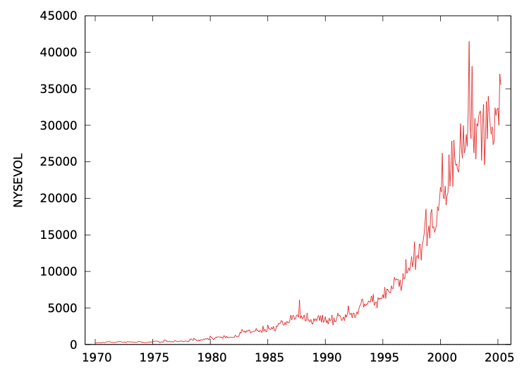
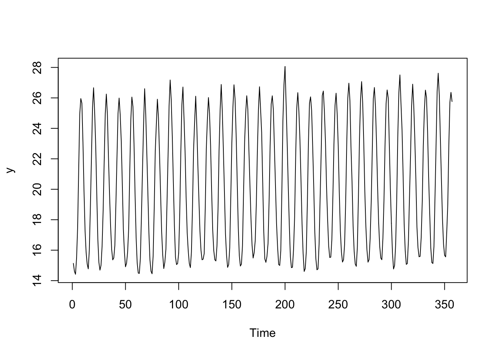
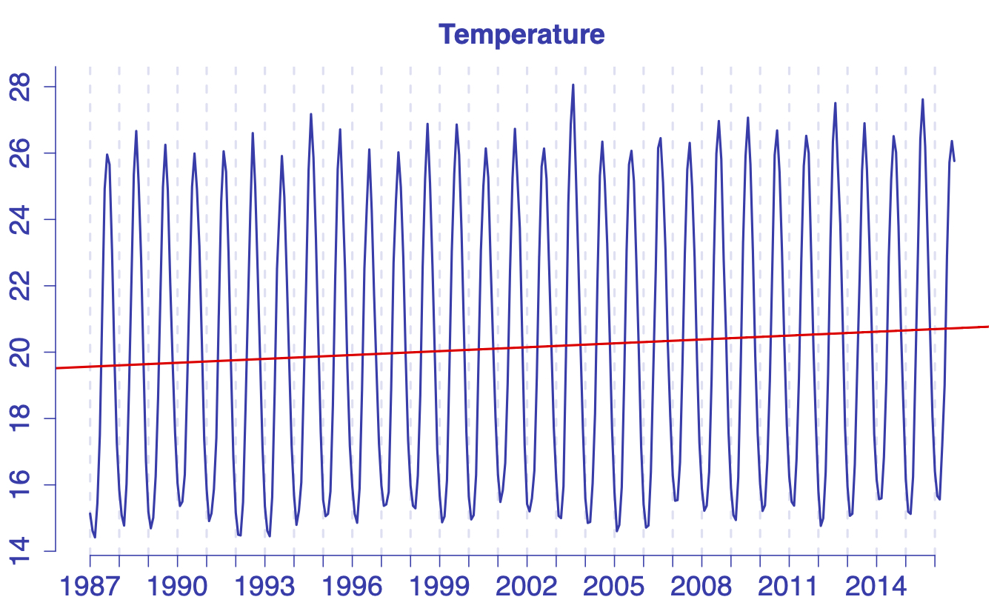
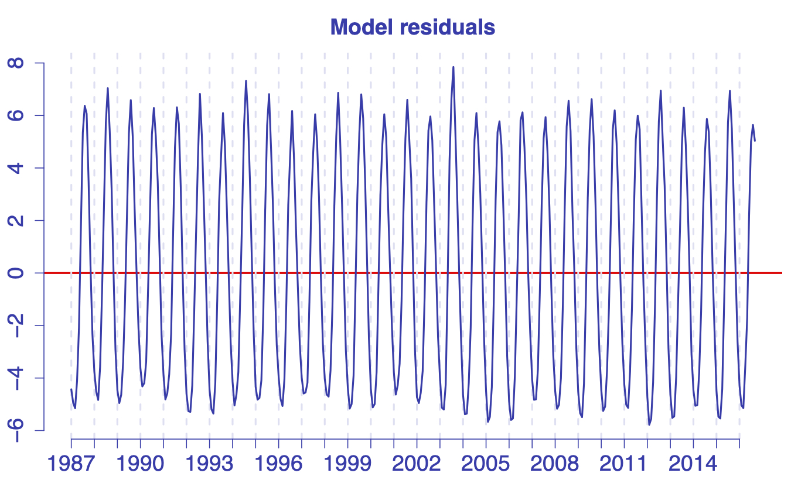

# Serie storiche
.png)


Una definizione informale

> Una serie storica $\{y_t\}$, $t = 1,\ldots, T$, è una sequenza di osservazioni rilevata su di una singola variabile.

Si noti che:

* l'indice $t$ delle osservazioni rappresenta il tempo,
* l'ampiezza campionaria viene indicata con $T$,
* assumeremo, per semplicità, che le osservazioni vengano rilevate a intervalli regolari di tempo,
* **non** assumeremo che le osservazioni siano *i.i.d.*,
* saremo in genere interessati nell'ottenere inferenze rispetto a $y_{T+h}$, con $h$ che rappresenta *l'orizzonte di previsione*. In genere, saremo interessati ad ottenere una *previsione* per il valore di $y_{T+1}$.




I dati che useremo sono disponibili a questo [link](http://academic.cengage.com/resource_uploads/downloads/032432359X_76181.zip).

Il dataset contiene due serie storiche mensili sulla temperatura della superficie marina e il livello di clorofilla vicino alla superficie dell'oceano.

Il periodo di osservazione parte da gennaio 1987 e arriva a novembre 2016.

I fenomeni rilevati sono importanti per diverse ragioni

* per gli oceanografi, metereologi e climatologi, essi rappresentano uno dei segnali dello scambio di energia tra l'oceano e l'atmosfera;
* per i biologi marini, essi determinano lo sviluppo di differenti organismi biologici;
* per i pescatori, rilevanti variazioni nella temperatura possono indicare zone prolifiche per la pesca.

In genere, è consigliabile definire un *periodo di stima* ed un *periodo di validazione*

* le osservazioni nel periodo gennario 1987 fino a settembre 2016 saranno utilizzate per identificare un modello, stimarlo e ottenere una previsione,
* le ultime due osservazioni (ottobre e novembre 2016) saranno quindi paragonate alle previsioni per valutare le capacità predittive del modello identificato.

Le due parti del *dataset* si trovano nei due *file* [data.csv](https://www.dropbox.com/s/smi7he4sdzgjk77/data.csv?dl=1) e [validation.csv](https://www.dropbox.com/s/rj95a20fq5pes1d/validation.csv?dl=1).

Entrambi i file contengono una terza serie storica, che è stata generata artificialmente.

```r
# Data import
dataset = read.csv('data.csv')
head(dataset, 16)
```

```
##    Time Year Month     Temp         Chl         w
## 1     1 1987     1 15.13394 -0.14451124  6.417343
## 2     2 1987     2 14.61469 -0.22089494  2.950538
## 3     3 1987     3 14.41865 -0.30399534  5.464654
## 4     4 1987     4 15.45596 -0.24689880  2.060287
## 5     5 1987     5 17.48308 -0.21311762  4.806130
## 6     6 1987     6 21.29084 -0.20264959  8.932903
## 7     7 1987     7 24.93280 -0.18946974 10.898198
## 8     8 1987     8 25.95497 -0.19630171  2.630377
## 9     9 1987     9 25.65588 -0.18868280  3.076883
## 10   10 1987    10 23.10903 -0.15422266  3.390082
## 11   11 1987    11 19.88245 -0.10641525  7.489066
## 12   12 1987    12 17.27361 -0.06731371  7.363165
## 13   13 1988     1 15.84286 -0.14969413  5.300799
## 14   14 1988     2 15.08528 -0.21976663  4.550507
## 15   15 1988     3 14.77392 -0.26324819  4.342551
## 16   16 1988     4 16.02603 -0.23149326  6.266070
```

```r
#
y = dataset$Temp                 # Temperature
z = dataset$Chl                  # Chlorophill
w = dataset$w                    # An artificial TS
month = as.factor(dataset$Month) # Month indicator
#
Ti = nrow(dataset)               # Sample size
nYears = ceiling(Ti / 12)        # Number of years
```
Per ogni serie storica, abbiamo

* $T$ = `Ti` = 357 osservazioni mensili,
* relative ad un arco temporale di `nYears` = 30 anni.

> Il vettore `month` è stato importato sotto forma di `factor`. Più avanti ne sarà chiarito il motivo.

Il grafico rivela intuitivamente la natura delle due serie

```r
# Plots
plot.ts(z)
```


```r
plot.ts(y)
```




## Obiettivi della ricerca
* qual è, date le informazioni disponibili, la migliore ipotesi a proposito della temperatura nel mese di ottobre 2016?
* ... e di novembre 2016?
* la temperatura sta salendo nel tempo?
* è ragionevole utilizzare la temperatura come un predittore del livello della clorofilla?


Tenteremo di ottenere queste inferenze usando modelli che derivano dal modello di regressione.

> *Disclaimer*
> 
> I modelli presentati qui sono ovviamente troppo semplici per dare una risposta affidabile a queste domande.

I grafici riportati sopra suggeriscono che il *tempo* possa essere un regressore per i fenomeni che stiamo studiando.

Un punto, centrale nell'analisi delle serie storiche, è che i modelli di regressione 'standard' non riescono ad incorporare adeguatamente la relazione temporale che esiste tra le osservazioni. Quindi, noi

* partiremo da un modello di regressione *naive*,
* illustreremo la struttura di dipendenza residua, che il modello non riesce a catturare,
* proporremo un metodo per risolvere il problema in maniera appropriata.

## Modelli di regressione per serie storiche
### Un modello con trend lineare

> Un **trend** rappresenta un lento movimento di lungo periodo nell'evoluzione della serie storica.

I trend possono essere **deterministici** or **stocastici**. Qui considereremo modelli contenenti un trend deterministico della forma
$$
 y_t  = T_t + \varepsilon_t,\qquad \varepsilon_t\stackrel{iid}{\sim} D(0,\sigma^2).
$$
Se il trend è lineare, cioè se $T_t = \beta_0 + \beta_1 t$, il modello può essere riscritto come
$$
 y_t = \beta_0 + \beta_1 t + \varepsilon_t,
$$
e può essere stimato tramite minimi quadrati ordinari (*Ordinary Least Squares*, OLS).

> Si noti come il vettore $t = \{1,2,\ldots,T\}$, che contiene l'indice delle osservazioni, qui giochi il ruolo di un regressore.

### Stimatore OLS
Siano dati i seguenti **assunti sul termine di errore**

* gli errori $\varepsilon_t$ sono **independenti** e identicamente distribuiti ($iid$),
* hanno media nulla e una varianza costante $\sigma^2$.

Sotto questi assunti, lo stimatore OLS è **corretto** e **consistente**.

Se gli errori sono anche Normalmente distribuiti, allora lo stimatore OLS estimator è anche il più efficiente tra gli stimatori lineari e non distorti (*Best Linear Unbiased Estimator, BLUE*).

### Stime puntuali
I parametri del modello sono $\beta_0$, $\beta_1$ e $\sigma^2$. Si dimostra che lo stimatore OLS è il seguente
\begin{eqnarray*}
 \hat\beta_1 & = & \displaystyle\frac{\sum_{t=1}^T (t-\bar t)(y_t-\bar y)}{\sum_{t=1}^T (t-\bar t)^2}\\
 \hat\beta_0 & = & \bar y-\hat\beta_1\bar t\\
 \hat\sigma & = & \sqrt{\displaystyle\frac{\sum_{t=1}^T e_t^2}{T-2}}
\end{eqnarray*}
con $e_t = y_t - \hat\beta_0 - \hat\beta_1 t$.

Possiamo utilizzare il comando `lm` per ottenere le stime OLS per i dati sulla temperatura

```r
# OLS estimate (Linear Trend model)
tt = 1:Ti     # the 'regressor'
fitLT = lm(y ~ tt)
summary(fitLT)
```

```
## 
## Call:
## lm(formula = y ~ tt)
## 
## Residuals:
##     Min      1Q  Median      3Q     Max 
## -5.7805 -4.1470 -0.5607  4.3310  7.8463 
## 
## Coefficients:
##              Estimate Std. Error t value Pr(>|t|)    
## (Intercept) 19.559946   0.440915   44.36   <2e-16 ***
## tt           0.003265   0.002135    1.53    0.127    
## ---
## Signif. codes:  0 '***' 0.001 '**' 0.01 '*' 0.05 '.' 0.1 ' ' 1
## 
## Residual standard error: 4.157 on 355 degrees of freedom
## Multiple R-squared:  0.006547,	Adjusted R-squared:  0.003749 
## F-statistic:  2.34 on 1 and 355 DF,  p-value: 0.127
```
Il suffisso `LT` nel nome dell'oggetto `fitLT` sta per `L`*inear* `T`*rend*.

Il modello stimato risulta quindi
$$
 \hat y_t = \underset{(0.440)}{19.559} + \underset{(0.003)}{0.002}\cdot t, \qquad \hat\sigma^2 = 4.157^2.
$$

**Domande**

* il valore di $\beta_0$ risulta significativamente diverso da zero?
* e $\beta_1$?
* il modello risulta utile alla spiegazione del fenomeno?

E' possibile dare una risposta qualitativa dando uno sguardo alla retta di regressione

```r
# Regression line
plot.ts(y)
abline(fitLT$coeff)
```





### Model diagnostics
We already noticed, from the plot of the regression line, that the model doesn't fit the data. More formally, model diagnostics are based on the model residuals
$$
 e_t = y_t - \hat\beta_0 - \hat\beta_1 t.
$$
In a correctly specified model, the residuals
* should wander randomly around the horizontal line,
* should have the same variance for all the values of the covariate(s).

The residuals can be obtained using
```
# Model residuals
e = fitLT$residuals
```
and plotted using
```
plot.ts(e)
abline(h=0)
```
The *seasonal* behaviour of the series is not caught by the model, hence we still find it in the residuals.


