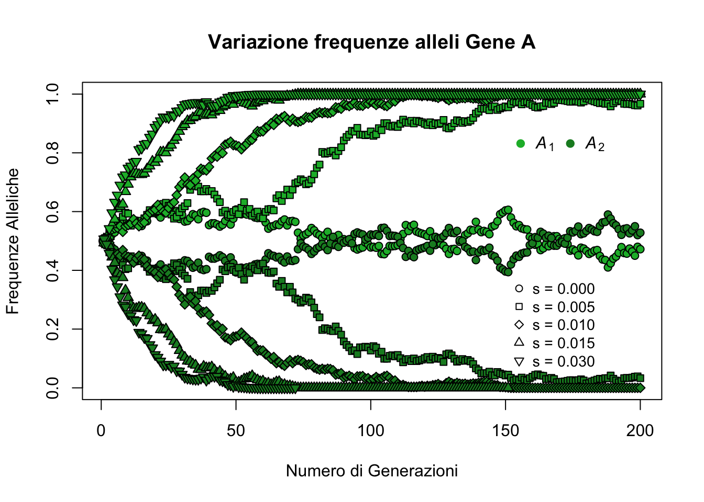
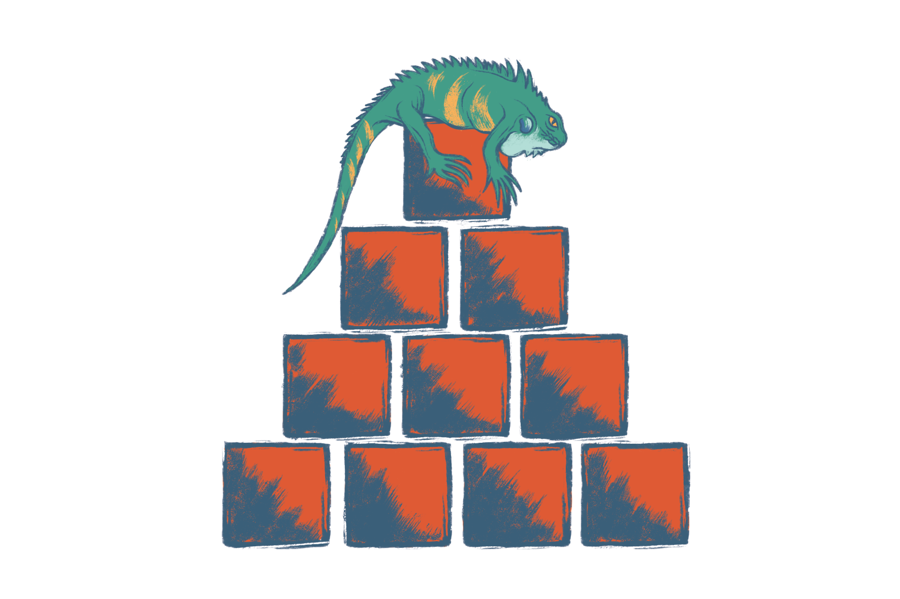
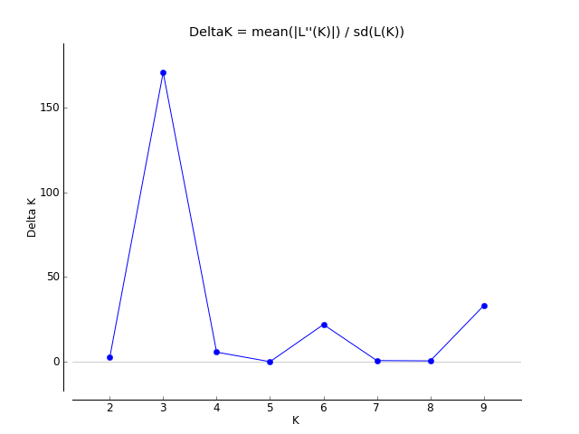
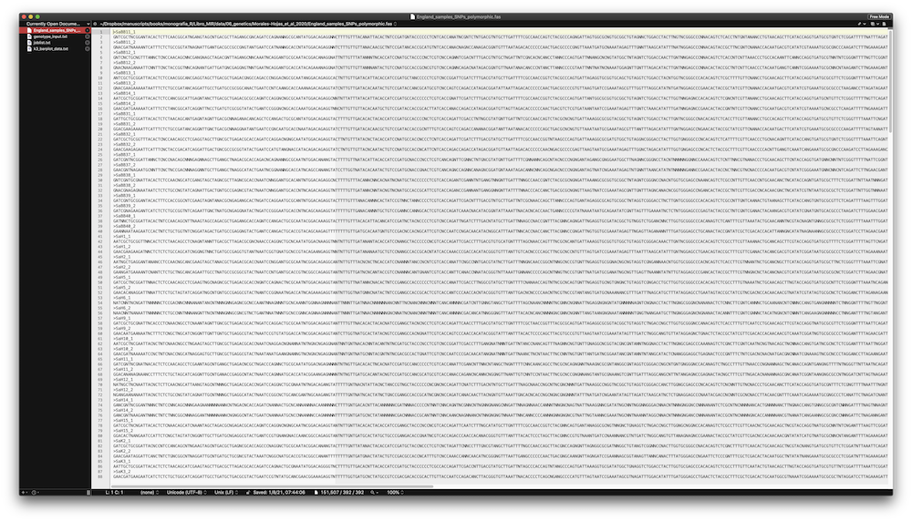

# Genetica {#gen}


## Introduzione {#gen_intro}

Nonostante il titolo, lo scopo di questo capitolo non è certo quello di insegnare la genetica! In effetti, quando si parla di genetica spesso ci si riferisce a quella branca della biologia (o della medicina) che ha a che fare con provette e pipette piuttosto che con la riga di comando! Se si è muniti di una fantasia particolarmente vivida la parola genetica ci fa venire in mente gli esperimenti di Jurassic Park per riportare in vita i dinosauri, o quelli che facevano nei laboratori dell'Umbrella Corporation e che hanno generato il temibilissimo T-Virus di Resident-Evil. 

Tuttavia, un importante aspetto della genetica e delle sue applicazioni (come la genetica di popolazione, la genetica evoluzionistica o la genetica della conservazione) risiede proprio nell'analisi numerica. Se non siete convinti di questa affermazione pensate solo al fatto che [Gregor Mendel](https://en.wikipedia.org/wiki/Gregor_Mendel), uno dei padri della genetica, teorizzò la presenza di unità ereditarie (i geni) basandosi solo sull'osservazione e sul conteggio di piselli di diversa forma e colore! E, di certo, non aveva nessun computer che lo aiutasse a tenere i conti o ad organizzare i dati o a fare simulazioni! Proprio per questo *R* può diventare un ottimo alleato per aiutarci a capire meglio e ad analizzare anche i dati di tipo genetico.

### Perché la genetica con R?

Nel suo libro dedicato alle analisi filogenetiche Emmanuel Paradis evidenzia alcune caratteristiche che fanno di *R*  uno strumento di analisi per i dati genetici molto valido [@Paradis2012]. 

- **Integrazione**
  - i dati genetici sono di diversa natura. Se questo potrebbe rappresentare un problema per altri softwares di analisi, di sicuro non lo è per *R*. I nostri dati, che si tratti di sequenze, di polimorfismi singoli, o di un altro tipo di *tipizzazione* genetica, possono essere organizzati nelle diverse classi di dati che *R* ci mette a disposizione;
- **Interattività**
  - i nostri dati diventano un oggetto con il quale è possibile interagire a qualsiasi stadio della nostra analisi, per non perdere traccia di quello che sta succedendo "dietro le quinte";
- **Programmabilità**
  - possiamo adattare le nostre esigenze di analisi creandoci test e analisi *ad-hoc*. In questo modo non sarà più necessario dover continuamente cambiare software di analisi, ma potremmo svolgere il nostro lavoro dall'inizio alla fine all'interno dello stesso ambiente;
- **Evolvibilità**
  - proprio come il mondo biologico intorno a noi, *R* è un ambiente in continua evoluzione. Questo continuo processo evolutivo consente di accomodare l'evolversi del tipo di analisi che stiamo applicando ai nostri dati.

Per uno studioso o un ricercatore laspetto dell' **Interattività** è fondamentale! La possibilità di vedere e modificare i dati in qualsiasi momento dell'analisi permette anche di sviluppare e confutare ipotesi teoriche e modelli che hanno contribuito alla generazione dei dati stessi.

### Risorse 

Altro punto di forza delle analisi genetiche con *R* è che si può contare sull'aiuto di una comunità in costante crescita ed evoluzione. Sono numerosissimi i pacchetti disponibili per le analisi più variegate ([qui](https://cran.r-project.org/web/views/Genetics.html) e [qui](http://www.bioconductor.org) trovate una lista, ragionevolmente aggiornata, ma non esaustiva, di pacchetti e risorse disponibili). Funzioni singole per effettuare analisi specifiche sono spesso disponibili su [GitHub](https://github.com) e vengono distribuite e aggiornate dai diversi autori e collaboratori. Quindi non preoccupatevi se all'inizio vi sentite disorientati e non sapete bene come maneggiare i vostri dati genetici. Come spesso accade, lo stesso problema che dovrete risolvere sarà probabilmente capitato a qualcuno prima di voi, quindi, se proprio non riuscite a venirne a capo per conto vostro, non disperate e affinate le vostre capacitá di ricerca sui vari motori di ricerca o su [StackOverflow](https://stackoverflow.com).  

### Prima di cominciare...

In questo capitolo non possiamo certo aspettarci di imparare a svolgere tutte le possibili analisi genetiche in *R*. Daremo, piuttosto, uno sguardo d'insieme ad alcuni dei meccanismi fondamentali che sono alla base delle analisi di genetica di popolazione, ed impareremo a svolgere alcune delle analisi che generalmente costituiscono la base di partenza per studi più approfonditi. Per questo motivo è importante avere un minimo di familiarità con la terminologia fondamentale della genetica (allele, eterozigosi, popolazione, genotipo, gene, generazione, etc. etc. etc.). Quindi, se avete bisogno di rinfrescare la memoria, fatelo prima di incominciare quest'avventura. 

Spesso i ricercatori cercano di rispondere a domande quali "Con quale frequenza un certo gene compare all'interno di un gruppo di individui?"; "Con quale probabilità la frequenza allelica rimarrà costante generazione dopo generazione?"; "Quali sono i fattori che alterano le frequenze geniche?"; "In quali regioni del genoma è più visibile l'effetto della selezione?"; "Che correlazione esiste tra la dimensione di una popolazione e la sua diversità genetica?". Per rispondere a queste domande non si può prescindere dalla statistica e dal calcolo delle probabilità. Se avete bisogno di rinfrescare anche alcuni di questi concetti sarebbe bene farlo, ma se siete arrivati fino a qui nella lettura probabilmente avete già rinfrescato la vostra memoria. 

## Deriva Genetica {#gen_drift}

Uno dei concetti fondamentali della genetica di popolazione e, ad una scala più grande, dell'evoluzione è la *Deriva Genetica*. Immaginiamo di essere su una zattera alla deriva, in balia di vento e onde. Non sappiamo quando vedremo terra e neanche se il nostro approdo sarà un luogo più grande o più piccolo di quello da dove veniamo, più bello o più brutto, più ricco o più povero. Possiamo, però, essere ragionevolmente sicuri che, ovunque arriveremo, lo scenario che ci si presenterà sarà diverso da quello iniziale!

Il concetto di *Deriva Genetica* si ispira proprio a questo scenario alla Robinson Crusoe e si riferisce alla casuale selezione di gameti dall'insieme iniziale di geni di una popolazione. Se i gameti in una popolazione sono piccole zattere in mezzo al mare spinti solo da vento e onde, l'assortimento di gameti che arriveranno su un'isola per stabilire una nuova popolazione può essere paragonato ad un processo casuale che porterà alla formazione di una popolazione con caratteristiche diverse da quelle di origine. 


Possiamo usare *R* e quello che abbiamo imparato fino ad ora per esplorare meglio questo concetto teorico e simularlo. Immaginiamo di lavorare con una popolazione di $N$ = 50 individui. Il genoma di questa specie è formato da 3 geni differenti che chiameremo gene $A$, gene $B$ e gene $C$. La specie è diploide, quindi ogni individuo possiede 2 copie per ogni gene. Poniamo anche che gli alleli (varianti dello stesso gene) per ogni gene sono solamente 2 che indicheremo con $A_{1}$ e $A_{2}$, $B_{1}$ e $B_{2}$, e $C_{1}$ e $C_{2}$. Il numero totale di geni nella popolazione sarà quindi: $N_{geni}$ = 2 x 3 x 50 = 300. Infine, poniamo che le frequenze ($p$) iniziali di ognuno degli alleli per ogni gene sono identiche con $p_{A_{1}}$ = $p_{A_{2}}$ = $p_{B_{1}}$ = $p_{B_{2}}$ = $p_{C_{1}}$ = $p_{C_{2}}$ = 0.5. 

Creiamo questa popolazione. Un approccio (ricordate che in *R* raramente c'è un solo approccio per fare le cose!) potrebbe essere il seguente. Sapendo a priori che il genoma dei nostri individui è formato da 3 geni ognuno con 2 alleli, e sapendo la frequenza di ognuno di questi alleli, possiamo organizzare i genotipi in una lista.


```r
# genotipo degli individui organizzato in una lista
# ogni elemento della lista si riferisce ad un gene
pop.ls <- list('gene A' = c(rep("A_1", 50),
                            rep("A_2", 50)), 
               'gene B' = c(rep("B_1", 50),
                            rep("B_2", 50)),
               'gene C' = c(rep("C_1", 50),
                            rep("C_2", 50)))
```

Potremmo scegliere di riassumere le frequenze alleliche della popolazione utilizzando una normale tabella come quella qui sotto.

------------------------------------
 Alleli    gene A   gene B   gene C 
--------- -------- -------- --------
 **A_1**    0.5       0        0    

 **A_2**    0.5       0        0    

 **B_1**     0       0.5       0    

 **B_2**     0       0.5       0    

 **C_1**     0        0       0.5   

 **C_2**     0        0       0.5   
------------------------------------

Lavorando un po' con i nostri dati possiamo però trovare una soluzione più intuitiva per visualizzare la distribuzione delle frequenze alleliche nella nostra popolazione, magari in una mamiera che renda anche semplice vedere la variazione delle frequenze da una generazione all'altra. 


```r
# trasformiamo la lista in un data frame
pop.df <- data.frame(Gene = c(rep("gene A", 100), 
                              rep("gene B", 100),
                              rep("gene C", 100)),
                     Alleles = matrix(unlist(pop.ls),
                                      ncol = 1, 
                                      byrow=F))

# tabuliamo le frequenze alleliche
f_tab <- table(pop.df$Allele, pop.df$Gene)/nrow(pop.df[pop.df$Gene == "gene A",])

# utilizziamo i dati tabulati per creare un plot a barre 
barplot(f_tab,
        col = c("#14B635", "#158A29",
                "#23A9F6", "#2970A1",
                "#F77023", "#AF4E18"), 
  xlab = "", ylab = "Frequenze alleliche",
  axes = F)
axis(side = 2, 
     labels = seq(from = 0, to = 1, by = 0.1),
     at = seq(from = 0, to = 1, by = 0.1))
lines(x = c(0.06,1,2,3,3.6),
      y = c(0.5, 0.5, 0.5, 0.5, 0.5),
      lty = 2, 
      col = "red")
par(xpd = TRUE)
legend(3.6, 1, 
       c(expression(italic(A)[1]), expression(italic(A)[2]),
         expression(italic(B)[1]), expression(italic(B)[2]),
         expression(italic(C)[1]), expression(italic(C)[2])),
       pch = rep(19, 4), 
       col = c("#14B635", "#158A29",
               "#23A9F6", "#2970A1",
               "#F77023", "#AF4E18"),
       horiz = F, bty = "n")
```


Questa rappresentazione grafica  mostra chiaramente le frequenze alleliche iniziali della popolazione. La linea rossa tratteggiata attraversa le tre barre colorate e le taglia esattamente al valore di 0.5, la frequenza che avevamo stabilito. Cosa succede dopo una generazione in cui la deriva genetica è la sola forza che agisce sulle frequenza geniche? In altre parole, campionando a caso come cambiano le frequenze alleliche nella generazione successiva? La funzione `sample()` fa al caso nostro perché ci permette di simulare il campionamento casuale e la deriva dei geni all'interno della popolazione.


```r
# per ottenere gli stessi risultati dell'esempio
set.seed(482)

# campioniamo ogni elemento della lista (ogni gene) 100 volte
# ammettiamo il replacement degli alleli
pop.ls.t1 <- lapply(pop.ls, sample, 100, replace = T)
```

Adesso riproduciamo il codice per creare un nuovo grafico aggiornato con le frequenze alleliche della nuova generazione.


```r
# trasformiamo la lista in un data frame
pop.df.t1 <- data.frame(Gene = c(rep("gene A", 100),
                                 rep("gene B", 100),
                                 rep("gene C", 100)),
                     Alleles = matrix(unlist(pop.ls.t1), ncol = 1, byrow=F))

# tabuliamo e per creiamo il plot a barre 
barplot(table(pop.df.t1$Allele,
              pop.df.t1$Gene)/nrow(pop.df.t1[pop.df.t1$Gene == "gene A",]),
        col = c("#14B635", "#158A29",
                "#23A9F6", "#2970A1",
                "#F77023", "#AF4E18" ),
        xlab="", ylab="Frequenze alleliche", axes = F)
axis(side = 2, labels = seq(from = 0, to = 1, by = 0.1),
     at = seq(from = 0, to = 1, by = 0.1))
lines(x = c(0.06,1,2,3,3.6), y = c(0.5, 0.5, 0.5, 0.5, 0.5),
      lty = 2, col = "red")
par(xpd=TRUE)
legend(3.6, 1, 
       c(expression(italic(A)[1]), expression(italic(A)[2]),
         expression(italic(B)[1]), expression(italic(B)[2]),
         expression(italic(C)[1]), expression(italic(C)[2])),
       pch = rep(19, 4), 
       col = c("#14B635", "#158A29",
               "#23A9F6", "#2970A1",
               "#F77023", "#AF4E18"),
       horiz = F, bty = "n")
```


Dopo una sola generazione le frequenze sono cambiate! Tutti gli alleli nella nostra popolazione hanno subito una variazione. Questa variazione potrebbe non sembrare molto grande o comunque non particolarmente significativa, ma c'è. Possiamo chiaederci un'altra domanda. Cosa succede dopo 200 generazioni di variazione stocastica delle frequenze alleliche? Cerchiamo di visualizzare passo passo come le frequenze cambiano in relazione al passare del tempo.


```r
set.seed(23561)
geneA <- vector(mode = "list", length = 200)
geneB <- vector(mode = "list", length = 200)
geneC <- vector(mode = "list", length = 200)
geneA[[1]] <- pop.ls[[1]]
geneB[[1]] <- pop.ls[[2]]
geneC[[1]] <- pop.ls[[3]]

for (i in 2:200) {
  geneA[[i]] <- sample(geneA[[i-1]], 100, replace = T)
  geneB[[i]] <- sample(geneB[[i-1]], 100, replace = T)
  geneC[[i]] <- sample(geneC[[i-1]], 100, replace = T)
}

freqA <- NULL
freqa <- NULL
freqB <- NULL
freqb <- NULL 
freqC <- NULL
freqc <- NULL 
for (i in 1:200) {
  freqA[i] <- sum(geneA[[i]] == "A_1")/ length(geneA[[i]])
  freqa[i] <- sum(geneA[[i]] == "A_2")/ length(geneA[[i]])
  freqB[i] <- sum(geneB[[i]] == "B_1")/ length(geneB[[i]])
  freqb[i] <- sum(geneB[[i]] == "B_2")/ length(geneB[[i]])
  freqC[i] <- sum(geneC[[i]] == "C_1")/ length(geneC[[i]])
  freqc[i] <- sum(geneC[[i]] == "C_2")/ length(geneC[[i]])
}

plot(1,0, type="n",
     xlim=c(1,200),
     ylim=c(0,1),
     main = "Variazione frequenze alleliche nei geni A, B e C",
     xlab="Generazioni", ylab="Frequenze alleliche"
     )
points(1:200, freqA, pch = 21, col = "black", bg = "#14B635")
points(1:200, freqa, pch = 21, col = "black", bg = "#158A29")
points(1:200, freqB, pch = 21, col = "black", bg = "#23A9F6")
points(1:200, freqb, pch = 21, col = "black", bg = "#2970A1")
points(1:200, freqC, pch = 21, col = "black", bg = "#F77023")
points(1:200, freqc, pch = 21, col = "black", bg = "#AF4E18")
par(xpd=TRUE)
legend(180, .75, 
       c(expression(italic(A)[1]), expression(italic(A)[2]),
         expression(italic(B)[1]), expression(italic(B)[2]),
         expression(italic(C)[1]), expression(italic(C)[2])),
       pch = rep(19, 4), col = c("#14B635", "#158A29",
                                 "#23A9F6", "#2970A1",
                                 "#F77023", "#AF4E18" ),
       horiz = F, bty = "n")
```


Il blocco di codice appena eseguito simula lo scorrere del tempo per la nostra popolazione (200 generazioni). Il grafico mostra la naturale (e stocastica) oscillazione delle frequenze geniche al passare delle generazioni. È interessante notare come dopo circa 150 generazioni l'allele $C_{2}$ va a fissazione ($p_{C_{2}}$ = 1), mentre l'allele $C_{1}$ si estingue dalla popolazione ($p_{C_{1}}$ = 0). Gli alleli degli altri due geni continuano ad oscillare e per capire quanto tempo ci vuole affinchè arrivino a fissazione/estinzione bisgnorebbe continuare la simulazione. 

Un aspetto importante da tenere in considerazione quando parliamo di processi stocastici è che prendere una decisione operativa sulla base dei risultati di una singola simulazione potrebbe non avere molto senso. Se infatti provassimo ad ottenere un nuovo grafico delle frequenze alleliche a partire da un altro "seme" iniziale i risultati sarebbero differenti. Quello che possiamo fare è, quindi, riprovare a far correre la simulazione diverse volte, e calcolare i valori medi dei risultati. Ad esempio, un aspetto interessante in biologia evoluzionistica è la stima del tempo medio di fissazione di un allele in uno scenario in cui il solo motore che contribuisce alla variazione delle frequenze è la *Deriva Genetica*. Questo ci offre le basi per construire un'**ipotesi nulla** da poter confrontare con i dati reali e poterli meglio interpretare.  Vediamo come costruire una distribuzione di tempi medi di fissazione da usare come ipotesi nulla.


```r
# Funzione per simulare il tempo medio di fissazione degli alleli

# pop.ls = Lista. Ogni elemento contiene i geni della popolazione
# num.sim = Numero di iterazioni della simulazione 
sim.gen2fix <- function (pop.ls, num.sims) {
  
  # Numero totale di loci per ogni gene nella popolazione  
  n <- length(pop.ls[[1]])
  # Numero di geni differenti nella popolazione
  n.genes <- length(pop.ls)
  # Creo una lista vuota per contenere i risultati della simulazione.
  # Il numero di elementi è pari al numero di geni diversi.
  # Ogni elemento è un vettore di lunghezza pari al numero di simulazioni.
  generations <- vector(mode = "list", length = length(pop.ls))
  for (h in 1:n.genes){
    generations[[h]] <- rep(0, num.sims)
  }
  names(generations) <- names(pop.ls)
  
  # Ciclo di simulazione 
  for (i in 1:num.sims) {
    temp.pop.ls <- pop.ls
    for (y in 1:n.genes) {
      while (max(table(temp.pop.ls[[y]])) < n) {
        temp.pop.ls[[y]] <- sample(temp.pop.ls[[y]], 100, replace = T)
        generations[[y]][i] <- generations[[y]][i] + 1
      }
    }
  }
  
  # Statistiche descrittive dei risultati
  df <- rbind(data.frame(lapply(generations, mean)),
        data.frame(lapply(generations, sd))) 
  rownames(df) <- c("mean", "sd")

  # Ciclo per plottare i risultati
  # Da modificare se i geni da plottare sono > 3
  par(mfrow = c(2,2))
  for (z in 1:n.genes) {
    graph <- generations[[z]]
    hist(graph, main = paste("Num. medio di Generazioni per \nfissazione ",
                             names(generations[z])),
         xlab = "Generazioni")
    abline(v = df[1,z], col = "orange", lwd = 1.5, lty = 2)
  }
  return(df)
}

sim.gen2fix(pop.ls, 1000)
```

```
##         gene.A  gene.B    gene.C
## mean 135.23800 139.435 133.83200
## sd    99.41759 102.342  97.99392
```


I dati che abbiamo simulato ci dicono che in media ci vogliono circa 135 generazioni prima che uno dei due alleli vada a fissazione. Ovviamente questo è uno scenario estremamente semplificato, ma permette comunque di avere un'ipotesi nulla da usare per la verifica di dati sperimentali. 

Immaginiamo di trasferirci in laboratorio. Vogliamo verificare sperimentalmente se le fluttuazioni delle frequenze alleliche osservate in diverse colture di moscerini sono dovute al caso o sono invece dovute alla forza selettiva applicata da diversi ambienti nei quali le nostro colonie sono cresciute. Anche qui, per facilitare la comprensione del meccanismo, ci soffermeremo su popolazioni di 500 individui con 3 geni diploidi. Per prima casa simuliamo la popolazione sorgente che nasce e scresce in un ambiente privo di selezione. 


Cosa succede se non lasciamo che sia solo il caso a guidare la variazione delle frequenze alleliche? In altre parole, cosa succede quando applichiamo una pressione selettiva che favorisce alcuni geni/alleli rispetto ad altri? Per semplicità svolgeremo questa procedura su uno solo dei 3 geni e visualizzeremo come le frequenze cambiano al variare del coefficiente di selezione.



È evidente che tanto più intensa è la pressione selettiva tanto più rapidamente gli alleli andranno a fissazione. A questo punto possiamo porre un'altra domanda interessante: ammettendo che sia solo la deriva genetica a produrre un cambiamento nelle frequenze alleliche della popolazione, che effetto hanno parmentri come la dimensione della popolazione e la frequenza allelica iniziale sulla stima del tempo medio di fissazione dei diversi geni? Intuitivamente, possiamo immaginare che entrambi i fattori possano avere un ruolo nell'influenzare il tempo medio di fissazione di un gene. La relazione matematica formale che tiene insieme tutte queste variabili e che descrive la loro interazione è evidenziata nella seguente equazione dove $t_{fix}$ è il tempo (generalmente espresso in numero di generazioni) necessario alla fissazinoe di un allele, $N_{e}$ è la [dimensione effettiva della popolazione](https://en.wikipedia.org/wiki/Effective_population_size) e $p$ è la frequenza allelica.

$$t_{fix} = \frac{-4N_e(1-p)log(1-p)}{p}$$

Come al solito, cerchiamo di ottenere una rappresentazione grafica di questo processo e costruiamo un grafico in cui visualizziamo l'output di questa equazione con diversi valori di $p$ e di $N_{e}$. 


```r
# per visualizzare i numeri non in notazione scientifica
options(scipen=999)

# vettore con 4 differenti frequenze alleliche
p <- c(0.01, 0.1, 0.25, 0.5)

# vettore con 10 differenti valori di dimensione effettiva di popolazione 
N <- c(20, 50, 100, 500, 1000, 5000, 10000, 25000, 50000, 100000)

# creo un data.frame con combinazione di tutti i valori
df <- expand.grid(p, N)
colnames(df) <- c("p", "N")

# aggiungo una colonna per contenere il valore del tempo di fissazione
df$tfix <- NA

# loop per applicare l'equazione
for(i in 1:nrow(df)) {
  df[i, 3] <- ((-4*df[i,2])*(1-df[i,1])*log(1-df[i,1]))/df[i,1]
}

# grafico
plot(df[df$p == 0.01, "N"], 
     df[df$p == 0.01, "tfix"],
     type = "b",
     col = "red",
     xlab = "Dimensione della popolazione",
     ylab = "Tempo (Num. di Generazioni)")
lines(df[df$p == 0.1, "N"], 
      df[df$p == 0.1, "tfix"],
      type = "b",
      col = "green")
lines(df[df$p == 0.25, "N"], 
      df[df$p == 0.25, "tfix"],
      type = "b",
      col = "blue")
lines(df[df$p == 0.5, "N"], 
      df[df$p == 0.5, "tfix"],
      type = "b",
      col = "black")
legend("topleft", legend = c("0.01", "0.1", "0.25", "0.5"),
       title = "All. Freq.", 
       col = c("red", "green", "blue", "black"),
       lty = 1)
```


Facciamo un ulteriore passaggio e cerchiamo di capire on un approccio diverso quanto influente è il numero di individui per il mantenimento delle frequenze alleliche. Ritorniamo un secondo allo scenario alla Robinson Crusoe di cui abbiamo parlato all'inizio del capitolo: è molto probabile che il numero dei nuovi individui che fonderanno una nuova popolazione (le zatterine che arrivano sull'isola sperduta) sarà diverso (probabilmente più piccolo) di quello di origine. Che effetto ha questa variazione sulla frequenza allelica nella popolazione che si formerà nell'isola?  

Intuitivamente, quando la dimensione del campione ($N_{s}$) si avvicina a quella della popolazione reale ($N_{p}$) possiamo essere ragionevolmente sicuri che i paramteri che andiamo a stimare (nello specifico, le frequenze alleliche) si avvicineranno molto al valore reale. Viceversa, se N$_{s}$ << N$_{p}$ la varianza associata con la stima dei nostri parametri sarà molto larga e quindi la nostra stima non accurata. In altre parole, più grande è il numero di naufraghi che arrivano sull'isola deserta, più probabile che questi naufraghi riescano a catturare tutta la variabilità genetica presente nella popolazione di origine. Viceversa, più piccolo il numero di naufraghi, più grande sarà la probabilità che ci sia una differenza tra le frequenze geniche della popolazione sorgente e quella appena formata.

Un grafico ci aiuterà a capire meglio. Partiamo con una popolazione formata da individui con un singolo gene bi-allelico. Non ci interessa tanto sapere quanto è grande la nostra popolazione, ma partiamo con l'assunto che le frequenze alleliche iniziali siano $p_{A}$ = $p_{a}$ = 0.5. Andremo a simulare ciò che succede alle frequenze alleliche campionando da questa popolazione un numero variabile di individui.


```r
# pacchetti necessari per svolgere la simulazione
library(dplyr)
library(RColorBrewer)
library(tidyverse)
library(phangorn)

# un gene, due alleli
alleles <- c("A","a")

# il numero di indiviui che andremo a campionare
n_sizes <- c(5,10,20,50,100,500,1000)

# campioniamo 50 volte ognuno dei valori di n_sizes
df <- data.frame(N = rep(n_sizes, each=50),
                 Freq_A = NA,
                 Freq_a = NA)

# loop per popolare il dataframe
for(row in 1:nrow(df)) {
  # selezione casuale di alleli 
  a <- sample(alleles, size = df$N[row], replace = T)
  # calcolare la frequenza di uno degli alleli
  f <- sum( a == "A" ) / length(a)
  # assegna il valore nel dataframe
  df$Freq_A[row] <- f
  df$Freq_a[row] <- 1-f
}

# calcolare valori medi di frequenza di A e a
# per ognuno dei valori di n_sizes
df_mean_freq_N <- df %>% 
  group_by(as.factor(N)) %>% 
  summarise(A = mean(Freq_A),
            a = mean(Freq_a))

# calcolare valori di deviazione standard 
# di frequenza di A e a
# per ognuno dei valori di n_sizes
df_sd_freq_N <- df %>% 
  group_by(as.factor(N)) %>% 
  summarise(A = sd(Freq_A),
            a = sd(Freq_a))

# organizzare i valori medi in una matrice
df_mean_freq_N_mtrx <- as.matrix(df_mean_freq_N[,2:3])
rownames(df_mean_freq_N_mtrx) <- c(5,10,20,50,100,500,1000)
# organizzare i valori di sd in una matrice
df_sd_freq_N_mtrx <- as.matrix(df_sd_freq_N[,2:3])
rownames(df_sd_freq_N_mtrx) <- c(5,10,20,50,100,500,1000)
# funzione per aggiungere barre di sd ad un 
# grafico a barre
sd.bar <- function(x, y,
                      upper, lower = upper, length = 0.1, ...){
  arrows(x, y+upper, x, y-lower, angle = 90,
         code = 3, length = length, ...)
}

# creare grafico
df_mean_freq_N_mtrx.blt <-barplot(df_mean_freq_N_mtrx, beside = T, 
        ylim = c(0,1), col = rev(brewer.pal(7, "Blues")),
        xlab = "Alleli",
        ylab = "Frequenza")
legend("topright", legend = c(5,10,20,50,100,500,1000),
       fill = rev(brewer.pal(7, "Blues")), title = "N", horiz = T)
lines(x = seq(0, 16, 1), y = rep(0.5, 17),
      lty = 2, col = "red", lwd = 3)
sd.bar(df_mean_freq_N_mtrx.blt, df_mean_freq_N_mtrx, df_sd_freq_N_mtrx)
```


È facile vedere come i valori medi delle frequenze alleliche nei nostri campioni simulati sono abbastanza costanti (notare la riga rossa che taglia il grafico ad una frequenza di 0.5). Quello che varia significativamente da un valore di N all'altro è la deviazione standard associata alle nostre frequenze. Volendo semplificare il concetto ancora di più, più piccolo è il valore del campione $N_{s}$ più alta è la probabilità di vedere cambiata la frequenza allelica nelle generazioni successive. Da un punto di vista evolutivo questo è molto importante. Quando una popolazione subisce una drastica riduzione della popolazione (un collo di bottiglia) la sua composizione allelica sarà, molto probabilmente, diversa da quella precedente. 

In effetti, è possibile calcolare la probabilità di una certa frequenza allelica nella generazione successiva. I nostri assunti sono accoppiamento casuale ed un $N$ piccolo. Lavorando con un gene biallelico questo calcolo si può effettuare utilizzando un'espansione binomiale.

$$\frac{2N!}{N_{A}!(2N-N_{A})!} p_A^{N_A} (1-p_A)^{2N-N_A}$$

La prima parte dell'espansione ($\frac{2N!}{N_{A}!(2N-N_{A})!} p_A^{N_A}$) calcola il numero di combinazioni che abbiamo per ottenere esattamente $N_A$ volte l'allele $A$ pescando a caso dalla nostra popolazione $2N$. La seconda parte dell'espansione ($p_A^{N_A} (1-p_A)^{2N-N_A}$) calcola la probabilità di ognuna di queste combinazioni a partire dalla frequenza $p_A$ dell'allele $A$.

Svolgiamo un piccolo esempio per chiarirci le idee. Immaginiamo di avere una popolazione di 20 individui ($N = 20$) tutti eterozigoti per il gene $A$ (per $T_0$, $p_A$ = $p_a$ = 0.5, e quindi $N_A$ = $N_a$ = 20). Calcoliamo la probabilità di ottenere esattamente 20 copie dell'allele $A$ nella generazione successiva (ovvero $N_A$ = 20 a $T_1$). Sostituiamo i valori nella nostra espansione e poi andiamo a risolverla.

$$\frac{2*20!}{20!((2*20)-20)!} 0.5^{20} (1-0.5)^{(2*20)-20}$$


```r
p <- 0.5
N <- 20
N.A <- 20

(coef <- factorial(2*N)/ (factorial(N.A)*factorial(2*N - N.A)))
```

```
## [1] 137846528820
```

```r
(prob <- p^N.A * (1 - p)^(2*N-N.A))
```

```
## [1] 0.0000000000009094947
```

```r
(Prob.20.A <- coef*prob)
```

```
## [1] 0.1253707
```

Questo numero ci dice che la probabilità che la frequenza rimanga la stessa da una generazione all'altra (ovvero $N_A$ = 20 a $T_1$) è solo ~0.125, mentre la probabilità che cambi è di ~0.875. Approfondiamo ancora di più. Costruiamo una distribuzione per vedere con quale probabilità si potrebbero verificare diversi valori di $N_A$.


```r
N.A <- 0:(2*N)
bino_coef <- factorial(2*N)/( factorial(N.A)*factorial(2*N-N.A)) 
bino_prob <- p^N.A * (1-p)^(2*N-N.A)
change_prob <- bino_coef*bino_prob
df <- data.frame(N.A, change_prob)
barplot(df$change_prob,
        names.arg = df$N.A,
        cex.names = 0.7,
        xlab = expression(italic(N)[A]),
        ylab = "Prob.",
        las = 2)
```


La distribuzione ci racconta una storia interessante, ovvero che esiste una probabilità (anche se estremamente piccola!) che in una sola generazione un allele venga perso (e l'altro vada a fissazione). Ovviamente questa probabilità è talmente piccola da poter essere scartata, in particolare se si sta lavorando su scale temporali relativamente brevi.

Adesso cambiamo marcia e andiamo a vedere come poter quantificare le differenze che si creano tra diverse popolazioni che, per qualche motivo, sono separate o strutturate da un punto di vista genetico.


## Struttura genetica delle popolazioni {#gen_str}

In quasi completo contrasto con la casualità di cui abbiamo parlato nella precedente sezione di questo capitolo, qui parleremo di Struttura Genetica delle Popolazioni. Gli individui di una popolazione si dicono "strutturati" da un punto di vista genetico quando il loro genotipo non è indipendente dalla loro zona e/o tempo di campionamento. Ad esempio, se non esistesse una struttura genetica di popolazioni ci aspetteremmo di trovare le stesse caratteristiche genetiche in individui di una certa specie che sono campionati in aree o tempi distinti. Per una specie di pianta che è distribuita sui declivi di una collina ci possiamo aspettare, in assenza di struttura genetica di popolazione, la stessa composizione allelica per individui campionati ai piedi e sulla cima della collina. L'interazione delle forze evolutive, della deriva genetica, e dell'ambiente, in realtà, contribuiscono a creare una struttura genetica che puo essere più o meno accentuata a seconda del tipo e dell'intensità delle forze in gioco.





### Le statistiche F

In uno dei più importanti lavori della genetica di popolazioni pubblicati all'inizio del secolo scorso, Sewal Wright descrisse la predicibile relazione tra il grado di differenziazione genetica tra popolazioni e l'influenza di imporatanti processi evolutivi quali la migrazione, la mutazione e la deriva genetica [@Wright1931; @Wright1951; @Holsinger2009].

Le statistiche F introdotte da Wright [@Wright1931; @Wright1951] sono uno degli strumenti maggiormente usati per descrivere la struttura genetica di popolazione. Tre principali indici di differenziamento vengono usati:

- $F_{IS}$: la correlazione tra i gameti di un individuo rispetto alla sua sottopopolazione;

- $F_{IT}$: la correlazione tra i gameti di un individuo rispetto all'intera popolazione;

- $F_{ST}$: la correlazione tra gameti presi in maniera casuale all'interno di una popolazione rispetto all'intera popolazione.

Ognuno di questi indici è stato, nel corso degli anni, interpretato e "chiamato" con nomi diversi. Ad esempio Cockerham dimostra che i parametri $f$, $θ$ e $F$ hanno le caratteristiche approssimabili rispettivamente a $F_{IS}$, $F_{ST}$ ed $F_{IS}$ [@Cockerham1969]. 

La trattazione di questi indici è ampliamente documentata nelle fonti citate. Nelle seguenti sezioni andremo a vedere come è possibile stimare e visualizzare la struttura genetica di popolazione usando un metodo differente.

### Inferenza Bayesiana con STRUCTURE

Uno degli approcci che vengono usati sistematicamente per l'analisi della struttura genetica di popolazioni è quello dell'individuazione di clusters di campioni che sono maggiormente simili tra loro, da un punto di vista genetico, rispetto ad altri. Rivoluzionario, da questo punto di vista, fù il contributo del software [STRUCTURE](http://web.stanford.edu/group/pritchardlab/structure.html) che utilizza un modello Bayesiano e il calcolo di una *posterior probability* per l'inferenza di gruppi di campioni piu o meno simili tra loro [@Pritchard2000].

**STRUCTURE** è un software scritto usando il linguaggio Java ed è quindi possibile scaricarlo ed utilizzarlo in maniera indipendente da $R$. Tramite l'interfaccia $R$ e l'utilizzo di pacchetti specifici è però possibile parallelizzare il lavoro svolto dal software, in modo da poter drammaticamente velocizzare il calcolo delle probabilità a posteriori. 

Prima di procedere con un esempio pratico su come è possibile usare $R$ per velocizzare le nostre analisi è doveroso fare una precisazione di tipo tecnico. Il modo in cui i computers usano i loro "cores" per il calcolo parallelo non è standardizzato e varia a seconda del sistema operativo (OS) che viene utilizzato!! È quindi possibile che il lettore incontrerà una serie di difficoltà tecniche quando proverà a replicare il codice riportato. Un'utile fonte di informazioni per capire come organizzare al meglio il lavoro a seconda del proprio OS si può trovare in questo [blog-post](https://www.molecularecologist.com/2013/09/03/using-r-to-run-parallel-analyses-of-population-genetic-data-in-structure-parallelstructure/). Ci sono poi numerose altre risorse sulla rete. Gli esempi qui riportati sono stati eseguiti utilizzando un iMac del 2017 (4.2 GHz Quad-Core Intel Core i7) con macOS Catalina 10.15.7.

Lavoreremo con un dataset composto da 182 individui che sono stati tipizzati ad 11 microsatelliti [@Taylor2012]. Il dataset può essere scaricato [qui](https://www.dropbox.com/preview/manuscripts/books/monografia_R/Libro_MIR/data/06_genetics/Taylor_et_al_2012/genotype_input.txt?role=personal). Sarà anche necessario un file con le istruzioni necessarie al programma **STRUCTURE** che può essere scaricato [qui](https://www.dropbox.com/preview/manuscripts/books/monografia_R/Libro_MIR/data/06_genetics/Taylor_et_al_2012/joblist.txt?role=personal). 

**STRUCTURE** dovrà essere installato sul nostro computer, perché la routine riportata qui non si sostituisce all'algoritmo di calcolo bayesiano implementata nel programma. Piuttosto, usiamo $R$ per fare in modo che l'agoritmo di **STRUCTURE** venga distribuito su un certo numero di cores (a seconda della disponibilità sul nostro computer) e riduca drammaticamente il tempo di calcolo della probabilità.

Sarà anche necessario installare e richiamare due pacchetti specifici: [*parallel*](https://stat.ethz.ch/R-manual/R-devel/library/parallel/doc/parallel.pdf)  e [*ParallelStructure*](https://rdrr.io/rforge/ParallelStructure/).


```r
# per sfruttare le possibilità di calcolo in parallelo
library(parallel) 
# per interagire con STRUCTURE e specificare i paramteri per l'analisi
library(ParallelStructure) 
```

Una volta installati e richiamati i pacchetti dovrebbe essere possibile far correre l'analisi. prima però andiamo a vedere i file di input e le istruzioni da impartire a **STRUCTURE**.


In questo file di testo tabulato sono contenuti i genotipi degli individui da analizzare. Si tratta di 182 campioni raccolti da 16 diversi siti e tipizzati per 11 loci microsatelliti. Ogni riga contiene un individuo. La prima colonna contiene un ID specifico del campione, la seconda un indice numerico relativo al sito di campionamento e a seguire ci sono 22 colonne colonne ognuna contenente l'allele relativo al locus analizzato. È convenzione indicare con il valore -9 quei loci per i quali non è disponibile il dato.


In questo secondo file tabulato sono contenute le istruzioni specifiche da impartire a **STRUCTURE** per indicargli per quanto tempo far correre l'analisi. La prima colonna contiene un ID specifico del singolo set di istruzioni. La seconda colonna contiene un'istruzione relativa a quale sito di campionamento da usare nell'analisi. Nel nostro esempio useremo sempre tutti i campioni e tutti i siti di campionamento. La terza colonna contiene un numero relativo ai valori di *K* da testare. In altre parole, con le prime tre righe stiamo chiedendo a **STRUCTURE** di calcolare la probabilità a posteriori che tutti i nostri campioni vengano da un singolo cluster genetico. È buona norma ripetere il calcolo, per ogni valore di *K*, almeno 15-20 volte. Nel nostro esempio abbiamo effettuato il calcolo solo 3 volte per ogni valore di *K*. Le ultime due colonne sono relative al *burn-in* e al numero di *MCMC* che il programma effettuerà per calcolare la probabilità.

Se tutto è stato preparato e formattato a dovere è possibile far correre l'analisi con il seguente codice. Rimandiamo al manuale di ParallelStructure per una dettagliate desamina di tutti i possibili parametri da inserire e qui ci limitiamo ad evidenziare quelli base.


```r
# Specifica il path per il file binario del programma STRUCTURE
STR_path <- 'YOUR/PATH/TO/STRUCTURE'

# Set di istruzioni per l'inizio dell'analisi
parallel_structure(structure_path = STR_path, # path per STRUCTURE
                   joblist = 'joblist.txt',   # specifica il file con le informazioni per STRUCTURE
                   n_cpu = 6,                 # specifica il numero di cores da usare
                   infile = 'input.txt',      # input file con il genotipo dei campioni
                   outpath = 'Results/',      # cartella dove trovare i risultati
                   label = 1,                 # 
                   popdata = 1,               #
                   numinds = 182,             # numero di individui 
                   numloci = 11,              # numero di loci
                   printqhat = 0,             #
                   onerowperind = 1,          #
                   missing = -9)              # carattere usato per i dati mancanti
```

Con il dataset usato ed i paramteri specificati nello script  l'analisi dovrebbe durare circa 2.5 ore. I risultati sono contenuti nella cartella che abbiamo chiamato Results. Questi file non ci danno ancora una risposta precisa alla domanda "Qual'è il numero minimo di clusters genetici in cui i nostri campioni possono essere classificati?". Uno dei modi per arrivare a questa conclusione è l'utilizzo del parametro  $∆K$ derivata dal secondo-ordine di variazione nel Ln $P$(D) come descritto in [@Evanno2005]. Il calcolo di $∆K$ può essere fatto tramite [Structure Harvester](http://taylor0.biology.ucla.edu/structureHarvester/), ma sarà prima necessario formattare i dati nel modo giusto. Se stiamo lavorando su un sistema UNIX dovrebbe essere possibile preparare il file usando il seguente codice:


```r
# spostimoci nella cartella dei risultati
setwd("~/Desktop/Results/")

# richiamiamo dei comandi di sistema per creare un file compresso .zip da usare
# sulla pagina web di Structure Harvester
system("mkdir ForHarvester")
system("mv *_f ForHarvester")
system("zip -r ForHarvester.zip ForHarvester")
```

Il server online produce un risultato in un paio di minuti (a seconda del carico di lavoro che ha). Il valore di $∆K$ ottenuto corrisponde al numero di cluster genetici identificati nei nostri campioni. Secondo questi valori $K$ = 3 meglio approssima il numero di clusters gentici differenti nei nostri capmioni.


Possiamo andare, ora, a controllare quelli che sono i valori delle probabilità relative di ogni individuo di appartenere ad uno dei 3 cluster genetici. Il modo più semplice per farlo è, come spesso succede, quello di creare un bel grafico. I dati di partenza sono disponibili [qui](https://www.dropbox.com/preview/manuscripts/books/monografia_R/Libro_MIR/data/06_genetics/Taylor_et_al_2012/k3_barplot_data.txt?role=personal) e il codice per creare il grafico è qui sotto. Il comando *read.table()* permette il recupero di dati anche da connesioni remote, senza la necessità di scaricare il file sul nostro computer. 


```r
str.K3 <- read.table("https://www.dropbox.com/s/g7bj8gccc5dotp8/k3_barplot_data.txt?raw=1",
                     header = T)

str.K3.mtx <- as.matrix(str.K3[, -c(1,2)])
rownames(str.K3.mtx) <- str.K3[, 1]

barplot(t(str.K3.mtx),
        col = c("red", "green", "blue"),
        xlab = "Individuals",
        ylab = "Post. Probability",
        las = 2,
        cex.names = .3)
```


Sull'asse delle X abbiamo gli individui, mentre sull'asse delle y abbiamo il valore di probabilità che, basandosi sul genotipo, ogni individuo appartengo ad uno 3 tre clusters genetici che il programma ha evidenziato (caratterizzati dai tre colori differenti). Questo risultato ci dice che anche se i nostri campioni provengono da 16 siti di campionamento differenti, siamo in grado di riconoscere solo 3 unità genetiche distinte una dall'altra, evidenziando il fatto che tra molti dei siti di campionamento avviene, probabilmente, un elevato flusso genico.

## Filogenesi {#gen_phylo}

Le ricostruzioni filogenetiche sono forse uno degli aspetti più affascinanti della biologia evolutiva, poiché ci permettono di indagare quelli che sono i rapporti di discendenza tra le diverse specie, e ci danno uno spaccato della storia evolutiva delle diverse forme biologiche esistenti ed estinte.


Fino ad ora la maggior parte delle cose che abbiamo visto in questo capitolo sulla genetica ed $R$ sono state abbastanza intuitive, sopratutto perché i dati che abbiamo usato sono di tipo numerico. Le cose cambiano leggermente ora che ci mettiamo a lavorare su un altro tipo di dati che sono relativi alle vere e proprie sequenze di DNA, e quindi stringhe di nucleotidi (i mattoncini che compongono gli acidi nucleici di tutte le forme viventi). 

Gli aspetti teorici dietro le ricostruzini filogenetiche presentano un grado di complessita che va ben oltre gli scopi di questo libro. Per questo motivo ci limiteremo a produrre una semplice ricostruzione filogenetica  per dimostrare le potenzialità di $R$ anche in questo campo.

Per queste analisi sarà necessario installare e richiamare una serie di pacchetti specifici. Assumendo che i pacchetti siano già presenti sul computer di chi ci legge, li possiamo richiamare tutti quanti con questo comando.


```r
x <- c("ade4", "adegenet", "ape", "gridExtra", "ips", "pegas", "phangorn", "phyloch", "seqinr")
lapply(x, require, character.only = T)
rm(x)
```

I dati che andremo ad utilizzare provengono da @MoralesHojas2020 e si riferiscono ad un set di sequenze di DNA di afidi. Il dataset è organizzato in un file [FASTA](https://en.wikipedia.org/wiki/FASTA).


La prima operazione da fare è quella di caricare il file in $R$.


```r
phyDat_dna <- read.phyDat("./data/06_genetics/Morales-Hojas_et_al_2020/England_samples_SNPs_polymorphic.fas",
                          format = "fasta", 
                          type = "DNA")
```

Per la stima di una filogenesi il primo passaggio è quello di trovare il modello di sostituzione nucleotidica che si adatta maggiormente alle nostre sequenze. Per fare questo possiamo far correre un algoritmo che confronta diversi modelli evolutivi con il nostro dataset e poi identificare quale di qeusti modelli megio descrive le nostre sequenze. 


```r
phyDat_dna_modelTest <- modelTest(phyDat_dna, 
                                  model = "all", 
                                  G = T, I = T, 
                                  multicore = T, 
                                  mc.cores = 4)


plot.default(x = c(1:length(phyDat_dna_modelTest$Model)),
             y = phyDat_dna_modelTest$AIC,
             type = 'p',
             axes = FALSE,
             pch = 21,
             bg = ifelse(phyDat_dna_modelTest$AIC == min(phyDat_dna_modelTest$AIC),
                         "red", "black"),
             xlab = "Modelli di sostituzione nucleotidica",
             ylab = "AIC")
axis(side = 1, 
     at = c(1:length(phyDat_dna_modelTest$Model)), 
     labels = as.character(phyDat_dna_modelTest$Model),
     las = 2,
     cex.axis = .4)
axis(side = 2,
     at = phyDat_dna_modelTest$AIC,
     #labels = phyDat_dna_modelTest$AIC,
     las = 2,
     cex.axis = .4)
```


Il modello che meglio approssima le nostre sequenze (usando il parametro AIC) è il TVM+G+I (Transversion model + una certa proporzione di variazione tra siti (con distribuzione $\Gamma$) + una proporzione di siti invariati).

Il modello migliore per ricostruire questa filogenesi è quindi il TVM+G+I. Purtroppo l'implemetazione di molti di questi modelli evolutivi non è supportata in diversi software per le ricostruzioni filogenetiche. In questi casi, quindi, si cerca di utilizzare il modello più flessibile, i.e. il GTR (General Time Reversible). Come nel precedente capitolo, ricorreremo ad $R$ per eseguire un'analisi utilizzando un sofware terzo, che nel caso specifico si chiama RAxML [@Stamatakis2014]. Il file di input saranno le nostre sequenze allineate che abbiamo precedentemente caricato in formato FASTA. 


```r
MLtree <- ips::raxml(DNAbin_dna, # DNAbin
                     m = "GTRGAMMA", 
                     f = "a",
                     N = "autoMRE",
                     p = 1234,
                     x = 1234, 
                     exec = "/Applications/RAxML-8.0.3/raxmlHPC-PTHREADS", 
                     threads = 4,
                     k = T)
```

Il calcolo di una filogenesi è, solitamente, un processo lungo, che varia molto a seconda della potenza del computer utilizzato. Nel caso specifico abbiamo salvato l'output che andiamo a caricare per la visualizzazione. 


```r
england <- ape::read.tree("./data/06_genetics/Morales-Hojas_et_al_2020/England_RAxML_newick.tre")

plot(england)
```


L'albero è, evidentemente molto complesso. @Paradis2012 offre una completa descrizione di come manipolare alberi anche molto complessi come quello appena generato, per poter evidenziare caratteristiche specifiche o particolari aspetti d'interesse.
