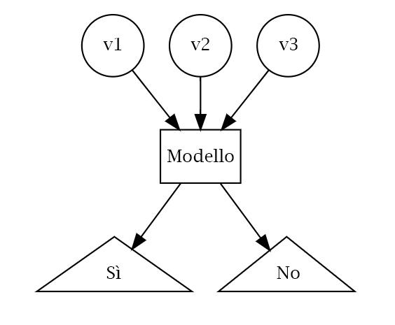
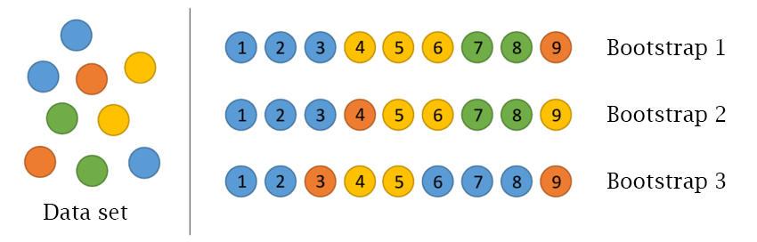
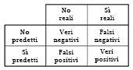
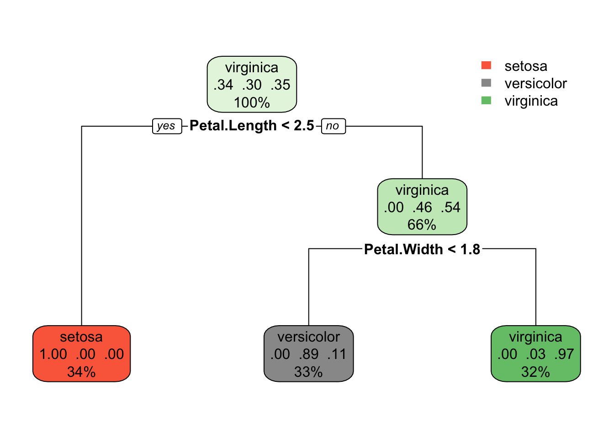

# Machine learning in R {#base}


## Introduzione{#R}
Il **Machine Learning** è una branca dell'informatica che studia la progettazione di algoritmi in grado di imparare e apprendere nuove infomrazioni. Lo scopo è quello di "insegnare" alla macchina così da renderla capace di generare predizioni sulla base dell'informazione ricevuta. In poche parole è come se istruissimo il cervello elettronico a sviluppare un proprio modo di ragionare; tanto più saranno i dati disponibili, più questo sarà in grado di apprendere informazioni e restituire risultati accurati. Per quanto ciò possa assimigliare ad un un romanzo di Gibson (non sapete chi sia? Molto male!) o al film Blade Runner, la risposta è: no, il machine learning in R non vi permetterà di creare un'intelligenza artificiale cosciente con cui parlare e che risolva magicamente i vostri problemi. Infatti, il processo di apprendimento e le modalità con cui l'informazione viene trasmessa alla macchina, sono le parti più critiche dell'utilizzo di questi algoritmi. Tutto dipenderà ovviamente dalla quantità (e la qualità) dei dati che immettiamo nel cervello e, ovviamente, il tipo di risposta che desideriamo questo ci restituisca.

Non trattandosi quindi di una scatola magica, spetta a noi supervisionare e indirizzare l'addestramento della macchina in modo da ottenere dei risultati il più possibile accurati. In questo capitolo, ci occuperemo di descrivere alcune nozioni base dei modelli di machine learning, la gestione dei dati e gli algoritmi più utilizzati. Quindi rimbocchiamoci le maniche e cominciamo a capire come insegnare ad una macchina a _pensare_! Magari, alla fine di questo capitolo, anche voi potrete affermare _Ho visto cose che voi umani..._

Innanzitutto, è opportuno spiegare nel dettaglio le due grosse famiglie in cui vengono comunemente divisi gli algoritmi di Machine Learning, ossia il **Supervised Learning** e l'**Unspervised Learning**.

### Supervised Learning

Un Supervised Learner consiste in un modello predittivo utilizzato per la previsione di un _output_ utilizzando altre variabili (o _input_) nel set di dati. In un modello di questo genere infatti vengono messe in relazione la variabile di _output_ (quella che viene predetta) e i parametri di input (variabili predittive). Il termine supervised si riferisce al fatto che l'utente ha il compito di dare istruzioni su cosa la macchina deve imparare. In particolare, dato un insieme di dati, l'algoritmo di apprendimento tenta di ottimizzare una data funzione (a seconda del modello) per trovare la combinazione di valori che si traducono in un valore predetto che è il più vicino possibile al target effettivo.
Esempi di modellizzazione predittiva possono essere:

- predire le scelte di acquisto di una persona sulla base della sua età, della zona geografica in cui vive, del suo reddito annuale etc.
- predire la probabilità di presenza di una specie animale ad una determinata latitude, sulla base delle temperature medie annuali, caratteristiche dell'habitat, inquinamento etc.
- predire la probabilità di contagio di un virus sulla base del numero di contatti tra persone, umidità, ricircolo dell'aria, tasso di igienizzazione etc.

Ovviamente, appare subito chiaro che migliore è la conoscenza dell'argomento da parte dell'utente, più facile sarà capire quali informazioni possano essere realmente utili per la predizione del nostro output. Di sicuro, utilizzare il numero medio di mele che vengono consumate dalle persone nel mondo non sarà un dato molto utile per predire la probabilità di precipitazione in Costa Rica. Per quanto, si possa sempre provare!

La maggior parte degli algoritmi di apprendimento supervisionati possono essere raggruppati in due categorie, **regressione** o **classificazione**.
Quando l'obiettivo del nostro apprendimento supervisionato è predire un risultato numerico, ci riferiamo a questo come a un problema di **regressione** (da non confondere con la modellizzazione di regressione lineare). I problemi di regressione ruotano intorno alla previsione che cade su un continuum numerico. 
Quando l'obiettivo del nostro apprendimento supervisionato è quello di prevedere un risultato categorico, ci riferiamo a questo come un problema di **classificazione**. Problemi di classificazione ruotano invece intorno alla predizione di una risposta binaria o multinomiale.
La figura seguente ci mostra una tipico problema di classificazione:



### Unsupervised Learning

L'**Unsupervised Learning** include una serie di strumenti statistici per comprendere e descrivere meglio i dati, ma esegue l'analisi senza una variabile target. In sostanza, l'apprendimento senza supervisione riguarda l'identificazione dei gruppi in un set di dati. I gruppi possono essere definiti dalle righe (cioè _clustering_) o dalle colonne (riduzione delle dimensioni).
L'apprendimento non supervisionato viene spesso eseguito come parte di un'analisi esplorativa dei dati . Tuttavia, l'esercizio tende ad essere più soggettivo, e non c'è un obiettivo semplice per l'analisi, come la previsione di una risposta. Inoltre, può essere difficile valutare la qualità dei risultati ottenuti con questi metodi di apprendimento. 
La ragione è piuttosto semplice se ci pensate: se ci adattiamo ad un modello predittivo usando una tecnica di apprendimento supervisionata, allora è possibile controllare il nostro lavoro vedendo quanto bene il nostro modello predice la risposta _Y_ su osservazioni non utilizzate per adattare il modello. Tuttavia, nell'apprendimento senza supervisione, non c'è modo di controllare il nostro lavoro perché non conosciamo la vera risposta: il problema non è supervisionato!

Nonostante la sua soggettività, l'importanza dell'apprendimento non supervisionato non deve essere trascurata e tali tecniche possono essere utilizzate per esempio in casi come:

 - Dividere i consumatori in diversi gruppi omogenei in modo che strategie di marketing personalizzate possano essere sviluppate e implementate per ogni segmento.
  - Identificare specie che hanno un pattern di distribuzione molto simile sulla base di gradienti ambientali.
 - Identificare gruppi di acquirenti online con storie di navigazione e di acquisto simili, così come gli elementi che sono di particolare interesse per gli acquirenti all'interno di ogni gruppo. 


### Dati

I set di dati scelti per questo libro ci permetteranno di illustrare le diverse caratteristiche degli algoritmi di machine learning presentati.  Di conseguenza, i set di dati esemplari che vi consigliamo di utilizzare sono quelli più comunemente utilizzati nel mondo di R (es. _mtcars_, _iris_, _geyser_).
L'**iris dataset** può essere facilmente scaricato ed esplorato utilizzando il pacchetto _datasets_:

```r
library(datasets)
data(iris)
summary(iris)
```

```
##   Sepal.Length    Sepal.Width     Petal.Length    Petal.Width   
##  Min.   :4.300   Min.   :2.000   Min.   :1.000   Min.   :0.100  
##  1st Qu.:5.100   1st Qu.:2.800   1st Qu.:1.600   1st Qu.:0.300  
##  Median :5.800   Median :3.000   Median :4.350   Median :1.300  
##  Mean   :5.843   Mean   :3.057   Mean   :3.758   Mean   :1.199  
##  3rd Qu.:6.400   3rd Qu.:3.300   3rd Qu.:5.100   3rd Qu.:1.800  
##  Max.   :7.900   Max.   :4.400   Max.   :6.900   Max.   :2.500  
##        Species  
##  setosa    :50  
##  versicolor:50  
##  virginica :50  
##                 
##                 
## 
```
Ugualmente per quanto riguarda l'**mtcars dataset**:

```r
data(mtcars)
head(mtcars, 6)
```

```
##                    mpg cyl disp  hp drat    wt  qsec vs am gear carb
## Mazda RX4         21.0   6  160 110 3.90 2.620 16.46  0  1    4    4
## Mazda RX4 Wag     21.0   6  160 110 3.90 2.875 17.02  0  1    4    4
## Datsun 710        22.8   4  108  93 3.85 2.320 18.61  1  1    4    1
## Hornet 4 Drive    21.4   6  258 110 3.08 3.215 19.44  1  0    3    1
## Hornet Sportabout 18.7   8  360 175 3.15 3.440 17.02  0  0    3    2
## Valiant           18.1   6  225 105 2.76 3.460 20.22  1  0    3    1
```

## Divisione dei dati

Come abbiamo già detto, un obiettivo principale del processo di apprendimento automatico è quello di trovare un algoritmo
che predica con maggior precisione i valori di output sulla base di variabili di input. In poche parole, vogliamo un algoritmo che non solo si adatti bene ai nostri dati passati, ma soprattutto, che riesca a predire accuratamente un risultato futuro. Questa si chiama **generalizzazione** del nostro algoritmo. La modalità con la quale "spendiamo" i nostri dati ci aiuterà a capire come il nostro algoritmo generalizza i dati futuri.

Si suppone che l'utente abbia già imparato le principali funzioni per esplorare i dataset e osservare più da vicino le variabili che li descrivono. In questo paragrafo approfondiremo una parte molto importante della modelizzazione tramite machine learning: la ripartizione dei dati. Questo step è di fondamentale importanza dato che da questo dipendono fattori come appunto la capacità generlizzante del modello.
Per fornire una comprensione accurata della generalizzazione del nostro modello ottimale finale, possiamo dividere i nostri dati in set di dati di **training** e **test**:

- **Training set**: questi dati vengono utilizzati per addestrare i nostri algoritmi, ottimizzare i parametri di apprendimento, confrontare i modelli e tutte le altre attività necessarie per scegliere un modello finale.
- **Test set**: dopo aver scelto un modello finale, questi dati vengono utilizzati per stimare le prestazioni del modello, a cui ci riferiamo come **errore di generalizzazione**.

Data una quantità fissa di dati, le raccomandazioni tipiche per dividere i dati in divisioni training-test includono il 60%(training)-40%(test), il 70%-30%, o l'80%-20%. In generale, queste sono linee guida appropriate da seguire; tuttavia, è bene tenere a mente i seguenti punti: _(i)_ spendere troppo informazione (ad esempio, >80%) non ci permetterà di ottenere una buona valutazione delle prestazioni predittive. Possiamo trovare un modello che si adatti molto bene ai dati del training, ma è poco generalizzabile; _(ii)_ allocare troppi dati nel test set (>40%) non ci permetterà di ottenere una buona valutazione dei parametri del modello durante l'addestramento. 
I due modi più comuni di dividere i dati sono il **campionamento casuale semplice** e il **campionamento stratificato**.

### Campionamento casuale semplice

Il modo più semplice per dividere i dati in training e test set è prendere un campione casuale semplice. Ciò, ovviamente, non tiene conto di un campionamento secondo la distribuzione della nostra variabile di risposta _Y_.


Dato che il campionamento è un processo casuale, occore quindi impostare il generatore di numeri casuali con un funzione _set.seed_ per ottenere dei risultati riproducibili. In questo questo libro, useremo spesso il _set.seed(123)_ per la riproducibilità, ma il numero stesso non ha un significato speciale.

```r
set.seed(123)  # per la riproducibilità
index_n <- sample(1:nrow(iris), round(nrow(iris) * 0.7))
training_set <- iris[index_n, ]
test_set <- iris[-index_n, ]
```
Con una dimensione del campione sufficiente, questo metodo di campionamento si tradurrà in genere in una distribuzione normale della nostra variabile _Y_ (nel caso sia numerica) tra il training e i test set, oppure in una simile distribuzione delle categorie nel caso in cui il nostro sia un problam di classificazione, come illustrato di seguito.

```r
table(training_set$Species)
```

```
## 
##     setosa versicolor  virginica 
##         36         32         37
```

```r
table(test_set$Species)
```

```
## 
##     setosa versicolor  virginica 
##         14         18         13
```
Questo è già un primo passo per renderci conto se il nostro modello ha abbastanza diversità di categorie per poter apprnedere le relazioni tra le variabili.

### Campionamento stratificato

Se il nostro insieme di dati non è abbastanza grande da permettere un apporccio casuale o se vogliamo controllare esplicitamente il campionamento in modo che il nostro training e test set abbiano simili distribuzioni della variabile _Y_, allora è necessario utilizzare un campionamento stratificato. Questo apporccio è comunemente più utilizzato con problemi di classificazione in cui la variabile di risposta può essere gravemente squilibrata (ad esempio, 90% delle osservazioni con risposta "Sì" e 10% con risposta "No"). Tuttavia, possiamo anche applicare il campionamento stratificato a problemi di regressione per set di dati che hanno una piccola dimensione del campione e in cui la variabile di risposta si discosta fortemente dalla normalità.

Il modo più semplice per eseguire il campionamento stratificato su una variabile di risposta è usare il pacchetto _rsample_, dove si specifica la variabile di risposta. Applicando il campionamento stratificato sul nostro iris dataset, ovviamente scopriremo che le variabili categoriche sono ugualmente presenti nel nostro insieme.

```r
library(rsample)  # per la riproducibilità
prop.table(table(iris$Species))
```

```
## 
##     setosa versicolor  virginica 
##  0.3333333  0.3333333  0.3333333
```

```r
split_n  <- initial_split(iris, prop = 0.7, 
                              strata = "Species")
training_set_strata  <- training(split_n)
test_set_strata  <- testing(split_n)
prop.table(table(training_set_strata$Species))
```

```
## 
##     setosa versicolor  virginica 
##  0.3333333  0.3333333  0.3333333
```

```r
prop.table(table(test_set_strata$Species))
```

```
## 
##     setosa versicolor  virginica 
##  0.3333333  0.3333333  0.3333333
```
In questo caso quindi, il campionamento stratificato  ci aiuta ad ottenere un uguale proporzione delle classi in ogni insieme di dati anche se non abbiamo ottenuto un risultato molto diverso da quello casuale. Ma supponiamo di avere un data set con una distribuzione della variabile categorica sbilanciata, come ad esempio una risposta **Sì** o **No**:

```r
library(wakefield)
```

```
## Warning: package 'wakefield' was built under R version 4.0.2
```

```r
yn_data <- answer(200, x = c("No", "Sì"), prob = c(0.8, 0.2), name = "Risposte")
prop.table(table(yn_data))
```

```
## yn_data
##    No    Sì 
## 0.805 0.195
```
In una situazione come questa, acquista molta più importanza ripartire i dati in modo che il numero di risposte **Sì** e **No** siano ugualmente distribuiti tra il training e il test set.

## Metodi di ricampionamento

Forse starete scalpitando per poter sapere come mettere le mani sul vostro codice di machine learning e cominciare ad addestrare la vostra macchina. Purtroppo (o per fortuna) i passi da fare prima di arrivare a coronare il vostro sogno sono molti. Saper utilizzare algoritmi di machine learning e ottenere buoni risultati richiede un'attenta preparazione degli ingredienti e una conoscenza di tutti gli strumenti, esattamente come per preparare una piatto complesso.
Come abbiamo già detto, una volta diviso il nostro insieme di dati, avremo due differenti partizioni, il training e il test set. Tuttavia, durante il processo di addestramento del modello non utilizzeremo il test set per valutare le prestazioni del modello durante il suo apprendimento. Quindi come valutiamo le prestazioni di generalizzazione del modello durante la fase di training?

Un'opzione è quella di valutare un errore metrico basato sui dati di training. Sfortunatamente, questo porta a risultati parziali in quanto alcuni modelli possono eseguire molto bene sui dati di formazione, ma non generalizzare bene ad un nuovo set di dati.
Un secondo metodo è quello di utilizzare quello che viene chiamato un **validation approach**, che comporta un'ulteriore suddivisione dell'insieme del training set per creare due parti: un training e un **validation** set. Possiamo quindi addestrare il nostro modello sul nuovo set di training e contemporaneamente stimare le prestazioni sul validation set, che verrà utilizzato dall'algorimto per stimare l'errore di predizione durante l'addestramento. In alcuni casi, per esempio quando si lavoro con un set di dati non molto grande, questa validazione può essere altamente variabile e inaffidabile. Possiamo dire che come la dimensione del nostro set di dati aumenta, più questa preoccupazione si riduce.

I **metodi di ricampionamento** forniscono un approccio alternativo permettendoci di adattare ripetutamente un modello di interesse a parti dei dati di training e di testarne le prestazioni su altre parti. I due metodi di ricampionamento più comunemente usati includono la **cross-validation** e **bootstrapping**.

### Cross-validation

La **k-fold cross-validation** (o più comunemente **k-fold CV**) è un metodo di ricampionamento che divide casualmente i dati di training in _k_ gruppi di dimensioni approssimativamente uguali. Il modello viene addestrato utilizzando i _k-1_ gruppi mentre un gruppo viene utilizzato per calcolare le prestazioni del modello. Questa procedura viene ripetuta _k_ volte; ogni volta, una gruppo diverso viene usato come convalida. Questo processo si traduce in _k_ stime dell'errore di generalizzazione. In questo modo, la stima del k-fold CV è calcolata usando la media degli errori di prova di _k_, fornendoci un'approssimazione dell'errore che potremmo aspettarci su dati di test.


Di conseguenza, con k-fold CV, ogni osservazione nei dati di addestramento sarà effettuata una sola volta per essere inclusa nella serie di test come illustrato nella figura 4. In pratica, si usa tipicamente _k=5_ o _k=10_. Non esiste una regola formale per quanto riguarda le dimensioni di _k_; tuttavia, man mano che _k_ diventa più grande, la differenza tra le prestazioni stimate e le prestazioni reali da vedere sul set di prova diminuirà. D'altra parte, usare _k_ troppo grande può introdurre oneri computazionali.

Alcuni pacchetti di machine learning (es. _h2o_) permettono di definire i gruppi per la k-fold CV all'interno delle loro funzioni. Se ciò non fosse possibile, non spaventatevi, ecco a voi un esempio su come fare: 

```r
library(randomForest)
```

```
## randomForest 4.6-14
```

```
## Type rfNews() to see new features/changes/bug fixes.
```

```r
data <- iris

# In questo esempio, utilizziamo l'iris data set per predire la "Sepal Length"
# a partire dalle altre variabili utilizzando una Random Forest (che vedremo più avanti).

k = 5 #Folds

# campione da 1 a k, nrow volte (il numero di osservazioni nel dataset)
data$id <- sample(1:k, nrow(data), replace = TRUE)
list <- 1:k

# il "prediction" e "testset" dataframes a cui aggiungiamo ogni iterazione di k

prediction <- data.frame()
testsetCopy <- data.frame()

for (i in 1:k){
  trainingset <- subset(data, id %in% list[-i])
  testset <- subset(data, id %in% c(i))
  
  # modello random forest 
  mymodel <- randomForest(trainingset$Sepal.Length ~ ., data = trainingset, ntree = 100)
  
  # rimuovere la variabile Y da predire
  temp <- as.data.frame(predict(mymodel, testset[,-1]))
  # attaccare questa predizione al dataframe "prediction"
  prediction <- rbind(prediction, temp)
  
  # attaccare il test set dell'iterazione al data frame "testsetCopy"
  # tenere solamente la colonna Sepal Length
  testsetCopy <- rbind(testsetCopy, as.data.frame(testset[,1]))
  
}
# aggiungere predizioni e i valori osservati di Sepal Length
result <- cbind(prediction, testsetCopy[, 1])
names(result) <- c("Predicted", "Actual")
result$Difference <- abs(result$Actual - result$Predicted)

# Come esempio, utilizziamo il  Mean Absolute Error per il calcolo dell'errore 
# (vedi più avanti per le metriche di errore) 
summary(result$Difference)
```

```
##     Min.  1st Qu.   Median     Mean  3rd Qu.     Max. 
## 0.002942 0.124396 0.254740 0.314781 0.492432 1.272912
```
Non vi preoccupate se il funzionamento del modello di randomForest vi appare poco chiaro, avremo modo di esplorare in dettaglio i vari algoritmi di apprendimento nei prossimi paragrafi.

### Bootstrapping
Un campione bootstrap è un campione casuale dei dati presi con metodo di ricampionamento (in inglese **resample**). Ciò significa che, dopo che un osservazione è stato selezionata per essere inclusa nel sottoinsieme, è ancora disponibile per un'ulteriore selezione. Un campione di bootstrap è della stessa dimensione del set di dati originale da cui è stato costruito. La figura 5 fornisce uno schema di campionamento del bootstrap in cui ogni campione di bootstrap contiene 9 osservazioni proprio come nel set di dati originale. Inoltre, il campionamento di bootstrap conterrà approssimativamente la stessa distribuzione di valori (rappresentata dai colori) del set di dati originale.



Data la procedura di resample, ogni campione di bootstrap è probabile che contenga valori duplicati. Le osservazioni originali non contenute in un particolare campione di bootstrap sono considerate **out-of-bag (OOB)**. Quando si avvia, un modello può essere costruito sui campioni selezionati e validato sui campioni OOB; questo è spesso fatto, ad esempio, nelle random forest (vedi più avanti).

Dal momento che le osservazioni sono replicate in bootstrap, c'è una minore variabilità nella misura dell'errore rispetto a k-fold CV. Tuttavia, questo può anche aumentare la distorsione della stima dell'errore. Questo può essere problematico con set di dati più piccoli; tuttavia, per la maggior parte dei set di dati medio-grandi (maggiori di 1000) questa preoccupazione è spesso trascurabile.

Per fare delle prove con il campionamento bootstrapping possiamo utilizzare semplicemente le funzioni base di R in questo esempio:

```r
resample <- sample(1:nrow(iris), round(nrow(iris) * 0.7), replace = TRUE)

bootstrap_set <- iris[resample, ]
OOB_set <- iris[-resample, ]
```

## Stima della performance del modello

L'approccio più valido alla valutazione delle prestazioni del modello consiste nel valutare l'accuratezza predittiva attraverso le **loss function**. Le loss function sono metriche che confrontano i valori predetti con il valore reale (l'output di una loss function è spesso indicato come l'errore o pseudo residuo). Quando eseguiamo metodi di ricampionamento, valutiamo i valori previsti per un insieme di convalida rispetto al valore obiettivo effettivo. Per esempio, in una regressione, un modo per misurare l'errore è prendere la differenza tra il valore effettivo e quello previsto per una data osservazione (questa è la definizione usuale di un residuo nella regressione lineare ordinaria). L'errore complessivo di convalida del modello è calcolato aggregando gli errori nell'intero set di dati di convalida.

Ci sono molte loss function tra cui scegliere quando si valutano le prestazioni di un modello predittivo, ognuna delle quali fornisce una comprensione unica della precisione predittiva e differisce tra modelli di regressione e classificazione. Inoltre, il modo in cui una loss function è calcolata tenderà a sottolineare alcuni tipi di errori rispetto ad altri e può portare a drastiche differenze nel modo in cui interpretiamo il "modello ottimale". È importante considerare il contesto del problema quando si identifica la metrica di prestazione preferita da utilizzare. E quando confrontiamo più modelli, dobbiamo confrontarli attraverso la stessa metrica.

Vi presentiamo qui una lista delle metriche più utilizzate per modelli di regressione e classificazione rispettivamente. La maggior parte dei pacchetti di algoritmi di machine learning permette l'utilizzo di queste metriche attraverso l'utilizzo delle rispettive funzioni. In alcuni casi, i nomi delle metriche sono mantenute in inglese per un miglior riscontro con le funzioni in R.

### Modelli di regressione

- **MSE**: il **Mean Squared Error** è la stima dell'errore quadratico medio. Il componente quadrato comporta errori più grandi con penalità più grandi. Questa (insieme a l'RMSE) è la metrica di errore più comunemente usata.

- **RMSE**: **Root mean squared error**. Questo prende semplicemente la radice quadrata della metrica MSE, in modo che il nostro errore sia nelle stesse unità della nostra variabile di risposta.

- **MAE**: **Mean Absolute Error**. Molto simile all' MSE ma, invece del quadrato, prende la differenza assoluta media fra i valori reali e previsti. Ciò si traduce in meno enfasi su errori più grandi di MSE.

- **Devianza**: Abbreviazione di deviazione residua media. In sostanza, fornisce un grado al quale un modello spiega la variazione in un insieme di dati quando si utilizza la stima della massima probabilità. Essenzialmente questo confronta un modello saturo (i.e. completamente caratterizzato) ad un modello insaturo (i.e. intercettare solo o media). Se la distribuzione della variabile di risposta è gaussiana, allora sarà approssimativamente uguale a MSE. Quando non, di solito dà una stima più utile di errore. La devianza è spesso utilizzata anche con i modelli di classificazione.

- **R^2^**: Questa è una metrica molto popolare che rappresenta la proporzione della varianza nella variabile dipendente che è prevedibile dalla variabile indipendente. Purtroppo, ha diversi limiti. Per esempio, due modelli costruiti da due diversi set di dati potrebbero avere lo stesso RMSE ma se uno ha meno variabilità nella variabile di risposta allora avrebbe un minore R^2^ rispetto all'altro. Non si dovrebbe porre troppa enfasi su questa metrica nel caso in cui i dati di training siano diversi.

### Modelli di classificazione

- **Misclassification**: Questo è l'errore generale. Per esempio, supponiamo di predire 3 classi (_Blu_, _Giallo_, _Rosso_) e ogni classe ha 15, 40, 35 osservazioni rispettivamente (90 osservazioni totali). Se si classificano male 4 osservazioni di classe _Blu_, 5 di classe _Giallo_, e 3 di classe _Rosso_, allora si misclassificano 12 su 90 osservazioni con conseguente tasso di errore di classificazione del 13.3%.

- **Media per errore di classe**: Questo è il tasso di errore medio per ogni classe. Per l'esempio precedente, questa sarebbe la media di 4/15, 5/40, 3/35 (15.9%). Ovviamente, se le classi sono bilanciate, questo errore sarà identico a quello della misclassification.

- **MSE**: Calcola la distanza tra 1 e la probabilità suggerita. Così, diciamo che abbiamo tre classi, _Blu_, _Giallo_, e _Rosso_, e il modello prevede una probabilità di 0,91 per _Blu_, 0,07 per _Giallo_, e 0,02 per _Rosso_. Se la risposta corretta è _Blu_, allora MSE = 0.0081 ($0,09^2$) , se è _Giallo_ MSE = 0.8649 ($0,93^2$), se è _Rosso_ MSE = 0.9604 ($0,98^2$).

- **Cross-entropy**: Simile all'MSE ma incorpora un logaritmo della probabilità prevista moltiplicato per la classe vera. Di conseguenza, questa metrica punisce in modo sproporzionato le previsioni in cui prevediamo una piccola probabilità per la vera classe.

- **Gini index**: Utilizzato principalmente con metodi a base di **classification tree** e comunemente indicato come misura di _purezza_ dove un piccolo valore indica che un nodo contiene prevalentemente osservazioni da una singola classe.

Quando applichiamo i modelli di classificazione, usiamo spesso una **matrice di confusione** per valutare determinate misure di performance. Una matrice di confusione è semplicemente una matrice che confronta i livelli categorici effettivi con i livelli categorici previsti. Quando prevediamo il giusto livello, ci riferiamo a questo come ad un vero positivo. Tuttavia, se prevediamo un livello che non è accaduto questo è chiamato un falso positivo. Al contrario, quando non prevediamo un livello e questo non avviene, questo è chiamato un falso negativo.



Possiamo estrarre diversi livelli di prestazioni per i classificatori binari. Ad esempio, data la matrice di confusione illustrata nella figura 6 possiamo valutare quanto segue:

- **Accuracy**: Nel complesso, quanto spesso il classificatore è corretto? Esempio: $(VP+VN)/Totale$.

- **Precision**: Con quale precisione il classificatore predice gli eventi? Questa metrica si occupa di massimizzare i veri positivi a falsi positivi. In altre parole, per il numero di previsioni che abbiamo fatto, quante erano corrette? Esempio: $VP/(VP+FP)$.

- **Sensitivity**: Con quale precisione il classificatore classifica gli eventi reali? Questa metrica si occupa di massimizzare il rapporto tra veri positivi e falsi negativi. In altre parole, per gli eventi che si sono verificati, quanti ne abbiamo previsti? Esempio: $VP/(VP+FN)$.

- **Specificity**: Con quale precisione il modello classifica i non-evento effettivi? Esempio: $VN/(VN+FP)$.

### Concludendo...

Lo sappiamo, tutta questa matematica vi ha spaventati un po'. Man a mano che illustreremo i principali algoritmi di machine learning utilizzati in R, vi renderete conto quanto la conoscenza di quete nozioni sia più utile del riuscire a far girare il vostro personale modello di predizione. Infatti, dall'accortezza che avrete nel sapere dividere i vostri dati e nell'utilizzare la giusta metrica di errore, il vostro modello potrebbe portare a risultati drasticamente diversi! Ma non vi preoccupate, come si dice: _sbagliando si impara_, e dopo numerose prove illustrate in questo capitolo riuscirete meglio a capire come orientarvi in questo labirinto.

Quindi, siamo arrivati al momento che tutti stavate aspettando! Rullo di tamburi e... 

Cominciamo a parlare di algoritmi e a smanettare un po' sul codice!

## Algoritmi di Machine Learning in R


### Decision Trees

I modelli basati su **Decision Trees** sono una classe di algoritmi non parametrici che funzionano partizionando lo spazio delle funzionalità in un certo numero di regioni più piccole (non sovrapposte) con valori di risposta simili utilizzando un insieme di regole di suddivisione. Possono essere utilizzati sia per problemi di classificazione che di regressione. Le previsioni sono ottenute adattando un modello più semplice (ad esempio, una costante come il valore medio di risposta) in ogni regione. Tali metodi di _divide-and-conquer_ possono produrre semplici regole che sono facili da interpretare e visualizzare con i diagrammi ad albero. Come vedremo, i decision trees offrono molti benefici; tuttavia, tipicamente mancano di prestazioni predittive rispetto ad algoritmi più complessi come le reti neurali. Tuttavia, nei prossimi paragrafi vedremo algoritmi di insieme, come le random forests, che sono costruiti combinando insieme molti alberi di decisione.

Ci sono molte metodologie per costruire alberi decisionali, ma il più noto è l'algoritmo di classificazione e regressione (CART) proposto in Breiman (1984). Un albero decisionale di base suddivide i dati del training in sottogruppi omogenei (cioè gruppi con valori di risposta simili) e quindi inserisce una costante semplice in ogni sottogruppo (ad esempio, la media dei valori di risposta all'interno del gruppo per la regressione). I sottogruppi (chiamati anche nodi) sono formati ricorsivamente usando partizioni binarie formate facendo semplici domande yes-or-no su ogni caratteristica (ad esempio, la larghezza del petalo è maggiore di 1,8?). Questo viene fatto un certo numero di volte fino a quando un criterio di arresto adeguato è soddisfatto (ad esempio, una profondità massima dell'albero è raggiunta). Dopo che tutto il partizionamento è stato fatto, il modello predice l'output basato su: (1) i valori medi di risposta per tutte le osservazioni che rientrano in quel sottogruppo (problema di regressione), o (2) la classe che ha la rappresentazione maggioritaria (problema di classificazione). Per la classificazione, le probabilità previste possono essere ottenute utilizzando la proporzione di ciascuna classe all'interno del sottogruppo.

Vediamo come costruire un nostro albero per un problema di classificazione utilizando l'iris dataset. Per farlo utilizzeremo le funzione del paccheto _rpart_:


```r
library(rpart)
library(rpart.plot)
```

```
## Warning: package 'rpart.plot' was built under R version 4.0.2
```

```r
set.seed(123) 

# creazione training e test set
xdata <- iris
index_n <- sample(1:nrow(xdata), round(nrow(xdata) * 0.7))
training_set <- xdata[index_n, ]
test_set <- xdata[-index_n, ]

# modello
fit <- rpart(Species ~., data = training_set, method = 'class')
# Species ~.: Formula del Decision Trees, vogliamo predire la specie 
# sulla base delle altre variabili 
# data: i dati di training
# method = 'class': in questo caso, il nostro è un modello di classificazione
rpart.plot(fit)
```



Complimenti! Avete appena "costruito" il vostro modello di machine learning! Facile no? Ma non è il momento di aprirsi una birra e rilassarsi. Come abbiamo già detto in precedenza, ci sono molte cose da esplorare e da tenere in conto per capire se il nsotro modello ha una buona performance predittiva o meno.

Innanzitutto, guardiamo più da vicino il nostro modello grazie al pacchetto _rpart.plot_. Gli algoritmi di decision tree permettono di poter guardare facilmente all'interno degli ingranaggi del modello. Cosa che è molto più difficile fare con modelli di reti neurali e random forests (chiamati in gergo, per l'appunto, **black-boxes**). Partendo dal nodo **radice** (in alto) possiamo osservare:

- In cima, è la probabilità complessiva di appartanenza alle classi.
- Il nodo successivo "chiede" se il Petal Length è maggiore di 2,5. Se sì, allora si scende al nodo figlio sinistro della radice, dove il 100% degli individui appartiene alla specie _I. setosa_.
- Nel secondo nodo, si chiede se il Petal Width è minore di 1,8. Se sì, allora la probabilità di che si tratti di _I. versicolor_ è dell'89%. Altrimenti c'è una probabilità del 97% che si tratti di _I. virginica_

Si noti che, una delle molte qualità di Decision Trees è che richiedono una preparazione dei dati molto limitata. In particolare, non richiedono ridimensionamento.

Per impostazione predefinita, la funzione _rpart()_ usa la misura del Gini Index per dividere i nodi. Più alto è il coefficiente di Gini, più diverse sono le istanze all'interno del nodo.

Proviamo a predire i nostri dati di test utilizzando il modello appena costruito.


```r
predicted <- predict(fit, test_set, type = 'class')
table_mat <- table(test_set$Species, predicted)
table_mat
```

```
##             predicted
##              setosa versicolor virginica
##   setosa         14          0         0
##   versicolor      0         18         0
##   virginica       0          1        12
```

WOW! Il nostro modello ha predetto la nostre classi molto bene! Ma con quale **Accuracy** di preciso?
Vediamo:


```r
accuracy_Test <- sum(diag(table_mat)) / sum(table_mat)
print(paste('Accuracy for test', accuracy_Test))
```

```
## [1] "Accuracy for test 0.977777777777778"
```

Possiamo dire: ottimo! Il nostro modello ha un'accuratezza del 97% sui dati indipendenti. Più che soddisfacente!

I decision trees in R hanno vari parametri che controllano gli aspetti del _fit_. Nella libreria _rpart_ è possibile controllare questi parametri utilizzando la funzione _rpart.control()_. Qui di seguito, ci sono alcuni parametri che potete regolare:

- minsplit: Imposta il numero minimo di osservazioni nel nodo prima che l'algoritmo esegua una divisione.
- minbucket:  Imposta il numero minimo di osservazioni nella nota finale ossia _la foglia_ dell'albero.
- maxdepth: imposta la profondità massima di qualsiasi nodo dell'albero finale. Il nodo radice è trattato con una profondità 0.

### Random Forests

Le **Random Forests** consistono in un insieme di algoritmi che costruiscono una vasta collezione di alberi de-correlati per migliorare ulteriormente le prestazioni predittive. Sono diventati un algoritmo di apprendimento "out-of-the-box" molto popolare che gode di buone prestazioni predittive con relativamente poca sintonizzazione degli iperparametri. Esistono molte implementazioni moderne di random forests; tuttavia, l'algoritmo di Leo Breiman (Breiman 2001) è diventato in gran parte la procedura più autorevole.

Le random forests sono costruite utilizzando gli stessi principi degli alberi di decisione. L'algoritmo di costruzione degli alberi introduce un componente casuale nel processo di apprendimento, costruendo molti alberi su copie bootstrapped dei dati di formazione. Questa aggregazione riduce la varianza della procedura complessiva e si traduce in una migliore performance predittiva.

Lo schema di campionamento predefinito per le random forests è un bootstrapping dove il 100% delle osservazioni sono campionate con la sostituzione (in altre parole, ogni copia bootstrap ha le stesse dimensioni dei dati di training originali); tuttavia, possiamo regolare sia la dimensione del campione e se campionare con o senza sostituzione. Il parametro della dimensione del campione determina il numero di osservazioni da effettuare per l'addestramento di ciascun albero. Diminuendo la dimensione del campione si ottengono alberi più diversi e quindi si riduce la correlazione tra gli alberi, il che può avere un effetto positivo sulla precisione di previsione. Di conseguenza, se ci sono alcune caratteristiche dominanti nel vostro insieme di dati, riducendo la dimensione del campione può anche aiutare a ridurre al minimo la correlazione tra gli alberi.

Anche le random forests possono essere utilizzati per probalemi di classificazione e regressione. Dato che abbiamo già utilizzato l'esempio con l'iris dataset, quest volta proviamo a costruire il nsotro modello utilizzando una variabile di output continua (e quindi una regressione).

In questo caso, quindi, utilizziamo l'mtcars dataset e, prima di addestrare il modello, normalizziamo i nostri dati in un intervallo tra 0 e 1 per facilitare il processo di apprendimento.


```r
# nromalizzazione dei dati
library(vegan)
```

```
## Carico il pacchetto richiesto: permute
```

```
## Carico il pacchetto richiesto: lattice
```

```
## This is vegan 2.5-6
```

```r
xdata <- mtcars
xdata_n <- decostand(xdata, method = "range")
head(xdata_n)
```

```
##                         mpg cyl      disp        hp      drat        wt
## Mazda RX4         0.4510638 0.5 0.2217511 0.2049470 0.5253456 0.2830478
## Mazda RX4 Wag     0.4510638 0.5 0.2217511 0.2049470 0.5253456 0.3482485
## Datsun 710        0.5276596 0.0 0.0920429 0.1448763 0.5023041 0.2063411
## Hornet 4 Drive    0.4680851 0.5 0.4662010 0.2049470 0.1474654 0.4351828
## Hornet Sportabout 0.3531915 1.0 0.7206286 0.4346290 0.1797235 0.4927129
## Valiant           0.3276596 0.5 0.3838863 0.1872792 0.0000000 0.4978266
##                        qsec vs am gear      carb
## Mazda RX4         0.2333333  0  1  0.5 0.4285714
## Mazda RX4 Wag     0.3000000  0  1  0.5 0.4285714
## Datsun 710        0.4892857  1  1  0.5 0.0000000
## Hornet 4 Drive    0.5880952  1  0  0.0 0.0000000
## Hornet Sportabout 0.3000000  0  0  0.0 0.1428571
## Valiant           0.6809524  1  0  0.0 0.0000000
```

Bene. Ora che i nostri dati sono normalizzati. Passiamo alla costruzione del modello:


```r
library(randomForest)
# creazione training e test set
index_n <- sample(1:nrow(xdata_n), round(nrow(xdata_n) * 0.7))
training_set <- xdata_n[index_n, ]
test_set <- xdata_n[-index_n, ]

# modello
rf.fit <- randomForest(mpg ~., data = training_set, 
                       ntree = 500, # il numero di alberi che verranno costruiti
                       mtry = 3) # il umero di variabili predittive (scelte casualmente) 
                                 # che verrano utilizzate per la costruzione di ogni albero
print(rf.fit)
```

```
## 
## Call:
##  randomForest(formula = mpg ~ ., data = training_set, ntree = 500,      mtry = 3) 
##                Type of random forest: regression
##                      Number of trees: 500
## No. of variables tried at each split: 3
## 
##           Mean of squared residuals: 0.01401642
##                     % Var explained: 79.95
```

Possiamo osservare già da subito alcune cose. Sotto la voce _Type_ è indicato _regression_. Il modello ha riconosciuto da solo che si tratta di una variabile numerica continua. Inoltre, il modello calcola l'RMSE sui dati di training utilizzando le osservazioni **out-of-bag (OOB)** (vedi sopra: **Metodi di ricampionamento**) per la stima dell'errore, dato che il processo di campionamento dei dati avviene attraverso un bootstrapping.

Adesso, utilizziamo il modello per predire le nuove osservazioni e calcolare l'errore di predizione utilizzando questa volta R^2^:


```r
rf.pred <- predict(rf.fit, newdata = test_set[-1]) # togliamo dal test_set la colonna con i valori da predire
obsPred <- cbind(rf.pred, test_set[, 1])
colnames(obsPred) <- c("Predicted", "Observed")
obsPred
```

```
##                    Predicted  Observed
## Merc 240D          0.5428932 0.5957447
## Merc 280C          0.3999806 0.3148936
## Merc 450SE         0.2168960 0.2553191
## Merc 450SL         0.2160671 0.2936170
## Cadillac Fleetwood 0.1264838 0.0000000
## Dodge Challenger   0.2500200 0.2170213
## AMC Javelin        0.3031936 0.2042553
## Camaro Z28         0.2081350 0.1234043
## Pontiac Firebird   0.2607244 0.3744681
## Ferrari Dino       0.3971294 0.3957447
```

```r
rss <- sum((rf.pred - test_set[, 1]) ^ 2)  ## residui della somma dei quadrati
tss <- sum((test_set[, 1] - mean(test_set[, 1])) ^ 2)  ## somma totale dei quadrati
rsq <- 1 - rss/tss
rsq
```

```
## [1] 0.7272982
```

Ricordate il discorso delle black-boxes? Vi sarete resi conto che, a meno che non andiamo a vedere da vicino ognuno dei 500 alberi (follia!!!), non è pssibile vedere quali variabili predittive incidano di più sul processo predittivo. Per ovviare a ciò, il pacchetto randomForest offre una funzione che stima l'importanze delle variabili.


```r
varImpPlot(rf.fit)
```


L'importanza di ciascuna variabile è valutata sulla base di due criteri:

- **MeanDecreaseAccuracy**: fornisce una stima approssimativa della perdita di prestazioni predittive quando tale variabile particolare viene omessa dal l'insieme degli allenamenti. Avvertenza: se due variabili sono un po' ridondanti, allora omettere una di esse potrebbe non portare a enormi guadagni nelle prestazioni di previsione, ma renderebbe la seconda variabile più importante.

- **MeandecreaseGini**: Gini è una misura dell'impurità dei nodi. Pensatela in questo modo: se usate questa funzione per dividere i dati, quanto saranno puri i nodi? Massima purezza significa che ogni nodo contiene solo elementi di una singola classe. La valutazione della diminuzione di Gini quando quella caratteristica è omessa conduce ad una comprensione di quanto importante quella caratteristica deve dividere correttamente i dati.

Si noti che queste misure sono utilizzate per classificare le variabili in termini di importanza e, quindi, i loro valori assoluti potrebbero essere ignorati.

### Reti Neurali Artificiali
